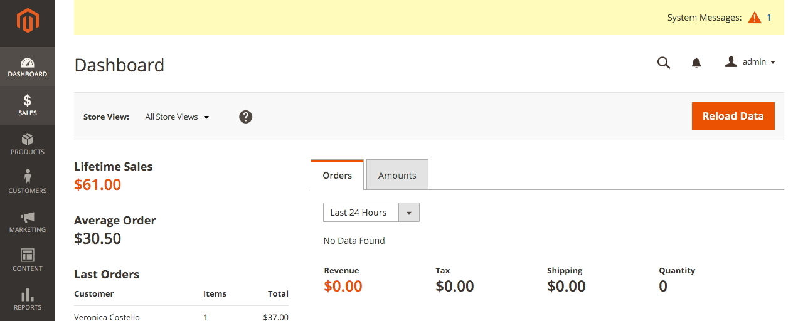
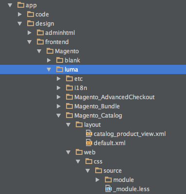
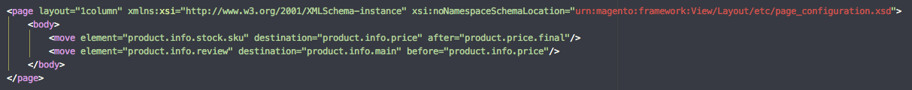

Tras varios años de desarrollo por fin ha visto la luz la nueva versión de **Magento 2**, en la que aspiran a revolucionar de nuevo el panorama e-commerce con nuevas mejoras tanto para merchants como para desarrolladores.

En este post os voy a contar mis primeras impresiones tras instalar una instancia de Magento 2 en local, navegar un poco por la tienda y el admin panel y echar un vistazo al código.

### Instalación

Para la [instalación](http://www.damianculotta.com.ar/2015/11/19/como-instalar-magento-2-en-todas-sus-variantes/) en local de una instancia de Magento 2 he utilizado [Vagrant](https://github.com/rgranadino/mage2_vagrant), ya que uno de los requisitos mínimos es MySql 5.6 y la versión de MAMP que utilizo para trabajar tiene MySql 5.5. En cualquier caso, la utilización de Vagrant para entornos locales es el procedimiento ideal según Magento. Ideal pero con contras, ya que esta versión de MySql no está todavía muy extendida. Otro problema es que hay que actualizar las dependencias con Composer antes de realizar la instalación de Magento. Esto era algo habitual antes de que se lanzara la versión final. Sin embargo también puede ser necesario con la versión final y recién descargada de la web. A pesar de que el rendimiento con Vagrant (en mi caso y con mi máquina) es más pobre que una instalación con XAMPP o MAMP me parece estupendo, ya que todo lo necesario para la ejecución de Magento como si se tratara de un entorno real está contenido en una imagen. Esto facilita los futuros pasos a producción (o por lo menos teóricamente).

### Vistazo general

La primera impresión tras navegar unos minutos por la tienda es: “ya era hora”. El tema **Luma** se ve moderno, y mejora bastante respecto a M1, aunque esperaba algo un poquito más elaborado. Hay 2 mejoras muy importantes que han añadido para la versión Community que casi todos los proyectos llevan y para las cuales se tenía que recurrir a extensiones de terceros: Ajax cart y un color swatches integrado en Magento, lo cual espero va a facilitar mucho el desarrollo, ya que tiene casi todo lo que se suele utilizar en la actualidad. Me ha gustado bastante el zoom sobre la imagen en la página de producto. Una extensión menos.

Vayamos a la trastienda. El panel de administración se ve muy fresco. Necesitaba un lavado de cara con mucha urgencia, aunque me parece un ejercicio de UX un poco equivocado. El admin panel de Magento tiene muchísimo contenido y muchísimas configuraciones. Esa es su gran baza respecto a los competidores, por lo que un sistema de navegación en el que hay que realizar un mínimo de 3–4 clicks para modificar una configuración me parece mucho. Aquí Prestashop o Shopify gana de calle. Tampoco es responsive, esperaba una vista móvil con la información básica en el dashboard, pero nada…Entiendo la complicación de mostrar tablas o tanto contenido en móvil, pero después de tantos años creo que podían haber probado algo…

### Un vistazo al código…

Para terminar un pequeño vistazo al código. Aquí es donde se han realizado la mayoría de cambios, ya que la organización del código cambia mucho respecto a la versión anterior, sobre todo en lo que a un front-end atañe.

Primero: Ahora todo el contenido de un tema se encuentra en app/design/frontend, tanto el layout, los phtml como los css. Una decisión bastante acertada de cara a tener una mejor visión global del contenido del template.

Segundo: Por fin se han deshecho de Prototype en favor de jQuery. Era de esperar. Con la primera versión de Magento se marcaron un triple decidiéndose por esta tecnología. Pero el tiempo le quitó la razón. Este hecho va a facilitar mucho la gestión de Javascripts junto con requireJS.

Tercero: El uso de XML para las modificaciones de layout toma bastante protagonismo con un lenguaje en el que no hay que hay que escribir un poquito menos para hacer más y con menos indentación.

También se han añadido etiquetas nuevas entre la que destaca container en sustitución de text_list para la creación de contenedores. El nuevo Magento va a obligar a los desarrolladores front usar XML para el desarrollo de un template. Como debe ser.

Cuarto: Ahora Magento 2 usa su propio preprocesador LESS para la creación de temas y un sistema para resolver las URL de CSS. La segunda parte…bien!, la primera…no tan bien. Por lo que he podido leer se han decantado por LESS por que mientras se desarrollaba M2 el compilador de LESS para php era mejor que el de SASS. El hecho es que todos los frameworks se están moviendo hacia SASS poco a poco, así que no se hasta que punto va a ser útil esta característica en poco tiempo. La disposición de los ficheros .less divididos por cada módulo ayuda para pequeñas modificaciones en un template existente, pero no para la creación de uno desde cero, ya que el flujo de trabajo es completamente distinto. En este último caso habría que implementar otro tipo de organización en el que se encuentren todos los css, scss, o less agrupados por módulos, layouts (o átomos si se quiere trabajar con atomic design). También he visto poco cariño a la hora del maquetar tanto el front como el back de M2. Me he encontrado por casualidad con el .less de variables de color y cuenta con más de 20 tipos de grises, varios naranjas…parece como si cada desarrollador hubiera añadido uno con cada commit…

Quinto: Javascript. M2 incorpora de serie requireJS para el uso de javascript facilitando (y mucho) la modularización y la estructuración de ficheros y funciones Javascript. Esto junto a las nuevas funciones en los XML cambia la forma de la extensión de funciones js.

### Conclusión

No todo son collejas en este post. **El movimiento de moverse hacia M2 va a ser complicado pero también necesario**. M1 en su lanzamiento distaba mucho de ser perfecto, pero con el tiempo se ha convertido en el estándar para grandes desarrollos de e-commerce. Lo “bueno” de M2 es que los ciclos de actualización serán mucho más rápidos (3 meses), por lo que la plataforma va a evolucionar mucho más rápido (los desarrolladores sudarán para realizar actualizaciones trimestrales, pero bueno…). El entorno de test va a mejorar la calidad del código de los módulos y las extensiones propias (aunque habrá que ponerse las pilas para utilizarlo) y la integración de Varnish elevará el performance de las tiendas de serie.
