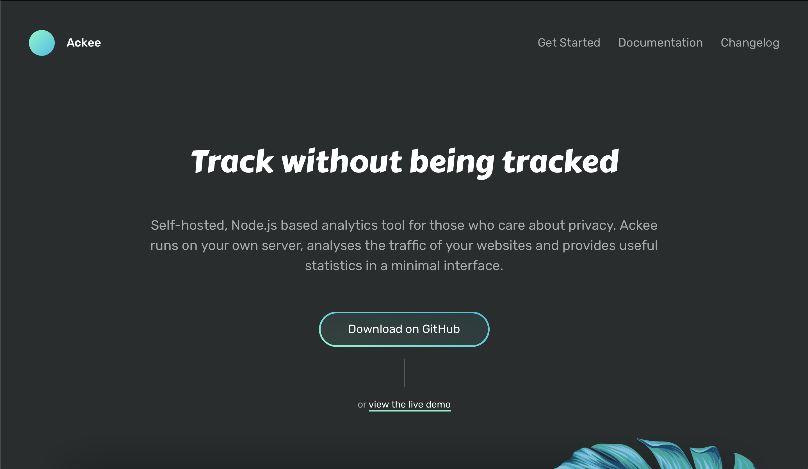
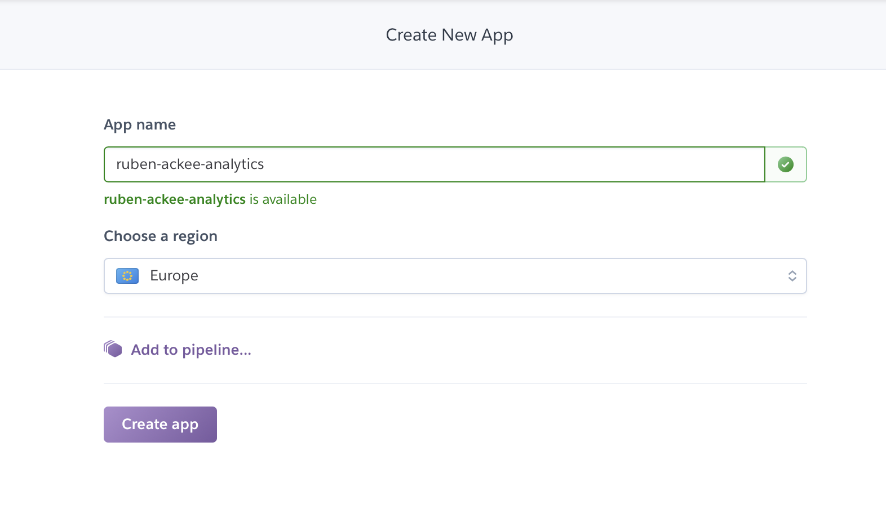
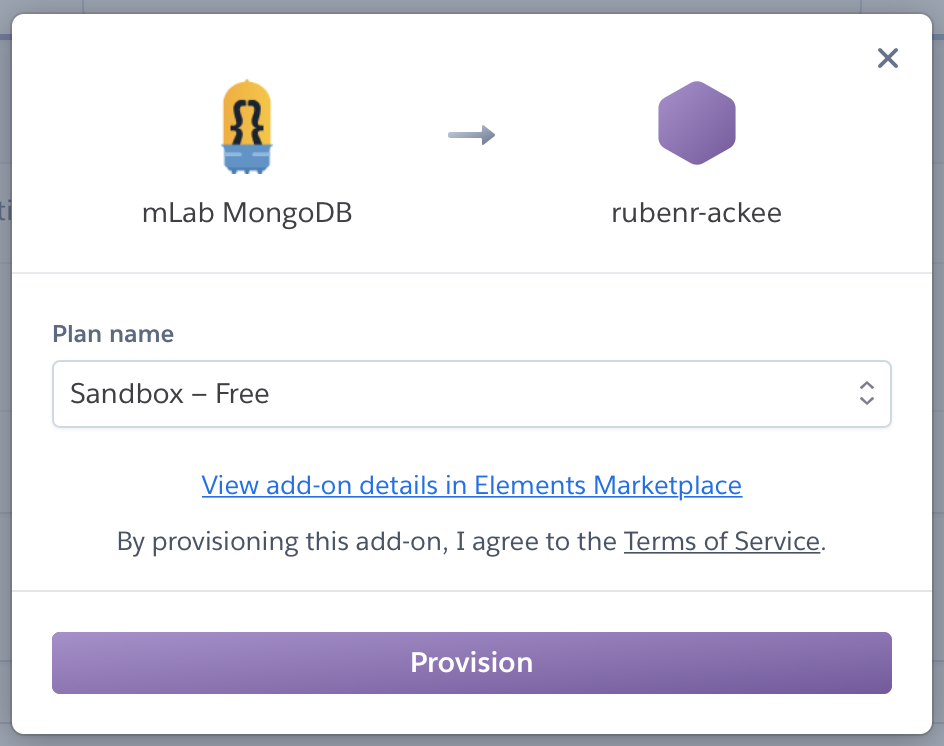
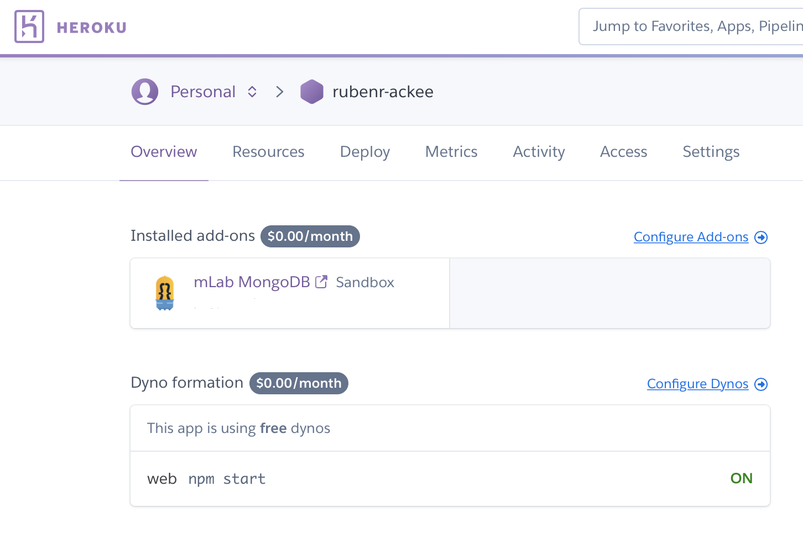
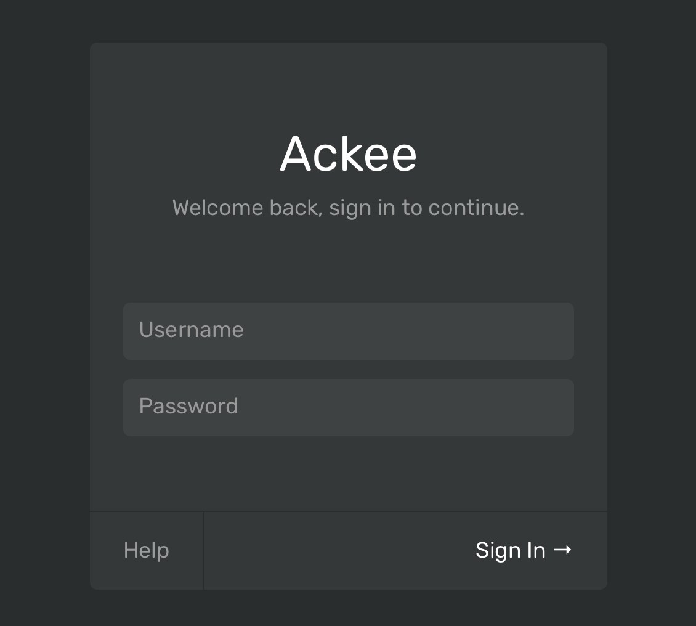
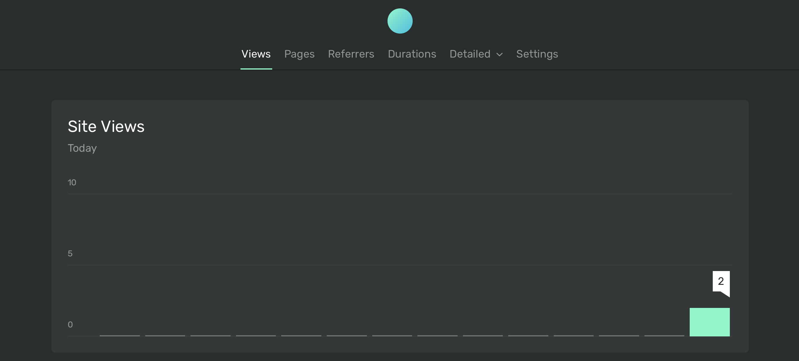
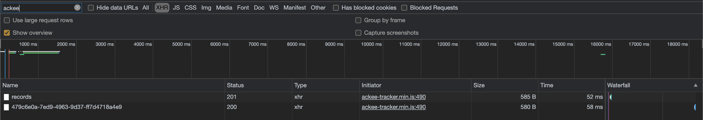
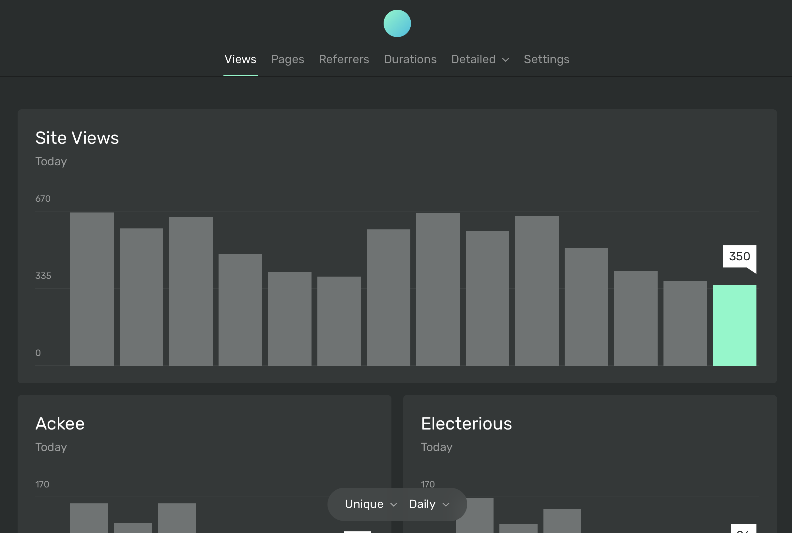

La analítica web es una disciplina en sí dentro de las prácticas relacionadas con el marketing digital y online. Para muchos sectores como el _ecommerce_ es de vital importancia la fiabilidad de los datos, ya que de ellos depende la estrategia del negocio y las ventas. En la mayoría de los casos la captura de los datos de los usuarios se realiza mediante un script, que obtiene información sobre tiempo, páginas vistas, países, dispositivos, etc...Uno de los servicios más usados, si no el que más es Google Analytics, que permite mediante unos pocos _clicks_, generar un script que, añadido a tu web ofrece una inmensa cantidad de datos sobre los usuarios que navegan en la web.

No obstante, esos datos también son utilizados por Google para su uso personal, lo que puede generar en muchos casos o en función del negocio, ciertos problemas éticos. Para otros casos, como un blog personal o un pequeño _site_ no es necesaria tanta información como la que ofrece Analytics y el uso de datos de forma responsable puede ser un activo de valor en sí.

Llevo unos días dándole vueltas a la necesidad de contar con datos de analítica para una web de este tipo, aunque sea por mera curiosidad. Al hilo del post de [Tania Rascia](https://www.taniarascia.com/another-website-redesign/) sobre el rediseño de su web en el que eliminó todo tipo de script y de _tracking_ decidí darle una vuelta al asunto e investigar alternativas a Google Analytics de tipo SASS o _self-hosted_ que trataran los datos de modo responsable pero que a su vez puedan ofrecer resultados de un modo fiable. Tras un rato investigando di con [Ackee](https://ackee.electerious.com), una herramienta basada en Node.js que, una vez alojada en un servidor privado permite ofrecer múltiples datos de tráfico en una interfaz bastante limpia y con un impacto en el rendimiento de la web mínimo.



<div class="text-center" style="margin: -15px 0 20px;">
  <small>Homepage de Ackee</small>
</div>

Dado que para utilizar esta herramienta necesitamos un servidor con NodeJS para desplegarlo y tampoco es necesario complicarse mucho para este tipo de cometido, me he decantado por [Heroku](https://www.heroku.com/) como plataforma para hospedar la herramienta, ya que con su consola y unos pocos _clicks_ dispondremos de un entorno completamente equipado para nuestro propósito, y gratis.

Como "conejillo de Indias" utilizaremos este blog, por lo que utilizaremos el plugin de Gatsby con el que cuenta Ackee, aunque tambien podríamos utilizar el script del que provee la herramienta.

## Creación de la instancia de Heroku

Primero, es necesario crear una instancia de NodeJS de Heroku. Una vez accedido al dashboard (si no has creado una cuenta antes ;) ) hacemos click en Create New App, y añadimos el nombre de nuestra nueva instancia y la ubicación del servidor.

<div class="columns" style="justify-content: center">
<div class="column col-8 col-sm-8">



</div>
</div>

<div class="text-center" style="margin: -15px 0 20px;">
  <small>Creación de nueva instancia de Heroku</small>
</div>

Cuando se complete la creación será necesario instalar el _addon_ de MongoDB para que Ackee pueda guardar los datos. Esto se realiza de modo muy sencillo en el dashboard de Heroku. Click en _Configure New Addons,_ Buscar **_mLab MongoDB_** y añadir el addon (en nuestro caso con el plan gratuito)

<div class="columns" style="justify-content: center">
<div class="column col-4 col-sm-8">



</div>
</div>

<div class="text-center" style="margin: -15px 0 20px;">
  <small>Configuración del addon de mLab</small>
</div>

<div class="columns" style="justify-content: center">
<div class="column col-8 col-sm-8">



</div>
</div>

<div class="text-center" style="margin: -15px 0 20px;">
  <small>Vista general del dashboard</small>
</div>

> **_Actualización (noviembre 2020):_** mLab se ha integrado con MongoDB, por lo que la integración con mongoDB se debe hacer con Atlas. Más info [aquí](https://docs.mlab.com/how-to-migrate-sandbox-heroku-addons-to-atlas/).

Una vez configurado el entorno estamos listos para instalar Ackee mediante la consola de Heroku. Si es la primera vez que se utiliza Heroku será necesario descargar la consola [Heroku CLI](https://devcenter.heroku.com/articles/heroku-cli) usando [Brew](https://brew.sh/index_es).


```bash
// Download Heroku CLI
brew tap heroku/brew && brew install heroku
```

Tras esto podemos hacer login desde el terminal. Este comando redigirá a la página de Heroku para que puedas añadir tu usuario y contraseña.

```bash
// Login with Heroku
heroku login
```

## Instalación de Ackee

Para instalar Ackee en Heroku será necesario descargar el repositorio en local para posteriormente enlazarlo con la instancia que hemos creado previamente en Heroku.

```bash
// Clone Ackee repo
git clone [git@github.com](mailto:git@github.com):electerious/Ackee.git

// Add repo to Heroku
heroku git:remote -a nombre-de-instancia-heroku

// Push code to Heroku
git push heroku master
```

Tras esto será necesario añadir las variables de usuario y contraseña para poder hacer login en Ackee. A su vez es necesario añadir una configuración para _setear_ el dominio o dominios que Ackee va a analizar para, de este modo evitar problemas de _Cross-Origin_.

```bash
// Set env variables for Ackee
heroku config:set ACKEE_PASSWORD=<your password>
heroku config:set ACKEE_USERNAME=<your username>
heroku config:set ACKEE_ALLOW_ORIGIN=<your site url>
```

Tras esto ya podemos acceder a la url de nuestro dashboard de Ackee instalado en Heroku. En nuestro caso será http://rubenr-ackee-analytics.herokuapp.com/

<div class="columns" style="justify-content: center">
<div class="column col-4 col-sm-8">



</div>
</div>

<div class="text-center" style="margin: -15px 0 20px;">
  <small>Ventana de login de Ackee</small>
</div>

Una vez logueado podemos ver por primera vez nuestro flamante dashboard de analítica.



<div class="text-center" style="margin: -15px 0 20px;">
  <small>Dashboard de Ackee</small>
</div>

Para añadir un nuevo sitio lo podemos realizar desde Settings → Domains → New Domain. Esto generará tanto un Domain Id como un script para que lo puedas añadir a tu página en el head sin utilizar ningún otro tipo de configuración. En nuestro caso, vamos a guardar el Domain Id y vamos a usarlo con el [plugin de Gatsby](https://www.gatsbyjs.org/packages/gatsby-plugin-ackee/) de Ackee.

## Configuración de Gatsby

Primero será necesario instalar el plugin de Gatsby de Ackee, para ello desde nuestra consola:

```bash
// Cd to the Gatsby project
cd rubenr-dev

// Instal Gatsby plugin
npm install --save gatsby-plugin-ackee
```

Una vez instalado el plugin, será necesario añadirlo a nuestro fichero gatsby-plugins.js seteando la información del Domain Id de Ackee:

```bash
// In your gatsby-config.js
plugins: [
	{
		resolve: "gatsby-plugin-ackee",
		options: {
			// Domatin ID found when adding a domain in the admin panel.
			domain_id: "YOUR_ACKEE_DOMAIN_ID",
			// URL to Server eg: "https://analytics.test.com".
			server: "https://analytics.test.com",
			// Disabled analytic tracking when running localy
			ignore_localhost: true,
			// If enabled it will collect info on OS, BrowserInfo, Device & ScreenSize
			detailed: false
			},
	},
]
```

Para poder probar correctamente el funcionamiento del plugin habilitaremos primero la configuración _ignore_localhost: false_, para poder comprobar que se realiza la petición correctamente.

Iniciamos el entorno de desarrollo de Gatsby con _gatsby develop_ y abrimos nuestra web con el inspector:



<div class="text-center" style="margin: -15px 0 20px;">
  <small>Se puede observar como ya se ha añadido el tracker de ackee con nuestro Domain Id</small>
</div>

¡Sí! Ya podemos observar los datos en Ackee. Antes de subir los cambios a nuestro entorno de producción no olvidéis deshacer el _flag_ de _ignore_localhost_ para que las visitas en local no cuenten.



<div class="text-center" style="margin: -15px 0 20px;">
  <small>Vista de Ackee con visitas y dos dominios, Ackee y Electerious.</small>
</div>

En este artículo hemos visto como en unos minutos es posible crear un entorno de análisis web bastante completo, independiente, administrado por vosotros y que presta atención por la privacidad de los usuarios. Actualmente están preparando la v2 de la herramienta para la release prevista este mismo mes. Os animo a que echéis un vistazo a su [documentación](https://docs.ackee.electerious.com/#/), [Github](https://rubenr-ackee.herokuapp.com) y colaboréis :)

## Referencias

[https://ackee.electerious.com](https://ackee.electerious.com/)

[https://www.heroku.com/](https://www.heroku.com/)

[https://www.gatsbyjs.org/packages/gatsby-plugin-ackee/](https://www.gatsbyjs.org/packages/gatsby-plugin-ackee/)

[https://docs.ackee.electerious.com/](https://docs.ackee.electerious.com/)

Photo by [Nick Fewings](https://unsplash.com/@jannerboy62?utm_source=unsplash&utm_medium=referral&utm_content=creditCopyText) on [Unsplash](https://unsplash.com/?utm_source=unsplash&utm_medium=referral&utm_content=creditCopyText)
