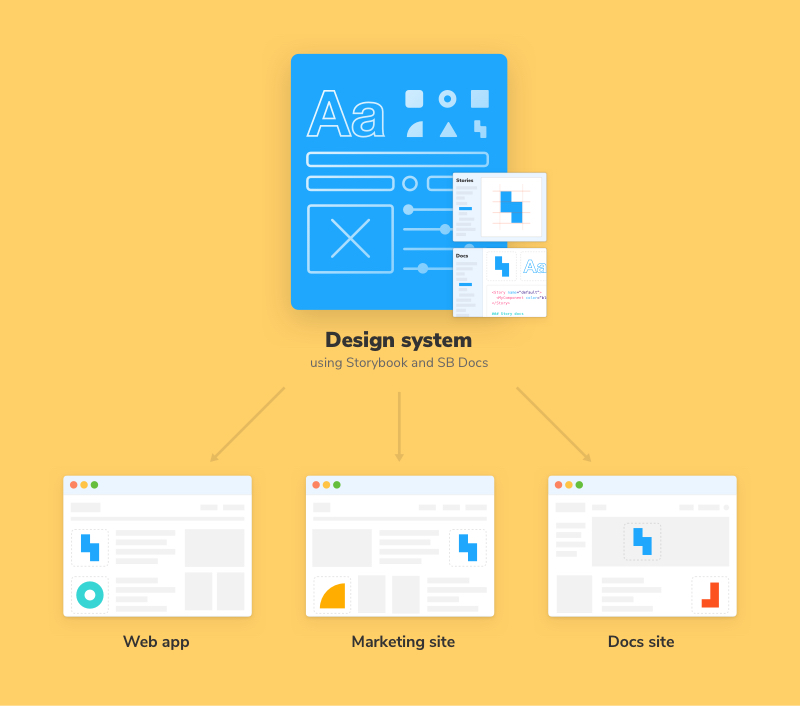
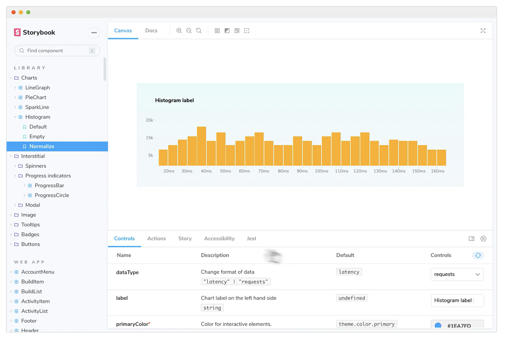
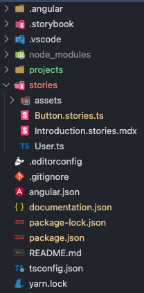
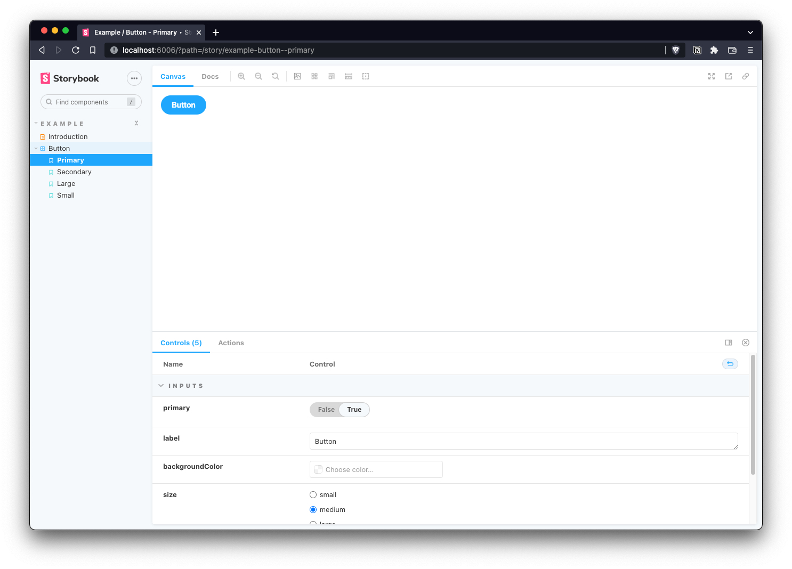

> You can read this article also in [Spanish](/angular-libraries-storybook).

Style guides have been around for years, but not so long ago, designers and developers have agreed to work together on an idea that is streamlining and making easier the use of UIs throughout the products of big companies. I am talking about **design systems** and their consequence in software development: **component libraries**.

In this post we are going to create an Angular app with **Angular Libraries and Storybook**, ready to publish a components library as a package. You can see the result in the [following repository](https://github.com/rubenRP/angular-lib-storybook-demo).

A **design system** is a set of reusable UI components that allow teams to build complex and consistent interfaces across multiple projects. In turn, they may contain information about their use, how to build said interfaces, or any other relevant information for their implementation or installation. The advantages of design systems over old practices are their scalability, coherence and robustness, which is why they have become the cornerstone of large companies and large projects in their applications.

<div style="margin: 0 auto; max-width: 400px;">



</div>
<div class="text-center" style="margin: -15px 0 20px;">
  <small>Source: Storybook</small>
</div>

With this situation and this new paradigm, the need arose to have a tool that centralizes this knowledge between designers and developers, generates useful documentation for both and also make easier the consumption of these components by projects that want to use this design system. And **Storybook came to the rescue.**

## What is Storybook?

[Storybook](https://storybook.js.org/) is a tool for building UI components and pages in isolation, generating documentation, and enabling both component development and testing. It allows the visualization of the components in an organized way, interact with them and test them as if they were deployed in a real application. This tool has integrations with multiple frameworks such as React, Vue.js, Angular...

<div style="margin: 0 auto; max-width: 600px;">



</div>
<div class="text-center" style="margin: -15px 0 20px;">
  <small>Source: Storybook</small>
</div>

You can also generate a static page with all the documentation related to those components, extra information, to serve as a reference for the project developers. In short, in 3 years it has become the standard for this type of project due to its usefulness and power. We can see examples of complete component libraries, such as [Carbon Components](https://angular.carbondesignsystem.com/?path=/story/components-welcome--to-carbon-angular), [The Guardian](https://5dfcbf3012392c0020e7140b-gmgigeoguh.chromatic.com/?path=/story/layouts-immersive--article-story) or [Shopify Polaris](https://5d559397bae39100201eedc1-iwzjuhbhrb.chromatic.com/?path=/story/playground-playground--playground)

Storybook becomes especially important if you add it the idea of being able to publish packages with those components, in isolation, so that they can be consumed by any application you want.

In a [previous post](https://rubenr.dev/github-packages/) we talked about how to publish Angular components using Angular Libraries. By using Storybook, you can keep the development, visualization, and testing of components in isolation while publishing the packages so that you can build multiple applications that use those components.

## Installing Storybook

Before installing Storybook it is necessary to create a project, in this case Angular, so we will install the Angular console (if it has not been done previously) and create our project.

```bash
npm install -g @angular/cli
ng new angular-storybook -create-application=false
```

The `-create-application=false` flag creates an “empty” Angular application, ready to create libraries. We proceed to generate the library.

```bash
cd angular-storybook
ng generate library design-system
```

The last command generates a new projects folder where our component library will be located: an Angular “application” inside another Angular application.

The next step is to install Storybook in the project:

```bash
npx sb init
```

> The versions used of both Angular and Storybook are the following:
> **Angular:** ^13.1.0 - **Storybook-angular:** ^6.4.14

This means that there are some **changes required** to work properly. In future versions of both Angular and Storybook this should be fixed.

First it is necessary to make a fix in the `tsconfig.json` file in the _.storybook_ folder.

```jsx
// From
"extends": "",
// To
"extends": "../projects/design-system/tsconfig.lib.json"

// From
"include": ["../src/**/*", "../projects/**/*"],
// To
"include": ["../stories/**/*", "../src/**/*", "../projects/**/*"],
```

When creating an Angular project with the `-create-application=false` flag, Storybook is not able to know the location of the components, so you have to do it manually. In the `angular.json` file of our project:

```jsx
{
  "$schema": "./node_modules/@angular/cli/lib/config/schema.json",
  "version": 1,
  "newProjectRoot": "projects",
  "projects": {
    "design-system": {
      ...
    },
    "storybook": {
      "projectType": "application",
      "root": "stories",
      "sourceRoot": "stories",
      "architect": {
        "build": {
          "options": {
            "tsConfig": "tsconfig.json",
            "styles": [],
            "scripts": []
          }
        }
      }
    }
  },
  "defaultProject": "design-system"
}
```

> It is important that both the `@angular` and `@angular-devkit/build-angular` versions are at least 13.1.3, as version 13.1.2 generates a build error when running Storybook.

## Development

We already have the project ready to start working, but since both Angular and Storybook create components and test files, it is necessary to refactor some file.

In the _projects/design-system/src/lib_ folder we will delete all the _design-system_ files except the _.module_, since this will be the one used to import all the components created in our design system. Also we will create a folder called _components/button_. We move the `button.component.ts` and `button.css` files found in the _stories_ folder to this last created folder, creating our library with the following structure:

<div style="margin: 0 auto; max-width: 600px;">


</div>
<div class="text-center" style="margin: -15px 0 20px;">
  <small>Library structure after refactor</small>
</div>

It is also necessary to modify the `public-api.ts` file to remove references to previously removed files:

```jsx
/*
 * Public API Surface of design-system
 */

export * from "./lib/design-system.module"
```

To finish, we modify the declarations and imports of the `design-system.module.ts` file:

```jsx
import { NgModule } from "@angular/core"
import ButtonComponent from "./components/button/button.component"

@NgModule({
  declarations: [ButtonComponent],
  imports: [],
  exports: [ButtonComponent],
})
export class DesignSystemModule {}
```

For this we will keep only the Button component and its story, removing the _header_ and _page_ components. The result of the stories folder is as follows:

<div style="margin: 0 auto; max-width: 600px;">



</div>
<div class="text-center" style="margin: -15px 0 20px;">
  <small>Project structure after refactor</small>
</div>

We already have our project ready to generate and publish our design system, therefore, we can visualize it by executing `npm run storybook` and going to the url [http://localhost:6006/](http://localhost:6006/).

In [this repository](https://github.com/rubenRP/angular-lib-storybook-demo) you can see the finished project with all the changes described.

<div style="margin: 0 auto; max-width: 600px;">



</div>

## Final thoughts

Although the installation of Storybook with Angular is a bit rough for this type of architecture, since there are currently some bugs, it is an ideal solution that is worth working on for the development of design systems in an orderly way and with the plus from the Angular Libraries package release.

## References

[https://www.nngroup.com/articles/design-systems-101/](https://www.nngroup.com/articles/design-systems-101/)

[https://angular.io/cli](https://angular.io/cli)

[https://angular.io/guide/creating-libraries](https://angular.io/guide/creating-libraries)

[https://storybook.js.org/docs/angular/get-started/install](https://storybook.js.org/docs/angular/get-started/install)

[https://dev.to/saulodias/angular-library-storybook-44ma](https://dev.to/saulodias/angular-library-storybook-44ma)

[https://github.com/storybookjs/storybook/issues/17039](https://github.com/storybookjs/storybook/issues/17039)

[https://storybook.js.org/tutorials/design-systems-for-developers/react/en/introduction/](https://storybook.js.org/tutorials/design-systems-for-developers/react/en/introduction/)

Photo by <a href="https://unsplash.com/@byfortytwo?utm_source=unsplash&utm_medium=referral&utm_content=creditCopyText">FORTYTWO</a> on <a href="https://unsplash.com/s/photos/lego-bricks?utm_source=unsplash&utm_medium=referral&utm_content=creditCopyText">Unsplash</a>
