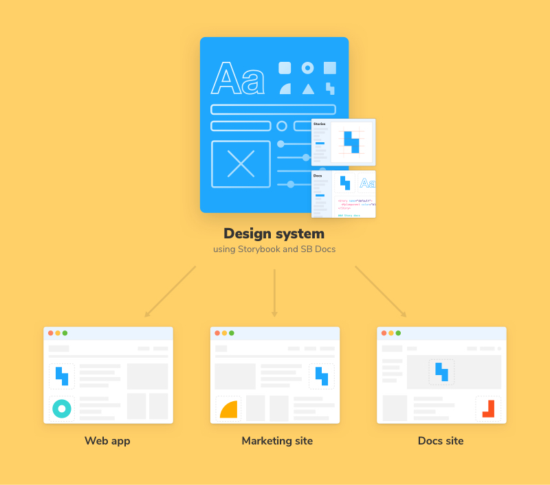
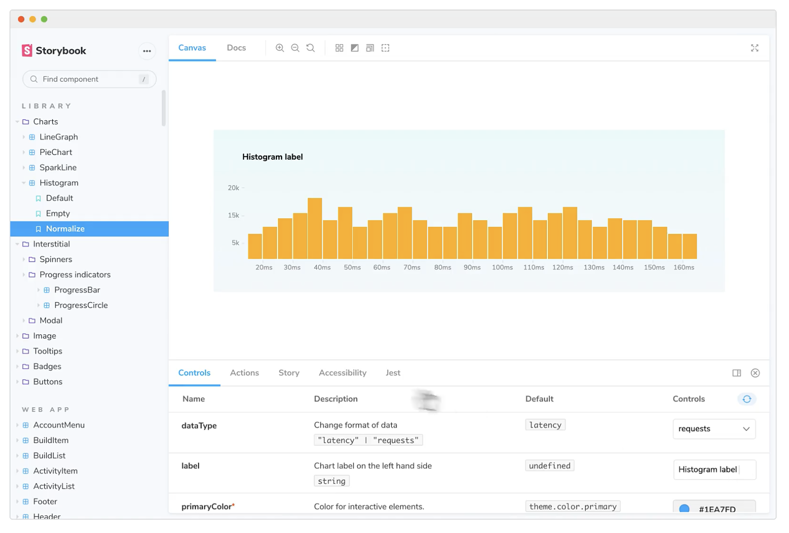
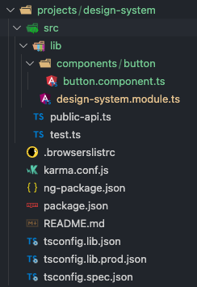
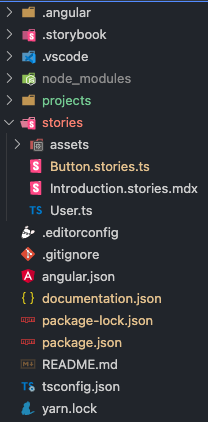
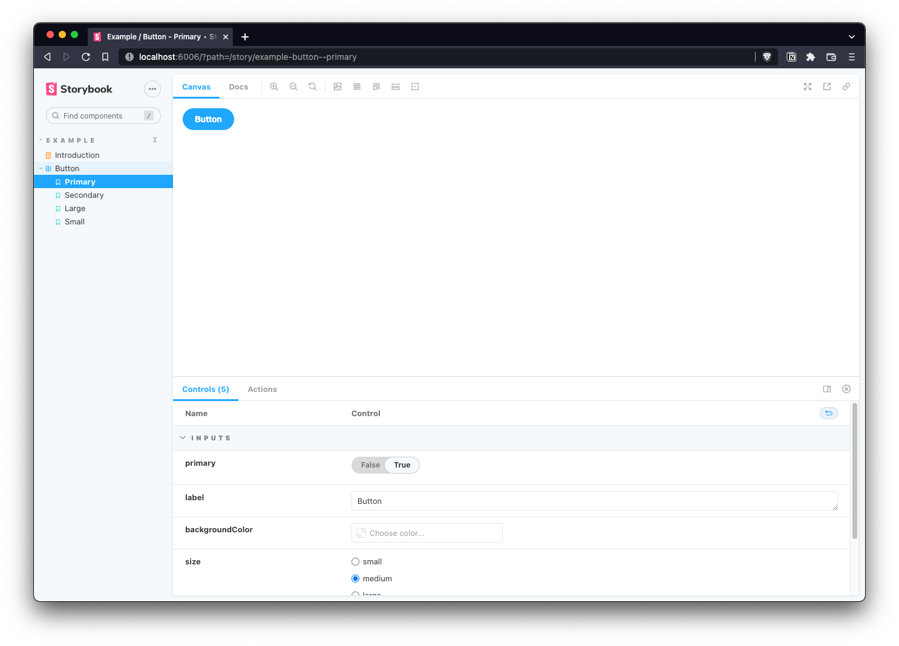

Las guías de estilos han existido desde hace años, pero desde hace no tanto, diseñadores y desarrolladores se han puesto de acuerdo para trabajar en conjunto en una idea que está dinamizando y facilitando el uso de UIs a lo largo de los productos de grandes compañías. Estoy hablando de los **sistemas de diseño.** y su consecuencia en el desarrollo de sofware: las **librerías de componentes**.

En este post vamos a crear una aplicación de Angular con **Angular Libraries y Storybook**, lista para publicar un sistema de diseño como paquete. El resultado lo puedes ver en el [siguiente repositorio](https://github.com/rubenRP/angular-lib-storybook-demo).

Un **sistema de diseño** es un conjunto de componentes UI reusables que permiten a los equipos construir interfaces complejas y consistentes entre varios proyectos. A su vez pueden contener información sobre su uso, cómo construir dichas interfaces, o cualquier información relevante para su implementación o instalación. Las ventajas de los sistemas de diseño respecto a las antiguas prácticas son su escalabilidad, coherencia y solidez, por lo que se han convertido en la piedra angular de las grandes compañías y grandes proyectos en sus aplicaciones.

<div style="margin: 0 auto; max-width: 400px;">



</div>
<div class="text-center" style="margin: -15px 0 20px;">
  <small>Fuente: Storybook</small>
</div>

Con esta situación y este nuevo paradigma surgía la necesidad de tener una herramienta que catalice ese conocimiento entre diseñadores y desarrolladores, genere una documentación útil para ambos y además facilite el consumo de esos componentes por parte de los proyectos que quieran usar ese sistema de diseño. Y **Storybook llegó al rescate.**

## ¿Qué es Storybook?

[Storybook](https://storybook.js.org/) es una herramienta para construir componentes UI y páginas de manera aislada, generando documentación, y posibilitando tanto desarrollo como el testing de componentes. Permite la visualización de los componentes de una manera organizada, interactuar con ellos y testearlos como si se encontraran desplegados en una aplicación real. Esta herramienta es capaz de integrarse con múltiples frameworks como React, Vue.js, Angular...

<div style="margin: 0 auto; max-width: 600px;">



</div>
<div class="text-center" style="margin: -15px 0 20px;">
  <small>Fuente: Storybook</small>
</div>

También puede generar una página estática con toda la documentación referida a esos componentes, información extra, para que sirva de referencia a los desarrolladores del proyecto. En fin, en 3 años se ha convertido en el estandar para este tipo de proyectos por su utilidad y su potencia. Podemos ver ejemplos de completas librerías de componentes, como la de [Carbon Components](https://angular.carbondesignsystem.com/?path=/story/components-welcome--to-carbon-angular), [The Guardian](https://5dfcbf3012392c0020e7140b-gmgigeoguh.chromatic.com/?path=/story/layouts-immersive--article-story) o [Shopify Polaris](https://5d559397bae39100201eedc1-iwzjuhbhrb.chromatic.com/?path=/story/playground-playground--playground)

Storybook cobra especial importancia si se le suma la idea de poder publicar paquetes con esos componentes, de manera aislada, para poder ser consumidos por cualquier aplicación que desee

En un [post anterior](https://rubenr.dev/github-packages/) hablamos de cómo publicar componentes de Angular utilizando Angular Libraries. Mediante el uso de Storybook, se puede mantener el desarrollo, visualización, y testing de componentes de forma aislada y a su vez publicar los paquetes para que se pueden generar múltiples aplicaciones que usen dichos componentes.

## Instalación

Antes de instalar Storybook es necesario crear un proyecto, en este caso de Angular, por lo que instalaremos la consola de Angular (si no se ha hecho previamente) y crearemos nuestro proyecto.

```bash
npm install -g @angular/cli
ng new angular-storybook -create-application=false
```

El modificador `-create-application=false` crea una aplicación de Angular “vacía”, lista para poder crear librerías. Procedemos a generar la librería.

```bash
cd angular-storybook
ng generate library design-system
```

El último comando genera una nueva carpeta projects donde se ubicará nuestra librería de componentes: una “aplicación” Angular dentro de otra aplicación Angular.

El siguiente paso es instalar Storybook en el proyecto:

```bash
npx sb init
```

> Las versiones utilizadas tanto de Angular como de Storybook son las siguientes:
> **Angular:** ^13.1.0 - **Storybook-angular:** ^6.4.14

Esto hace que haya una serie de **cambios necesarios** para que todo funcione correctamente. En futuras versiones tanto de Angular como de Storybook esto debería quedar solucionado.

Primero es necesario realizar un fix en el fichero `tsconfig.json` de la carpeta _.storybook_.

```jsx
// From
"extends": "",
// To
"extends": "../projects/design-system/tsconfig.lib.json"

// From
"include": ["../src/**/*", "../projects/**/*"],
// To
"include": ["../stories/**/*", "../src/**/*", "../projects/**/*"],
```

Al crear un proyecto Angular con el flag `-create-application=false` Storybook no es capaz de reconocer la ubicación de los componentes, de modo que hay que hacerlo manualmente. En el fichero `angular.json` de nuestro proyecto:

```jsx
{
  "$schema": "./node_modules/@angular/cli/lib/config/schema.json",
  "version": 1,
  "newProjectRoot": "projects",
  "projects": {
    "design-system": {
      ...
    },
    "storybook": {
      "projectType": "application",
      "root": "stories",
      "sourceRoot": "stories",
      "architect": {
        "build": {
          "options": {
            "tsConfig": "tsconfig.json",
            "styles": [],
            "scripts": []
          }
        }
      }
    }
  },
  "defaultProject": "design-system"
}
```

> Es importante que tanto la versión de `@angular` como la de `@angular-devkit/build-angular` sea como mínimo la 13.1.3, ya que la versión 13.1.2 genera un error de building al ejecutar Storybook.

## Desarrollo

Ya tenemos listo el proyecto para comenzar a trabajar, pero ya que tanto Angular como Storybook crea componentes y ficheros de prueba es necesario refactorizar algún fichero.

En la carpeta _projects/design-system/src/lib_ eliminaremos todos los ficheros _design-system_ menos el _.module_, ya que este será el que sirva para importar todos los componentes creados en nuestro sistema de diseño. A su vez crearemos una carpeta llamada _components/button_. Movemos el fichero `button.component.ts` y `button.css` que se encuentra en la carpeta _stories_ a esta última carpeta creada, creando nuestra librería con la siguiente estructura:

<div style="margin: 0 auto; max-width: 600px;">



</div>
<div class="text-center" style="margin: -15px 0 20px;">
  <small>Estructura de la librería tras la refactorización</small>
</div>

También es necesario modificar el fichero `public-api.ts` para eliminar las referencias a ficheros eliminados previamente:

```jsx
/*
 * Public API Surface of design-system
 */

export * from "./lib/design-system.module"
```

Para terminar, modificamos las declaraciones e imports del fichero `design-system.module.ts`:

```jsx
import { NgModule } from "@angular/core"
import ButtonComponent from "./components/button/button.component"

@NgModule({
  declarations: [ButtonComponent],
  imports: [],
  exports: [ButtonComponent],
})
export class DesignSystemModule {}
```

Para esto nos quedaremos solo con el componente Button y su story, eliminando los componentes _header_ y _page_. El resultado de la carpeta stories es el siguiente:

<div style="margin: 0 auto; max-width: 600px;">



</div>
<div class="text-center" style="margin: -15px 0 20px;">
  <small>Estructura del proyecto tras la refactorización</small>
</div>

Ya tenemos nuestro proyecto listo para generar y publicar nuestro sistema de diseño, por tanto, lo podemos visualizar al ejecutar `npm run storybook` y dirigirnos a la url [http://localhost:6006/](http://localhost:6006/).

En [este repositorio](https://github.com/rubenRP/angular-lib-storybook-demo) se pueden ver el proyecto terminado con todos los cambios descritos.

<div style="margin: 0 auto; max-width: 600px;">



</div>

## Conclusiones

Si bien la instalación de Storybook con Angular es un poco áspera para este tipo de arquitectura, ya que actualmente hay algún bug, es una solución idónea en la que merece la pena trabajar para el desarrollo de sistemas de diseño de una forma ordenada y con el plus de la publicación de paquetes de Angular Libraries.

## Referencias

[https://www.nngroup.com/articles/design-systems-101/](https://www.nngroup.com/articles/design-systems-101/)

[https://angular.io/cli](https://angular.io/cli)

[https://angular.io/guide/creating-libraries](https://angular.io/guide/creating-libraries)

[https://storybook.js.org/docs/angular/get-started/install](https://storybook.js.org/docs/angular/get-started/install)

[https://dev.to/saulodias/angular-library-storybook-44ma](https://dev.to/saulodias/angular-library-storybook-44ma)

[https://github.com/storybookjs/storybook/issues/17039](https://github.com/storybookjs/storybook/issues/17039)

[https://storybook.js.org/tutorials/design-systems-for-developers/react/en/introduction/](https://storybook.js.org/tutorials/design-systems-for-developers/react/en/introduction/)

Photo by <a href="https://unsplash.com/@byfortytwo?utm_source=unsplash&utm_medium=referral&utm_content=creditCopyText">FORTYTWO</a> on <a href="https://unsplash.com/s/photos/lego-bricks?utm_source=unsplash&utm_medium=referral&utm_content=creditCopyText">Unsplash</a>
  