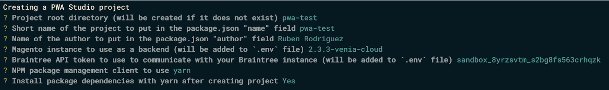
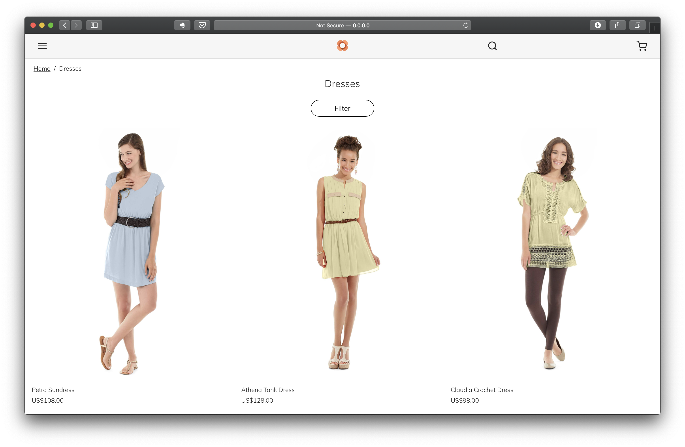
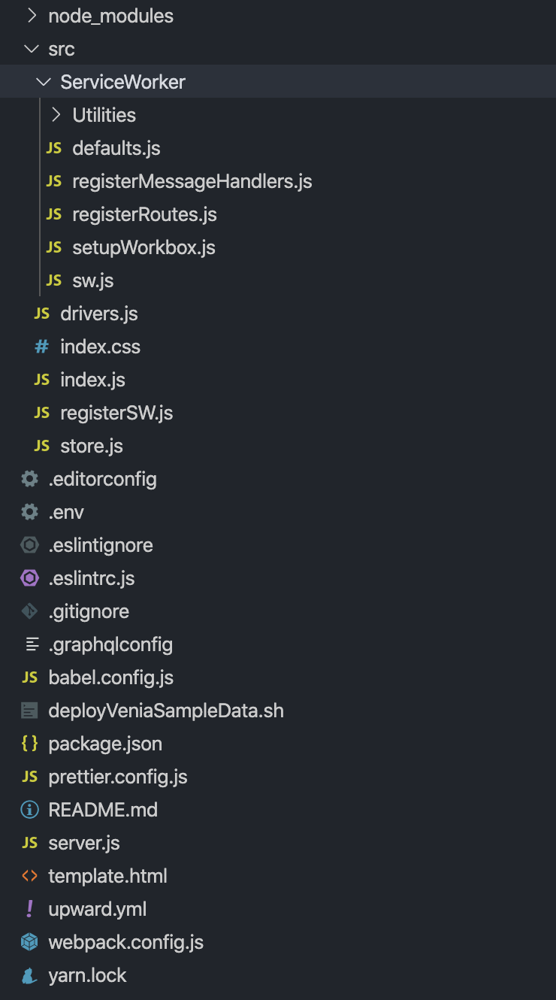
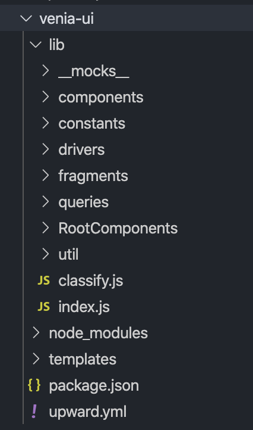

Han pasado 533 días desde que Magento lanzó con la versión 2.3 de Magento 2 [PWA Studio](https://magento.com/products/magento-commerce/pwa), aunque esta nueva plataforma de desarrollo para Magento 2 llevaba haciendo ruido desde mucho antes, [antes incluso](https://alankent.me/2016/12/14/headless-magento-and-extensions/) de que comenzara su desarrollo.

A parte de la opinión que me merece tanto el desarrollo de los acontecimiento como las [decisiones tomadas](https://divante.com/blog/pwa-studio-ready-production/) en PWA Studio me gustaría escribir una serie de artículos sobre los procedimientos y cosas básicas que hay que saber para desarrollar en PWA Studio desde el punto de vista del Front-End. Seguramente escriba un post opinando sobre ello y analizando el estado del arte de la plataforma, pero hoy vamos a comenzar con lo más básico, instalación, estructura, tecnologías y elementos principales.

Cuando se empieza a hablar de PWA Studio se suele hacer una introducción de todas las tecnologías implicadas en el asunto y las nuevas desarrolladas por Magento. Esto conlleva un problema, y es que la descripción de tecnologías y la relación entre sí es **abrumadora**. Así que cuando se llega al final de la descripción de tecnologías, que es la parte más interesante de cara al frontend ya se ha aburrido uno de leer o se ha perdido entre tantos paquetes, librerías y componentes, por lo que voy a obviar de momento información sobre [Peregrine](https://magento.github.io/pwa-studio/peregrine/), [Buildpack](https://magento.github.io/pwa-studio/pwa-buildpack/) y [Upward](https://magento.github.io/pwa-studio/technologies/upward/). Solo haré comentarios sobre las mismas a lo largo del desarrollo del de estos artículos, así creo que se comprenderá un poco mejor la relación entre componentes.

## Tecnologías

Para la mayoría de desarrolladores de Magento o Magento 2 el cambio a PWA Studio supone un pequeño reto, ya que el modo de operar, la arquitectura y las tecnologías son completamente distintas. Y aunque la primera vez que se echa un vistazo a un proyecto con PWA Studio la sensación de mareo es grande, cuando se comienza a trabajar te das cuenta de una cosa muy importante: **Al final es desarrollar con JavaScript**, por lo que tras el periodo de adaptación el desarrollo es más ágil, mucho más robusto y personalmente lo encuentro mucho más divertido.

Dicho esto el desarrollo básico con PWA Studio se basa en el uso de 3 tecnologías:

- **[React](https://es.reactjs.org)**, una librería para construir interfaces haciendo uso del VirtualDOM.
- **[GraphQL](https://graphql.org)**, un lenguaje para obtener datos en una API mediante la ejecución de _queries_.
- **[CSS Modules](https://github.com/css-modules/css-modules)**, una nueva aproximación al desarrollo de css en el que los estilos se acotan por módulos, mediante el uso de una librería.

## Elementos principales

Teniendo en cuenta las tecnologías descritas previamente, en PWA Studio existe un tipo de fichero, componente o módulo que se encarga de implementar este tipo de tecnologías. En muchos casos, Magento crea una capa de abstracción para unificar la plataforma, pero en realidad, la mayor parte del tiempo se están utilizando paquetes básicos en el desarrollo de JavaScript. En cualquier caso, y para comenzar con lo más sencillo, el desarrollo en PWA Studio se basa en el uso de queries de GraphQL, componentes de React y Root Components.

### Query de GraphQL

Una _query_ GraphQL se usa para leer o recuperar valores de una API. A su vez, el guardado o publicación de valores se realiza mediante una mutación. En ambos caso, la operación es una cadena simple que un servidor GraphQL puede analizar y responder con datos en un formato específico (habitualmente JSON). La gran ventaja de este sistema es que estas consultas ayudan a reducir la sobrecarga de datos. Estas consultas se pueden guardar tanto a nivel de componentes como aislarlos en ficheros específicos e importarlos desde un componente.

### Componente de React

Los componentes de React son los bloques de código que forman una aplicación en React. Típicamente conforman la representación de una funcionalidad de manera aislada, ya sea un botón, una cabecera o un formulario. De manera sencilla, un componente es una función o clase de JavaScript que, dados unos parámetros devuelve un elemento de React con dicha representación. Un componente puede estar formado de uno o varios componentes, y la granularidad de estos dependerá de la calidad del código y de la complejidad del proyecto. Una de las cosas más importantes a tener en cuenta es que **todo gira en torno a los componentes de React**, por lo que es importante tener unos conocimientos sólidos sobre React.

### Root Component

Los _Root Components_ son una peculiaridad de PWA Studio y son un modo de dividir y simplificar la lógica de grandes componentes, ya sea la página de producto o un resultado de búsqueda. Típicamente este tipo de componentes son llamados vistas y tienen asociado a él una ruta concreta, pero la implementación en este caso es ligeramente diferente. Son componentes que cargan la información de una query de GraphQL, gestiona sus estados y pasa esa información como parámetros a un componente menor. Como nota hay que mencionar que este es uno de los aspectos menos consistentes de PWA Studio actualmente.

## Instalación

Para instalar PWA Studio hay que tener en mente cuál es el objetivo, ya que no se instala de la misma manera si se desea contribuir al proyecto que si se quiere crear un proyecto nuevo que parte de Venia. Este es uno de los principales malentendidos al trabajar con PWA Studio. Como nuestro caso va a ser el desarrollo de un proyecto nuevo que parte de Venia sólo hay que ejecutar la herramienta de scaffolding y seguir responder a las preguntas que se realizarán por el terminal:

```sh
yarn create @magento/pwa
```

El instalador permite configurar el nombre, ubicación, credenciales de Braintree o la instancia de Magento contra la que va a lanzar peticiones PWA Studio. Puede ser una instancia propia de Magento o la de demo Magento Cloud. Para este caso utilizaremos la demo de Magento Cloud, ya que el contenido es bastante completo y ahorra bastante tiempo de setup.



<div class="text-center" style="margin: -15px 0 20px;">
  <small>Proceso de instalación de PWA Studio</small>
</div>

Una vez realizada la instalación se puede proceder a lanzar el entorno de desarrollo en local mediante el siguiente comando de yarn.

```sh
yarn start
```

El terminar nos dirá desde qué url podemos acceder al entorno local de desarrollo de PWA Studio, en este caso [http://0.0.0.0:54455/](http://0.0.0.0:54455/)



<div class="text-center" style="margin: -15px 0 20px;">
  <small>Categoría básica de PWA Studio con el tema Venia</small>
</div>

## Estructura básica

Una vez realizada la instalación de PWA Studio nos encontramos una estructura de carpetas como la que sigue:

<div class="columns" style="justify-content: center">
<div class="column col-4 col-sm-8">



</div>
</div>

<div class="text-center" style="margin: -15px 0 20px;">
  <small>Estructura de ficheros de PWA Studio.</small>
</div>

A decir verdad, los ficheros que se crean tras la instalación no nos dicen mucho sobre cómo se puede empezar a trabajar en PWA Studio, ya que casi todo son ficheros de configuración y no hay creados componentes ni ejemplos que ayuden. Una buena manera de hacerse a la idea es revisar la estructura de la carpeta lib del módulo **_@magento/venia-ui_**. Este módulo contiene todo lo necesario para crear un front con PWA Studio y se refleja el el típico front con Venia que se ve en la típica demo de PWA Studio. Es el punto de referencia desde el que partir para desarrollar, el proyecto del que estás "heredando".

<div class="columns" style="justify-content: center">
<div class="column col-3 col-sm-6">



</div>
</div>

<div class="text-center" style="margin: -15px 0 20px;">
  <small>Estructura de ficheros del paquete @magento/venia-ui</small>
</div>

Aquí ya se puede ver algo que puede tener relación con los elementos principales descritos previamente: components, queries y Root Components.

Actualmente se cuenta como Root Component las vistas de 404, listado de productos y detalle de producto. Básicamente obtienen el contenido necesario mediante _talons_ (hablaremos de ellos en otro post) o _queries_ de GraphQL y lo pasan como _props_ a los componentes de vista de producto, lista de productos, etc…

Dentro de la carpeta de cada Root Component todos tienen en común la misma estructura: un fichero index.js donde se exporta el módulo en cuestión, cuyo código se encuentra en el fichero product.js, search.js o el nombre que corresponda al Root Component.

```js
/**
 * @RootComponent
 * description = 'Basic Product Page'
 * pageTypes = PRODUCT
 */

export { default } from "./product"
```

Este patrón de exposición del módulo, aunque no es muy común en aplicaciones con React es el utilizado en PWA Studio. La parte buena es que es consistente en todo el proyecto.

```js
import React, { Fragment, useEffect } from "react"
import { useProduct } from "@magento/peregrine/lib/talons/RootComponents/Product/useProduct"

import { Title, Meta } from "../../components/Head"
import { fullPageLoadingIndicator } from "../../components/LoadingIndicator"
import ProductFullDetail from "../../components/ProductFullDetail"
import { MagentoGraphQLTypes } from "../../util/apolloCache"
import getUrlKey from "../../util/getUrlKey"
import mapProduct from "../../util/mapProduct"

/*
 * As of this writing, there is no single Product query type in the M2.3 schema.
 * The recommended solution is to use filter criteria on a Products query.
 * However, the `id` argument is not supported. See
 * https://github.com/magento/graphql-ce/issues/86
 * TODO: Replace with a single product query when possible.
 */
import GET_PRODUCT_DETAIL from "../../queries/getProductDetail.graphql"
import PRODUCT_DETAILS_FRAGMENT from "../../fragments/productDetails.graphql"

const Product = () => {
  useEffect(() => {
    window.scrollTo(0, 0)
  }, [])

  const talonProps = useProduct({
    cachePrefix: MagentoGraphQLTypes.ProductInterface,
    fragment: PRODUCT_DETAILS_FRAGMENT,
    mapProduct,
    query: GET_PRODUCT_DETAIL,
    urlKey: getUrlKey(),
  })

  const { error, loading, product } = talonProps

  if (loading && !product) return fullPageLoadingIndicator
  if (error) return <div>Data Fetch Error</div>

  if (!product) {
    return (
      <h1>This Product is currently out of stock. Please try again later.</h1>
    )
  }

  // Note: STORE_NAME is injected by Webpack at build time.
  return (
    <Fragment>
      <Title>{`${product.name} - ${STORE_NAME}`}</Title>
      <Meta name="description" content={product.meta_description} />
      <ProductFullDetail product={product} />
    </Fragment>
  )
}

export default Product
```

Bajo la carpeta _components_ se encuentran todos los componentes que forman parte de Venia, y la estructura es similar a la de los Root Components, pero en la mayoría de los casos la complejidad es menor. Como ejemplo veremos el contenido del componente Gallery:

```js
import React, { useMemo } from "react"
import { string, shape, array } from "prop-types"

import { mergeClasses } from "../../classify"
import GalleryItem from "./item"
import defaultClasses from "./gallery.css"

// map Magento 2.3.1 schema changes to Venia 2.0.0 proptype shape to maintain backwards compatibility
const mapGalleryItem = item => {
  const { small_image } = item
  return {
    ...item,
    small_image:
      typeof small_image === "object" ? small_image.url : small_image,
  }
}

/**
 * Renders a Gallery of items. If items is an array of nulls Gallery will render
 * a placeholder item for each.
 *
 * @params {Array} props.items an array of items to render
 */
const Gallery = props => {
  const classes = mergeClasses(defaultClasses, props.classes)

  const { items } = props

  const galleryItems = useMemo(
    () =>
      items.map((item, index) => {
        if (item === null) {
          return <GalleryItem key={index} />
        }
        return <GalleryItem key={index} item={mapGalleryItem(item)} />
      }),
    [items]
  )

  return (
    <div className={classes.root}>
      <div className={classes.items}>{galleryItems}</div>
    </div>
  )
}

Gallery.propTypes = {
  classes: shape({
    filters: string,
    items: string,
    pagination: string,
    root: string,
  }),
  items: array.isRequired,
}

export default Gallery
```

En los próximos artículos entraremos en detalle sobre la estructura de estos datos, cómo modificarlos y qué es cada cosa, sobre todo para los desarrolladores más acostumbrados a trabajar con Magento y menos con JavaScript, pero mientras tanto dejo una pista sobre cómo extender un componente.

> La estrategia a seguir para extender o modificar un componente es sencilla: Sólo es necesario copiar el fichero o los ficheros que se desean modificar bajo la ruta **src/components/nombre_componente** y cambiar las referencias de los _import_ para que se hagan a los ficheros ubicados en la carpeta _node modules_ o a los ubicados en la carpeta src. En algunos casos será necesario relanzar el comando _yarn start_ para actualizar las referencias.

Para finalizar, la carpeta _queries_ contiene todas las queries complejas y mutaciones para obtener la información de Magento 2. En este artículo no se profundizará en la estructura de las mismas pero en este sencillo ejemplo de los filtros de cada categoría uno se puede hacer una idea de como se obtienen los datos de la API con GraphQL

```js
query getProductFiltersByCategory($categoryIdFilter: FilterEqualTypeInput!) {
   products(filter: { category_id: $categoryIdFilter }) {
       aggregations {
           label
           count
           attribute_code
           options {
               label
               value
           }
       }
   }
}
```

¡Ya estamos listos para desarrollar! Con esto ya tenemos un pequeño overview de la plataforma desde un punto de vista orientado al frontend y eliminando el ruido de la arquitectura global del proyecto. En próximos artículos se profundizará sobre la creación y modificación de componentes y estracción de datos mediante queries.

## Referencias

[https://magento.github.io/pwa-studio/](https://magento.github.io/pwa-studio/)

[https://es.reactjs.org](https://es.reactjs.org)

[https://graphql.org](https://graphql.org)

[https://github.com/css-modules/css-modules](https://github.com/css-modules/css-modules)

Photo by [Émile Perron](https://unsplash.com/@emilep?utm_source=unsplash&utm_medium=referral&utm_content=creditCopyText) on [Unsplash](https://unsplash.com/s/photos/coding?utm_source=unsplash&utm_medium=referral&utm_content=creditCopyText)
