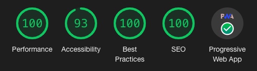
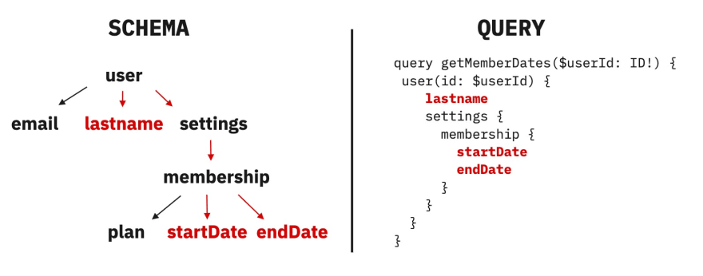
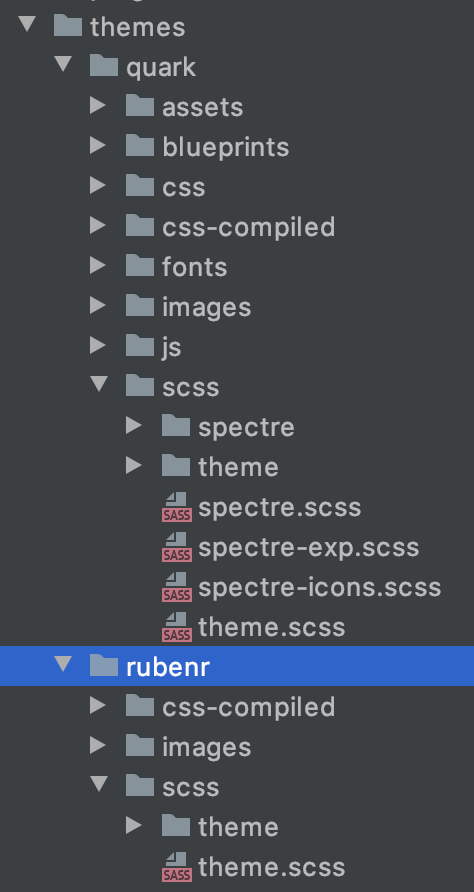
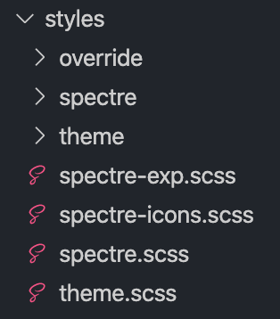
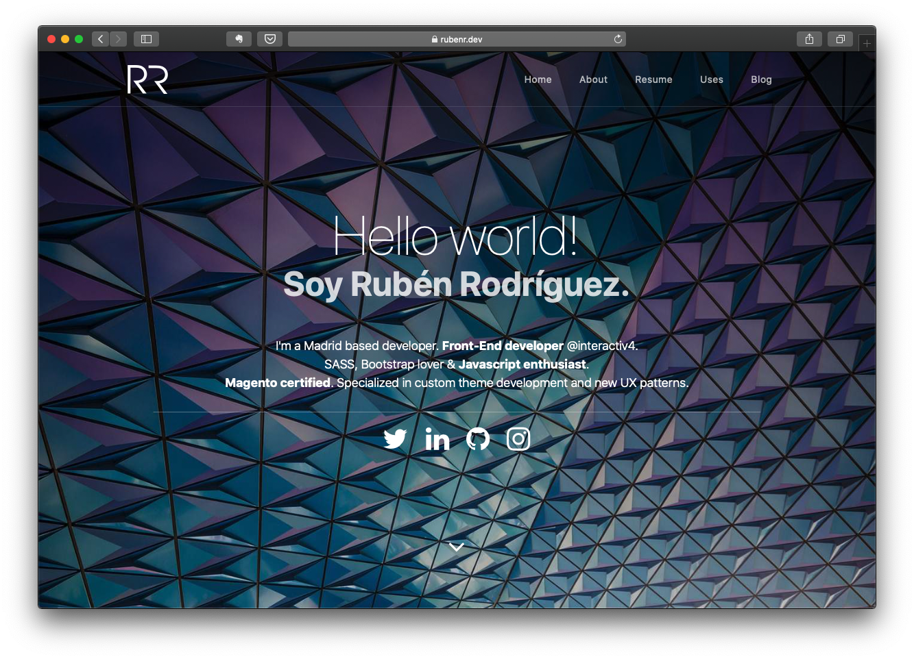

Dicen que comer y cantar todo es empezar. Pues yo empecé a introducirme en Gatsby con el proyecto [COVID-19 Map](https://rubenr.dev/blog/gatsbyjs-y-leaflet-como-crear-una-aplicacion-para-mostrar-estadisticas-sobre-covid-19/) y unas semanas después he acabado migrando mi blog personal a Gatsby.

Como comenté en el post anterior, Gatsby es un framework basado en React cuyo objetivo es ayudar a los desarrolladores a realizar páginas web de manera ágil. Es uno de los frameworks basados en [JAMstack](https://www.netlify.com/jamstack/) con más tracción en los últimos meses. Debido a su arquitectura se puede desplegar en servicios de CDN/JAMstack como [Netlify](https://www.netlify.com) de modo muy sencillo (tan sencillo como enlazar a un repositorio). A su vez, y utilizando Netlify como servicio de despliegue se puede hacer uso de [Netlify CMS](https://www.netlifycms.org), una capa de administración para gestionar los posts sin tener que levantar un admin completo.

Era algo que me rondaba por la cabeza desde finales del año pasado, pero me encontraba muy cómodo con [Grav](https://getgrav.org) y aunque no exprimía al 100% su potencial (No deja de ser un blog muy sencillo) no lo veía claro del todo...hasta que me puse a jugar de verdad con Gatsby. Así que si me embarcaba en esta aventura tenía que fijar ciertas restricciones para que realizar la migración no solo fuera mover posts de una plataforma a otra con un tema diferente, un tema nuevo y un catálogo de opciones diferente. Quería que el aspecto y la forma de trabajar fuera similar desarrollo realizado con Grav.

La gran desventaja que tenía Grav de entrada era que conseguir esta imagen era bastante difícil:



<div class="text-center" style="margin: -15px 0 20px;">
  <small>Todavía se pueden rascar unos puntos en accesibilidad.</small>
</div>

Este es el resumen del report de Lighthouse tras realizar la migración a Gatsby y la verdad que ver todo en verde hace que además del aprendizaje, la migración haya merecido la pena.

## Requisitos de la migración

Para realizar la migración y aprender a solucionar problemas con Gatsby por el camino me fijé las siguientes restricciones:

- El tema tendría que ser el mismo, por lo que tendría que migrar la estructura de HTML y el tema en SASS, que está basado en el tema [Quark](https://github.com/getgrav/grav-theme-quark) de Grav, que a su vez implementa [Spectre.css](https://picturepan2.github.io/spectre/) como librería CSS
- A nivel de SEO los slugs, rutas, la información de metas, descripción, sitemap, etc. tendría que ser similar
- La operativa de edición de posts tendría que ser similar a Grav. Grav y Gatsby comparten la ventaja que pueden gestionar los posts mediante Markdown con frontmatter. A su vez Gatsby añade soporte de mdx (Markdown con Jsx)
- Se tiene que desarrollar un sistema para gestionar tanto posts como páginas estáticas, ya que no necesariamente tienen que tener un diseño común y los propósitos son diferentes.
- Los posts deberían almacenarse en el repositorio para poder desplegarse (De esto se hablará en otro post)

Una vez fijadas los requisitos y con la experiencia previa del mapa del COVID-19 con Leaflet era el momento de empezar a escribir código.

## Stack básico

Para la migración me decidí utilizar [gatsby-starter-blog](https://www.gatsbyjs.org/starters/gatsbyjs/gatsby-starter-blog/), el _starter_ oficial de Gatsby para crear un blog. Aunque por diseño y arquitectura estaba a años luz de lo que tenía fijado en los requisitos seguía siendo un buen punto de partida, ya que contaba con toda la configuración necesaria para la gestión de Markdown, imágenes, Analytics y PWA. Dicho esto, a la configuración existente de Gatsby solo fue necesario añadir los módulos para la generación del sitemap y para la compilación de SASS, ya que el tema de Grav y SpectreCSS usa SASS como lenguaje de preprocesado.

```js
 plugins: [
   `gatsby-plugin-sass`,
   {
     resolve: "gatsby-plugin-sitemap",
     options: {
       exclude: [`/blog/page:*`, `/blog/tag:*`, `/blog/category:*`],
     },
   },
 ],
```

### GraphQL

Antes de empezar con la arquitectura de la información y la generación de páginas es necesaria una pequeña introducción sobre [GraphQL](https://graphql.org), ya que todo gira sobre esta tecnología. GraphQL es un lenguaje en forma de _query_ para APIs y uno de sus objetivos principales es permitir a los usuarios obtener los datos necesarios para sus desarrollos (y solo los necesarios) mediante una consulta en forma de query, en contraposición al modelo de REST API en el que se van realizando peticiones, guardando el contenido necesario y enlazando con la siguiente petición hasta conseguir toda la información necesaria. Para ello GraphQL desarrolla un grafo completo de los datos y lo va recorriendo para ofrecer la información solicitada en la _query_.



<div class="text-center" style="margin: -15px 0 20px;">
  <small>Fuente: <a href="https://dev.to/bogdanned/the-graph-in-graphql-1l99" target="_blank">Bogdan Nedelcu - dev.to</a></small>
</div>

Basándonos en la estructura de la imágen previa y teniendo en cuenta la estructura de datos del blog una posible query sobre el blog de Gatsby sería la siguiente:

```js
query BlogPostBySlug($slug: String!) {
  mdx(fields: { slug: { eq: $slug } }) {
    id
    excerpt(pruneLength: 160)
    body
  }
}
```

En esta query se puede ver de manera sencilla el modo de operar de GraphQL. En ella, se selecciona el campo mdx filtrando por el _slug_ del post. Mdx es el campo generado desde el plugin gatsby-plugin-mdx que genera un grafo con toda la información provista en un fichero Markdown, campos de Frontmatter incluidos. Por tanto, esta _query_ devuelve, dado un slug, el id del fichero, un resumen de 160 caracteres y el cuerpo del documento.

## Generación de la url y estructuración de datos

Dado que uno de los requisitos es poder gestionar post y páginas de modo independiente es necesario modificar y añadir sources al fichero gatsby-config.js

```js
plugins: [
  {
    resolve: `gatsby-source-filesystem`,
    options: {
      path: `${__dirname}/content/blog`,
      name: `blog`,
    },
  },
  {
    resolve: `gatsby-source-filesystem`,
    options: {
      path: `${__dirname}/content/pages`,
      name: `pages`,
    },
  },
  {
    resolve: `gatsby-source-filesystem`,
    options: {
      path: `${__dirname}/content/assets`,
      name: `assets`,
    },
  },
]
```

De este modo y desde la carpeta _content_ del proyecto podemos dividir el contenido en 3 carpetas, **_assets_** para imágenes y recursos compartidos, **_blog_** para los posts y **_pages_** para las páginas (hoy solo lo uso para la página _/uses_ pero quería que fuera flexible en el futuro por si quería añadir otras páginas).

Con esto ya podemos generar todas las páginas para cada fuente de manera dinámica. Esto se realiza mediante el fichero gatsby-node.js.

```js
exports.createPages = async ({ graphql, actions, reporter }) => {
 const { createPage } = actions

 const blogPost = path.resolve(`./src/templates/blog-post.js`)
 const defaultPage = path.resolve(`./src/templates/page.js`)
 const blogPage = path.resolve(`./src/templates/blog-list.js`)
 const tabPage = path.resolve(`./src/templates/tag.js`)
 const categoryPage = path.resolve(`./src/templates/category.js`)

 const result = await graphql(
   `
     {
       pagesGroup: allMdx(
         sort: { fields: [frontmatter___date], order: DESC }
         limit: 1000
         filter: { frontmatter: { published: { ne: false } } }
       ) {
         edges {
           node {
             fields {
               slug
             }
             fileAbsolutePath
             frontmatter {
               title
             }
           }
         }
       }
       tagsGroup: allMdx(limit: 2000) {
         group(field: frontmatter___taxonomy___tag) {
           fieldValue
         }
       }
       categoriesGroup: allMdx(limit: 2000) {
         group(field: frontmatter___taxonomy___category) {
           fieldValue
         }
       }
     }
   `
 )

...
```

En la parte inicial del fichero se inicializan las plantillas que se van a usar para cada tipo de página generada dinámicamente, blog post, página, página de tabs y página de categorías. Posteriormente se realiza la query con la información agrupada en 3, para páginas y posts, categorías y tags.

```js
 // Create pages and blog posts.
 const posts = result.data.pagesGroup.edges
 const postsPerPage = 10
 const numPages = Math.ceil(posts.length / postsPerPage)

 Array.from({ length: numPages }).forEach((_, i) => {
   createPage({
     path: i === 0 ? `/blog` : `/blog/page:${i + 1}`,
     component: blogPage,
     context: {
       limit: postsPerPage,
       skip: i * postsPerPage,
       numPages,
       currentPage: i + 1,
     },
   })
 })

...
```

Una vez recibida la información de la query se generan las páginas del blog, ya que contará con paginación. El modo de operar va a ser similar para todos los casos, llamando al método createPage. En este caso se fija la ruta (/blog para la página inicial y /blog/page:índice para las siguientes), el componente o _template_ a usar y el contexto (límite, página actual o cualquier otra información que pueda ser relevante…).

```js
posts.forEach((post, index) => {
   const previous = index === posts.length - 1 ? null : posts[index + 1].node
   const next = index === 0 ? null : posts[index - 1].node
   const path = post.node.fileAbsolutePath
   const regex = "/blog/"

   if (path.match(regex)) {
     createPage({
       path: `blog${post.node.fields.slug}`,
       component: blogPost,
       context: {
         slug: post.node.fields.slug,
         previous,
         next,
       },
     })
   } else {
     createPage({
       path: `${post.node.fields.slug}`,
       component: defaultPage,
       context: {
         slug: post.node.fields.slug,
       },
     })
   }
   // return null
 })

...
```

Mismo procedimiento para generar los posts y páginas. Para diferenciar entre uno y otro se utiliza una expresión regular en base a la ruta de la que proceden. No estoy seguro que sea el método más correcto de implementación, pero no he encontrado nada nativo en la documentación de Gatsby y no me parece una operación muy pesada para el orden de posts que manejo actualmente.

Para generar los tags y categorías se utiliza el mismo procedimiento pero llamando cada uno a su grupo, como sigue:

```js
const tags = result.data.tagsGroup.group

tags.forEach(tag => {
  createPage({
    path: `/blog/tag:${tag.fieldValue.toLowerCase()}`,
    component: tabPage,
    context: {
      tag: tag.fieldValue,
    },
  })
})

const categories = result.data.categoriesGroup.group

categories.forEach(category => {
  createPage({
    path: `/blog/category:${category.fieldValue.toLowerCase()}`,
    component: categoryPage,
    context: {
      category: category.fieldValue,
    },
  })
})
```

Con esto ya tenemos la generación de blog con paginación, posts, páginas, categorías y tags, cada uno con su ruta diferenciada.

## Migración del estilos

Uno de los objetivos de la migración de estilos era simplificar, ya que en Grav, había desarrollado un tema llamado _rubenr_ que heredaba del tema _quark_, pero la verdad es que para este caso no era necesario utilizar todos los módulos del tema quark y solo era necesario importar Spectre.css, los estilos de _quark_ y los estilos de mi tema, que eran bastante escasos, ya que solo tenían unos overrides y la definición de tamaños, colores etc de Spectre.scss.

<div class="columns" style="justify-content: center">
<div class="column col-3">



</div>
<div class="column col-3">



</div>
</div>
<div class="text-center" style="margin: -15px 0 20px;">
  <small>Estructura Grav vs Gatsby</small>
</div>

Así queda la estructura de estilos en Gatsby. El objetivo futuro es mover todos los ficheros de la carpeta override a theme. No son muchos pero no he tenido tiempo todavía y prefiero plantear antes si es necesario moverlos o abandonar Spectre.css y desarrollar otro tema.

Para terminar solo es necesario añadir los estilos a nuestro layout e ir añadiendo las clases necesarias a todos los componentes para que se corresponda con la estructura actual del tema en Grav.

```js
import React from "react"
import Header from "../Header"
import Footer from "../Footer"
import MobileNav from "../MobileNav"

import "font-awesome/css/font-awesome.min.css"
import "../../styles/spectre.scss"
import "../../styles/theme.scss"

const Layout = ({ children }) => {
  return (
    <>
      <div id="page-wrapper">
        <Header />
        <main>{children}</main>
      </div>
      <Footer />
      <MobileNav />
    </>
  )
}

export default Layout
```

## Migración de posts

La migración de los posts ha sido la parte más sencilla de todo el proceso, ya que los posts ya se encontraban en formato Markdown y sólo era necesario gestionar la información almacenada en el encabezado con frontmatter, que es del siguiente tipo:

```md
---
title: "GatsbyJS y Leaflet: Cómo crear una aplicación para mostrar estadísticas sobre COVID-19"
media_order: "covid-map-thumbnail.jpg,video-post.gif,gatsby-home-example.jpg,covid-map-file-structure.jpg,covid-map-app.jpg,covid-map-coronavirus-app.jpg"
published: true
date: "30-03-2020 08:30"
publish_date: "30-03-2020 08:30"
taxonomy:
  category:
    - Articles
  tag:
    - JavaScript
    - React
    - GatsbyJS
hero_classes: "hero-tiny text-light title-h1h2 parallax overlay-dark-gradient"
hero_image: covid-map-coronavirus-app.jpg
feed:
  limit: 10
---
```

El mayor cambio que hubo que realizar fue modificar el formato de la fecha por uno standard. Esto es posible mediante prettier:

```sh
cd user/data
prettier
  --print-width 100
  --no-semi
  --single-quote
  --jsx-single-quote
  --trailing-comma es5
  --arrow-parens avoid
  --parser "markdown"  "*.md"
```

Con esto ya tenemos todos los posts con un formato consistente y listo para moverlos a la carpeta content/blog. Si bien es cierto que en Gatsby no todos los campos se van a usar, como _feed_ o _media_order_, no es necesario eliminarlos, ya que no se llaman en ninguna query de GraphQL.

### Futuras mejoras

Queda mucho por mejorar, quizá algo de refactor, propTypes, testing, modificaciones en el tema, etc. pero la verdad es que me ha motivado mucho lo rápido que se conseguían cosas con Gatsby y quería compartirlo.

El resultado se puede ver tanto en [https://rubenr.dev](https://rubenr.dev) como en el repositorio de Github [https://github.com/rubenRP/rubenr.dev](https://github.com/rubenRP/rubenr.dev). He decidido hacer el repo Open Source por si alguien quiere tomarlo como referencia para algún proyecto y a su vez permitir corrección de erratas en los post. Así que como siempre, los PR son bienvenidos :)



Gracias a Grav por la aventura de 5 años en la que he aprendido mucho. Todavía sigue siendo mi primera decisión para un CMS sencillo y ligero (para pequeñas páginas corporativas por ejemplo), pero ha llegado el momento de probar cosas nuevas con JavaScript como lenguaje base :)

Este no es el último post sobre Gatsby y Netlify. Próximamente escribiré otro post sobre la configuración de Netlify CMS, generación de atributos y diferentes colecciones.

## Referencias

[https://www.gatsbyjs.org/starters/gatsbyjs/gatsby-starter-blog/](https://www.gatsbyjs.org/starters/gatsbyjs/gatsby-starter-blog/)

[https://github.com/getgrav/grav-theme-quark](https://github.com/getgrav/grav-theme-quark)

[https://picturepan2.github.io/spectre/](https://picturepan2.github.io/spectre/)

[https://github.com/vagr9k/gatsby-advanced-starter/](https://github.com/vagr9k/gatsby-advanced-starter/)

[https://www.gatsbyjs.org/docs/deploying-to-netlify/](https://www.gatsbyjs.org/docs/deploying-to-netlify/)

[https://dev.to/bogdanned/the-graph-in-graphql-1l99](https://dev.to/bogdanned/the-graph-in-graphql-1l99)

Photo by [Ferdinand Stöhr](https://unsplash.com/@fellowferdi?utm_source=unsplash&utm_medium=referral&utm_content=creditCopyText) on [Unsplash](https://unsplash.com/@fellowferdi?utm_source=unsplash&utm_medium=referral&utm_content=creditCopyText)
