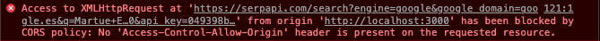

> You can read this article also in [Spanish](https://rubenr.dev/errores-cors-vite-vue).

Lately I have been working on a personal project that among other things uses a SERP service through an API. I created this project with Vite and Vue 3 to test the new features that it brings with respect to the previous version. However, along the way I am finding a series of differences that I find interesting to comment on. In today's article we will talk about CORS, Proxies with Vite, and redirects with Netlify.

## Introduction

Before going in depth, I leave a small summary of the characteristics of the project:

- Vue 3
- Vite as development / bundler server
- Axios as HTTP client
- Netlify as hosting / deployment system

To create a test project (I will not go into detail) it is necessary to execute the following commands:

```bash
yarn create vite
// framework: vue
// variant: vue-ts
cd vite-project
yarn
yarn add axios
yarn dev
```

As always, when calling the dev _URL_ (in our case localhost: 3000) the typical _Hello World_ landing appears. Already in the app.vue file itself we can add an example method to make a Get type request with Axios to our example API:

```jsx
const searchFromApi = async (query: string) => {
  return axios.get("[https://apiservice.com](https://apiservice.com)/search", {
    params: query,
  })
}

// Calls with this.searchFromApi(query)
```

However, when testing it in our development environment, the following error appears in the browser console and the request is not delivered:



<div class="text-center" style="margin: -15px 0 20px;">
  <small>CORS error example</small>
</div>

This is because our server tries to make the request to the API, but within our domain, since to make a request to a different domain, it is necessary to set special rules so that the request can _"exit"_ from our development environment. Well, this is due to CORS.

CORS problems are easy to identify; but they are not so easy to parse, since they are not possible to trace with the browser inspector. In turn, the operation of CORS is not usually well known, so looking for solutions in the different frameworks and JAMstack hosting systems becomes very complicated.

## What is a CORS error?

The acronym CORS comes from _Cross-Origin Resource Sharing_ and by the name you will get an idea of what is an error of this type appears, since we are trying to obtain information from an API. A CORS error is any error generated by the browser that is related to the loading of resources from an unknown source (hypothetically).

To be a bit more specific, all API invocations that use _XMLHttpRequest_ or _Fetch_ and web fonts that use _@ font-face_ use CORS (among others), and are susceptible to CORS errors

<div style="margin: 0 auto; max-width: 600px;">

](CORS_principle.png)

</div>

<div class="text-center" style="margin: -15px 0 20px;">
  <small>Source: https://developer.mozilla.org</small>
</div>

For security reasons, browsers restrict cross-origin requests that are started in a _script_, as is our case. To solve this, there are a series of rules that can be added both in the header of the request and in the server to give legitimacy to the request. In our case, we need to legitimize the URL [https://apiservice.com](https://apiservice.com) through a rule of type **_Access-Control-Allow-Origin_**:

```bash
Access-Control-Allow-Origin: https://apiservice.com //Allows only this URL
Access-Control-Allow-Origin: * //Allows all URLs
```

### Bonus: Preflight requests

If the browser considers that the request made may not be secure, it will automatically deliver out the **_preflight_** process, in which it will evaluate if the CORS request is secure. An example of a call with _preflight_ is any simple request of type _application/json_, something widely used in API calls. In most cases it will be solved by defining the _content-type_ of the request in the Axios options.

```jsx
const res = await axios.get('[https://apiservice.com](https://apiservice.com)/search', {
  headers: {
    'Content-Type': 'application/json;charset=UTF-8',
    'Access-Control-Allow-Origin': '*' // Could work and fix the previous problem, but not in all APIs
  },
```

Other requests in which the _preflight_ process will automatically be carried out are calls with credentials, cookies, not allowed headers, or PUT, PATCH and DELETE type requests.

## How to solve it?

To solve this problem, both Vue-cli and Vite need to set a **_Proxy_** in the Vue-cli or Vite configuration files to give legitimacy to the requests and _"tell"_ to the browser that this request has to be made off the dev server and that it is a correct and authentic request.

For an application created with vue-cli it is necessary to add a configuration similar to the one that follows in the vue.config.js file

```jsx
devServer: {
    proxy: {
      "/api": {
        ws: true,
        changeOrigin: true,
        target: "https://apiservice.com"
      }
    }
  }
```

<div class="text-center" style="margin: -15px 0 20px;">
  <small>Proxy configuration with vue-cli. Vue.config.js file</small>
</div>

For our case, in which we use Vite, the proxy configuration would be similar to the following code:

```jsx
import vue from "@vitejs/plugin-vue"
import { defineConfig } from "vite"

export default defineConfig({
  server: {
    proxy: {
      "/api": {
        target: "https://apiservice.com",
        changeOrigin: true,
        secure: false,
        rewrite: (path) => path.replace(/^\/api/, ""),
      },
    },
  },
  plugins: [vue()],
})
```

<div class="text-center" style="margin: -15px 0 20px;">
  <small>Proxy configuration with Vite. Vite.config.ts file</small>
</div>

After adding our proxy in the configuration file we can now run our development server and call our API with Axios:

```jsx
const searchFromApi = async (query: string) => {
  return axios.get("/api/search", {
    params: query,
  })
}
```

> As you can see, the API call is made using as url the reference made in the _vite.config.ts_ file and not the API url.

With these modifications in the calls and the proxy settings, we are now ready to develop our application calling any API using Axios without CORS problems.

## Netlify configuration

This does not end here. We have fixed our CORS issues to develop on our local server, but what happens when deploying our application on Netlify?

The deployment is successful and appears to be working correctly, but the API request is not working. There are also no console errors, so it is not clear what is happening. This is due to the fact that it is necessary recreate a similar process and allow the execution of the URL through a redirection rule. Otherwise it will be called from the URL from which the application is running.

In Netlify this type of modification is made through a **_\_redirects_** file. In the case of a Vue 3 application it must be in the root of the project, while in a Vite project it must be located within the **_public_** folder.

```markdown
/api/_ https://apiservice.com/:splat 200
/_ /index.html 200
/\* /index.html 404
```

> The order of the redirects is important, first the redirection rules must go to the different APIs or services and then the rest of the redirects to index.html

With this we can commit and push the file, deploy it in Netlify and enjoy our application :)

It is true that another option would be making use of Netlify functions, but it would complicate the development a lot for what we are doing, since we would have to modify the proxy to execute the function locally as well and call netlify in our Yarn or NPM command previously to Vite. In this case it does not seem necessary, but surely there are other cases in which it is a good solution.

## Resources

[https://stackoverflow.com/questions/67986822/api-from-proxy-not-working-after-deploying-on-netlify](https://stackoverflow.com/questions/67986822/api-from-proxy-not-working-after-deploying-on-netlify)

[https://medium.com/@kamry.bowman/circumventing-cors-with-netlify-functions-nodejs-65aa6ec69a65](https://medium.com/@kamry.bowman/circumventing-cors-with-netlify-functions-nodejs-65aa6ec69a65)

[https://developer.mozilla.org/es/docs/Web/HTTP/CORS](https://developer.mozilla.org/es/docs/Web/HTTP/CORS)

[https://vitejs.dev/config/#server-proxy](https://vitejs.dev/config/#server-proxy)

[https://cli.vuejs.org/config/#devserver-proxy](https://cli.vuejs.org/config/#devserver-proxy)

Photo by [Anders Jildén](https://unsplash.com/@andersjilden?utm_source=unsplash&utm_medium=referral&utm_content=creditCopyText) on [Unsplash](https://unsplash.com/s/photos/bridge?utm_source=unsplash&utm_medium=referral&utm_content=creditCopyText)
