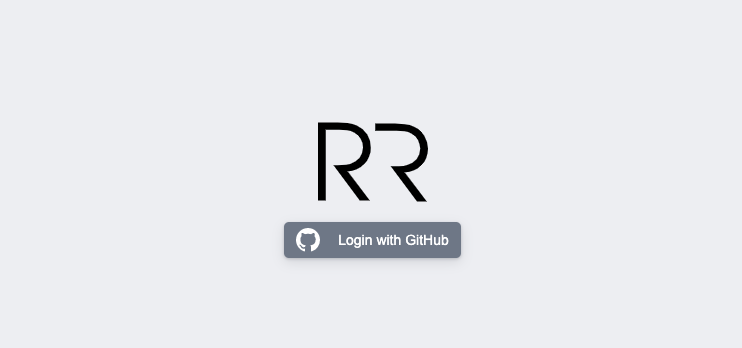
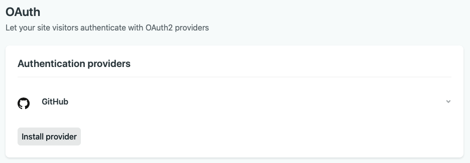

> You can read this article also in [Spanish](https://rubenr.dev/blog/gatsby-y-netlify-cms).

For a large community of developers Gatsby JS and Netlify are the perfect match when it comes to web application development with a _static site generator_ and its combination with a headless CMS. This allows a fast, efficient and very useful development for developers with little experience, since the creation of the CMS leaves the equation, simplifying the problem a lot.

In this article we will talk about Netlify CMS, its advantages and disadvantages, its configuration and the process of integration with Gatsby. Before delving into the subject it is necessary to make a brief summary about what is Gatsby and what is Netlify CMS.


<div class="text-center" style="margin: -15px 0 20px;">
  <small>NetlifyCMS File Browser View</small>
</div>

### Gatsby JS

[Gatsby](https://www.gatsbyjs.org) is a React-based static-web-framework/generator with GraphQL integration whose objective is to help developers to create web pages in an agile way. It is one of the platforms based on [JAMStack](https://www.netlify.com/jamstack/) with the most traction in recent months. It has very complete learning resources, very good documentation and a large community of developers supporting the project.

### Netlify CMS

Complementing Gatsby (or other _static site generators_), [Netlify CMS](https://www.netlifycms.org) is an Open Source content manager, extensible, based on Git storage, platform agnostic and easy to use. install whose objective is to offer a user-friendly content editing interface.

The use of Netlify CMS brings several advantages and several disadvantages to consider before carrying out this type of integration.

#### Pros

- Deployments in the same repository
- Free if Netlify is used as hosting
- Simplicity to generate specific routes
- Instant preview, although for the visualization to be correct and aesthetic it is necessary both configuration and editing of code and styles.
- Simple field configuration using a YAML file
- Possibility of creating custom fields

#### Cons

- Managing the edition locally and saved in "local" requires extra configuration.
- Project not finished, so there are quite a few issues reported on Github.
- Preview limited to the file being edited
- The integration of styles in the preview requires development
- Using a repository as a storage source makes seeing changes in the environment require a deployment

The goal is to integrate the CMS into a personal blog and store the posts in the same repository to facilitate edits and improvements by readers. Given a certain moment, it is possible to edit the code since it will not be managed by users without development knowledge, such as a news portal or a corporate website. All this makes it a viable option and that the cons of this platform are not so relevant, but that we must take into account these types of factors for other types of developments.

## Configuration

Before talking about the Netlify CMS configuration it is necessary to add the plugin to the Gatsby configuration. Using the command line, we first install the package:

```sh
npm install --save netlify-cms-app gatsby-plugin-netlify-cms
```

After this we can add the plugin to our _gatsby-config.js_ file:

```javascript
plugins: [
   {
    resolve: `gatsby-plugin-netlify-cms`,
    options: {
      modulePath: `${__dirname}/src/cms/cms.js`,
    },
  },
   ...
]
```

Como se puede ver se añade la referencia a un fichero _cms.js._ Este fichero es el utilizado para realizar modificaciones el _look and feel_ del editor como puede ser añadir estilos en el live preview del editor, cosa de la que hablaremos más adelante.

Toda la configuración de repositorio, campos, url, etc...se realiza desde un único fichero YAML alojado en la carpeta _/static/admin_ y llamado _config.yml_. Como ejemplo tomaremos el fichero de configuración de [este mismo blog](https://github.com/rubenRP/rubenr.dev/blob/master/static/admin/config.yml). Dividiremos el código por partes para realizar un análisis pormenorizado del fichero.

As you can see, the reference to a _cms.js._ file is added. This file is used to make modifications to the editor's _look and feel_, such as adding styles to the editor's live preview, which we'll talk about later.

All the repository configuration, fields, url, etc ... is done from a single YAML file hosted in the _ / static / admin_ folder and called _config.yml_. As an example we will take the configuration file of [this same blog](https://github.com/rubenRP/rubenr.dev/blob/master/static/admin/config.yml). We will divide the code into parts to carry out a detailed analysis of the file.

```yaml
backend:
  name: github
  repo: rubenRP/rubenr.dev
```

All Netlify CMS configuration must have the information of the repository under which it must operate, in this case it is github and the url is that of this blog.

```yaml
media_folder: static/assets
public_folder: assets

logo_url: https://rubenr.dev/logo-rr.svg
```

After configuring the repo, it is necessary to define where the multimedia resources will be stored and which will be the public folder (accessible) to display resources. Using the variable logo_url we can define the location of the logo that will be displayed on the Netlify CMS login splash screen. This image must be located in an accessible url, so in this case it will be located in /static/logo-rr.svg.



<div class="text-center" style="margin: -15px 0 20px;">
  <small>NetlifyCMS splash screen modified</small>
</div>

Once the basic configuration of where the resources are located is done, it is necessary to define what type of content and what fields are necessary. Netlify CMS defines it by collections.

### Collections

The collections are the organization modes that Netlify CMS has, and that can be both by files and by folders. A collection of folders represents one or more files with the same data structure and configurable fields, while a collection of files defines a data structure and configurable fields for one or more files, but these must be defined by a path. In the case of the blog we have two Blog collections, for blog posts and a simplified version for pages called Pages. In this way, we can locate files in different folders and use that location to generate the urls differently in the gatsby-node.js file.

Before delving into the collections, we are going to review the structure defined for the posts:

```markdown
---
title: "Básicos en PWA Studio: Estructura, tecnologías, instalación y elementos principales"
hero_title: "Básicos en PWA Studio"
hero_subtitle: "Estructura, tecnologías, instalación y elementos principales"
published: true
date: "2020-05-14T08:30:00.000Z"
taxonomy:
  category:
    - Articles
  tag:
    - Magento
    - PWA Studio
    - JavaScript
    - React
hero_image: pwa-basics-hero.jpg
thumbnail: pwa-basics-thumb.jpg
---
```

Given this structure of frontmatter, it is necessary to generate fields of the following types: text, _boolean_, _datetime_, image widget and list for both categories and tags.

Taking these fields into account, the Netlify CMS configuration should be as follows:

```yaml
collections:
  - name: blog
    label: Blog
    folder: content/blog
    path: "{{slug}}/index"
    media_folder: ""
    public_folder: ""
    create: true
    fields:
      - { name: title, label: Title }
      - { name: path, label: Path, required: false }
      - { name: date, label: Date, widget: date }
      - { name: published, label: Published, widget: "boolean", default: false }
      - { name: hero_title, label: Hero Title, required: false }
      - { name: hero_subtitle, label: Hero Subtitle, required: false }
      - { name: description, label: Description, required: false }
      - { name: hero_classes, label: Hero Classes, required: false }
      - {
          name: hero_image,
          label: Hero Image,
          widget: "image",
          required: false,
        }
      - { name: thumbnail, label: Thumbnail, widget: "image", required: false }
      - name: taxonomy
        label: Taxonomy
        widget: "object"
        fields:
          - { name: category, label: Category, required: false }
          - { name: tag, label: Tags, widget: "list", required: false }
      - { name: body, label: Body, widget: markdown }
```

It first defines the necessary information and settings for the collection.

- Collection name
- Label of the same
- Folder in which to host the posts
- Path of each post. In this case we generate a folder for each post in which we will save the post in Markdown and all the images. This is why the variable _{{slug}}_ is used.
- Public and resource folder, in this case the same as the one in the post.
- Flag to indicate to Netlify that it should generate both folders and files.

After this we proceed to define all the necessary fields existing in frontmatter. Netlify CMS has [a multitude of widgets to facilitate this work](https://www.netlifycms.org/docs/widgets/), and in turn offers the possibility of generating [custom widgets](https://www.netlifycms.org/docs/custom-widgets) for specific data structures.

> Gatsby offers the ability to test changes locally. Enabling the Netlify CMS module and running _gatsby develop_ in a terminal will generate an additional url to operate with Netlify CMS.

```sh
You can now view rubenr.dev in the browser.
⠀
  http://localhost:8000/
⠀
View GraphiQL, an in-browser IDE, to explore your sites data and schema
⠀
  http://localhost:8000/___graphql
⠀
Note that the development build is not optimized.
To create a production build, use gatsby build
⠀
success Building development bundle - 8.468s
 DONE  Compiled successfully in 8540ms                                                                                                                                                                                                                               11:46:43 AM
⠀
Netlify CMS is running at http://localhost:64023/admin/
```

#### Live Preview

As previously mentioned, it is also possible to add special styles to the preview, to make text editing more attractive. Both adding styles and creating custom widgets is done through the src / cms / cms.js file.

```javascript
/**
 * Any imported styles should be automatically be applied to the editor preview
 * pane thus eliminating the need to use `registerPreviewStyle` for imported
 * styles. However if you are experiencing build errors regarding importing css,
 * sass or scss into a cms module when deploying to the netlify platform, you
 * may need to follow the implementation found in netlify documentation here:
 * https://www.netlifycms.org/docs/beta-features/#raw-css-in-registerpreviewstyle
 * All of the example imports below would result in styles being applied to the
 * preview pane.
 */
import "../styles/theme.scss"
```

With this we already have everything we need to be able to manage our posts through Netlify CMS. The final step will be to upload the changes to the repository, generate an OAuth key on Github for this project, and enable the functionality through the Netlify dashboard.

In the Netlify panel it is necessary to enable the Github OAuth integration (Previously, you have to generate a key in Github). This can be done in:

**Site Settings -> Access Control -> OAuth**

<div class="columns" style="justify-content: center">
<div class="column col-8 col-sm-8">



</div>
</div>

After this we can access our brand new CMS through the url of our project _/admin_ and modify our contents from any computer without having to have a development environment, editor, etc.


<div class="text-center" style="margin: -15px 0 20px;">
  <small>NetlifyCMS editor view.</small>
</div>

As you can see, Netlify CMS offers all the power of Headless CMS but managed from the repository itself. This in many cases can be a disadvantage, but for simple projects it can be a very useful tool. What is clear is that it is not for all audiences, it requires a lot of configuration, and although it is simple, you have to have knowledge of the platform.

## References

[https://www.gatsbyjs.org/docs/sourcing-from-netlify-cms/](https://www.gatsbyjs.org/docs/sourcing-from-netlify-cms/)

[https://www.netlify.com/jamstack/](https://www.netlify.com/jamstack/)

[https://www.netlifycms.org](https://www.netlifycms.org)

[https://www.gatsbyjs.org](https://www.gatsbyjs.org)

[https://www.gatsbyjs.org/packages/gatsby-plugin-netlify-cms/](https://www.gatsbyjs.org/packages/gatsby-plugin-netlify-cms/)

Photo by [Jan Kahánek](https://unsplash.com/@honza_kahanek?utm_source=unsplash&utm_medium=referral&utm_content=creditCopyText) on [Unsplash](https://unsplash.com/s/photos/writting?utm_source=unsplash&utm_medium=referral&utm_content=creditCopyText)
