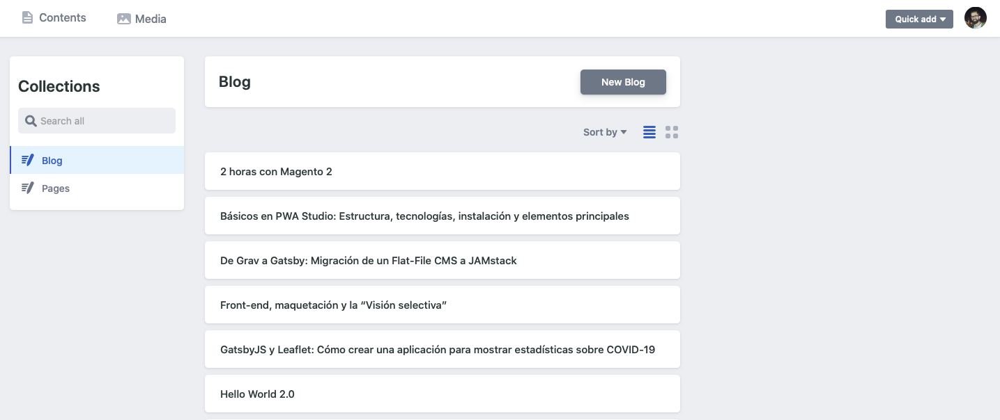
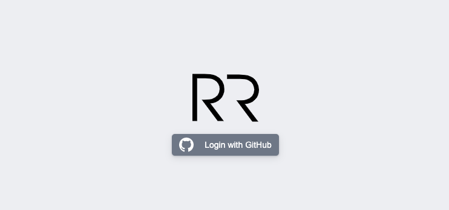
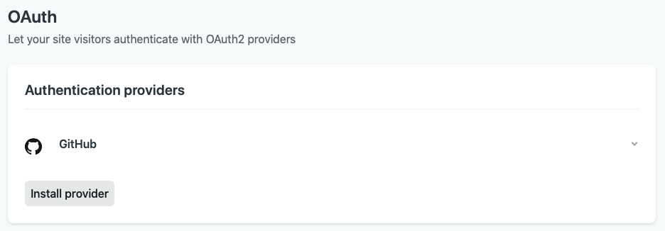
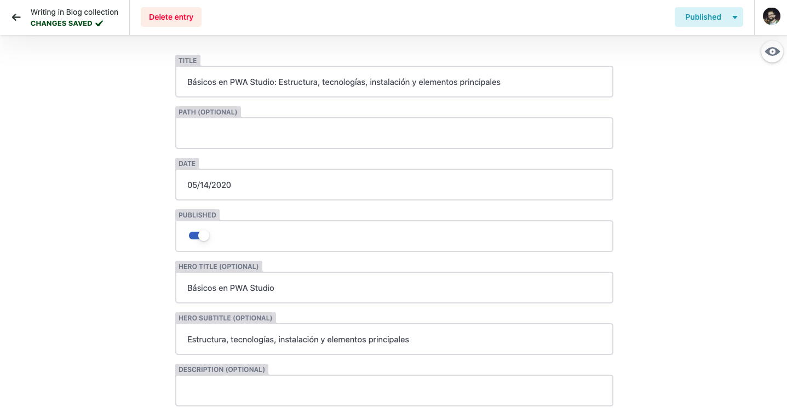

Para una gran comunidad de desarrolladores Gatsby JS y Netlify son la pareja perfecta cuando se habla del desarrollo de aplicaciones web con un _static site generator_ y su combinación con un CMS headless. Esto permite un desarrollo rápido, eficiente y muy útil para desarrolladores con poca experiencia, ya que la creación del CMS sale de la ecuación, simplificando mucho el problema.

En este artículo hablaremos de Netlify CMS, sus ventajas e inconvenientes, su configuración y el proceso de integración con Gatsby. Antes de profundizar en el tema es necesario hacer un pequeño resumen sobre qué es Gatsby y qué es Netlify CMS.



<div class="text-center" style="margin: -15px 0 20px;">
  <small>Vista del navegador de archivos de NetlifyCMS</small>
</div>

### Gatsby JS

[Gatsby](https://www.gatsbyjs.org) es un framework/generador-de-webs-estáticas basado en React con integración de GraphQL cuyo objetivo es ayudar a los desarrolladores a realizar páginas web de manera ágil. Es una de las plataformas basados en [JAMStack](https://www.netlify.com/jamstack/) con más tracción en los últimos meses. Tiene unos recursos de aprendizaje muy completos, muy buena documentación y una gran comunidad de desarrolladores apoyando el proyecto.

### Netlify CMS

Complementando Gatsby (o otros _static site generators_), [Netlify CMS](https://www.netlifycms.org) es un gestor de contenidos Open Source, extensible, basado en el almacenamiento en Git, agnóstico respecto a la plataforma y fácil de instalar cuyo objetivo es ofrecer una interfaz de edición de contenidos amigable para el usuario.

El uso de Netlify CMS trae varias ventajas y varios inconvenientes a tener en cuenta antes de llevar a cabo este tipo de integración.

#### Pros

- Despliegues en el mismo repositorio
- Gratis si se usa Netlify como hosting
- Sencillez para generar rutas específicas
- Previsualización instantánea, aunque para que la visualización sea correcta y estética es necesario tanto configuración, como edición de código y estilos.
- Configuración de campos sencilla mediante un fichero YAML
- Posibilidad de creación de campos custom

#### Contras

- Gestionar la edición en local y guardado en “local” requiere configuración extra.
- Proyecto no finalizado, por lo que hay bastantes issues reportados en Github.
- Preview limitada al fichero que se está editando
- La integración de estilos en la preview requiere desarrollo
- El usar un repositorio como fuente de almacenamiento hace que ver los cambios en el entorno requiere un despliegue

El objetivo es integrar el CMS en un blog personal y almacenar los posts en el mismo repositorio para facilitar las ediciones y mejoras por parte de los lectores. Dado cierto momento cabe la posibilidad de realizar edición de código ya que no lo va a gestionar usuarios sin conocimientos de desarrollo como puede ser un portal de noticias o una web corporativa. Todo esto hace que sea una opción viable y que los contras de esta plataforma no sean tan relevantes, pero que sí que hay que tener en cuenta este tipo de factores para otro tipo de desarrollos.

## Configuración

Antes de hablar de la configuración de Netlify CMS es necesario añadir el plugin a la configuración de Gatsby. Mediante línea de comandos instalamos primero el paquete:

```sh
npm install --save netlify-cms-app gatsby-plugin-netlify-cms
```

Tras esto podemos añadir el plugin a nuestro fichero _gatsby-config.js_:

```javascript
plugins: [
   {
    resolve: `gatsby-plugin-netlify-cms`,
    options: {
      modulePath: `${__dirname}/src/cms/cms.js`,
    },
  },
   ...
]
```

Como se puede ver se añade la referencia a un fichero _cms.js._ Este fichero es el utilizado para realizar modificaciones el _look and feel_ del editor como puede ser añadir estilos en el live preview del editor, cosa de la que hablaremos más adelante.

Toda la configuración de repositorio, campos, url, etc...se realiza desde un único fichero YAML alojado en la carpeta _/static/admin_ y llamado _config.yml_. Como ejemplo tomaremos el fichero de configuración de [este mismo blog](https://github.com/rubenRP/rubenr.dev/blob/master/static/admin/config.yml). Dividiremos el código por partes para realizar un análisis pormenorizado del fichero.

```yaml
backend:
  name: github
  repo: rubenRP/rubenr.dev
```

Toda configuración de Netlify CMS debe contar con la información del repositorio bajo el que debe operar, en este caso es github y la url es la de este blog.

```yaml
media_folder: static/assets
public_folder: assets

logo_url: https://rubenr.dev/logo-rr.svg
```

Tras la configuración del repo es necesario definir dónde se van a almacenar los recursos multimedia y cuál será la carpeta pública (accesible) para mostrar recursos. Mediante la variable logo_url podemos definir la ubicación del logo que se mostrará en el splash screen de login de Netlify CMS. Esta imagen debe ubicarse en una url accesible, por lo que en este caso se ubicará en /static/logo-rr.svg.



<div class="text-center" style="margin: -15px 0 20px;">
  <small>Splash screen de NetlifyCMS modificada</small>
</div>

Una vez realizada la configuración básica sobre dónde se ubican los recursos toca definir qué tipo de contenidos y qué campos son necesarios. Netlify CMS lo define mediante colecciones.

### Colecciones

Las colecciones son los modos de organización que tiene Netlify CMS, y que pueden ser tanto por ficheros como por carpetas. Una colección de carpetas representa uno o más ficheros con la misma estructura de datos y campos configurables, mientras que una colección de ficheros define una estructura de datos y campos configurables para uno o varios ficheros, pero estos deben estar definidos mediante una ruta. En el caso del blog contamos con dos colecciones Blog, para posts del blog y una versión simplificada para páginas llamada Pages. De este modo, podemos ubicar ficheros en diferentes carpetas y utilizar esa ubicación para generar las urls de modo diferente en el fichero gatsby-node.js.

Antes de profundizar en las colecciones vamos a revisar la estructura definida para los posts:

```markdown
---
title: "Básicos en PWA Studio: Estructura, tecnologías, instalación y elementos principales"
hero_title: "Básicos en PWA Studio"
hero_subtitle: "Estructura, tecnologías, instalación y elementos principales"
published: true
date: "2020-05-14T08:30:00.000Z"
taxonomy:
  category:
    - Articles
  tag:
    - Magento
    - PWA Studio
    - JavaScript
    - React
hero_image: pwa-basics-hero.jpg
thumbnail: pwa-basics-thumb.jpg
---
```

Dado esta estructura de frontmatter hay que generar campos de los siguientes tipos: texto, _boolean_, _datetime_, widget de imágenes y listado tanto para categorías como para tags.

Teniendo en cuenta estos campos la configuración de Netlify CMS debería ser la siguiente:

```yaml
collections:
  - name: blog
    label: Blog
    folder: content/blog
    path: "{{slug}}/index"
    media_folder: ""
    public_folder: ""
    create: true
    fields:
      - { name: title, label: Title }
      - { name: path, label: Path, required: false }
      - { name: date, label: Date, widget: date }
      - { name: published, label: Published, widget: "boolean", default: false }
      - { name: hero_title, label: Hero Title, required: false }
      - { name: hero_subtitle, label: Hero Subtitle, required: false }
      - { name: description, label: Description, required: false }
      - { name: hero_classes, label: Hero Classes, required: false }
      - {
          name: hero_image,
          label: Hero Image,
          widget: "image",
          required: false,
        }
      - { name: thumbnail, label: Thumbnail, widget: "image", required: false }
      - name: taxonomy
        label: Taxonomy
        widget: "object"
        fields:
          - { name: category, label: Category, required: false }
          - { name: tag, label: Tags, widget: "list", required: false }
      - { name: body, label: Body, widget: markdown }
```

En ella primero se define la configuración y la información necesaria de la colección.

- Nombre de la colección
- Label de la misma
- Carpeta en la que alojar los posts
- Ruta de cada post. En este caso generamos una carpeta para cada post en la que guardaremos el post en Markdown y todas las imágenes. Esta es la razón por la que se usa la variable _{{slug}}_.
- Carpeta pública y de recursos, en este caso la misma que la del post.
- Flag para indicar a Netlify que debe generar tanto carpetas como ficheros.

Tras esto se procede a definir todos los campos necesarios existentes en frontmatter. Netlify CMS cuenta con [multitud de widgets para facilitar esta labor](https://www.netlifycms.org/docs/widgets/), y a su vez ofrece la posibilidad de generar [widgets custom](https://www.netlifycms.org/docs/custom-widgets) para estructuras de datos concretas.

> Gatsby ofrece la posibilidad de probar los cambios en local. Al habilitar el módulo de Netlify CMS y ejecutar _gatsby develop_ en un terminal se generará una url adicional para operar con Netlify CMS.

```sh
You can now view rubenr.dev in the browser.
⠀
  http://localhost:8000/
⠀
View GraphiQL, an in-browser IDE, to explore your sites data and schema
⠀
  http://localhost:8000/___graphql
⠀
Note that the development build is not optimized.
To create a production build, use gatsby build
⠀
success Building development bundle - 8.468s
 DONE  Compiled successfully in 8540ms                                                                                                                                                                                                                               11:46:43 AM
⠀
Netlify CMS is running at http://localhost:64023/admin/
```

#### Live Preview

Como se comentaba previamente también cabe la posibilidad de añadir estilos especiales a la vista previa, para hacer más atractiva la edición de texto. Tanto añadir estilos como la creación de widgets custom se realiza mediante el fichero src/cms/cms.js.

```javascript
/**
 * Any imported styles should be automatically be applied to the editor preview
 * pane thus eliminating the need to use `registerPreviewStyle` for imported
 * styles. However if you are experiencing build errors regarding importing css,
 * sass or scss into a cms module when deploying to the netlify platform, you
 * may need to follow the implementation found in netlify documentation here:
 * https://www.netlifycms.org/docs/beta-features/#raw-css-in-registerpreviewstyle
 * All of the example imports below would result in styles being applied to the
 * preview pane.
 */
import "../styles/theme.scss"
```

Con esto ya tenemos todo lo necesario para poder gestionar nuestros posts mediante Netlify CMS. El paso final será subir los cambios al repositorio, generar una clave OAuth en Github para este proyecto y habilitar la funcionalidad mediante el panel de Netlify.

En el panel de Netlify es necesario habilitar la integración OAuth de Github (Previamente hay que generar una clave en Github). Esto se puede realizar en:

**Site Settings -> Access Control -> OAuth**

<div class="columns" style="justify-content: center">
<div class="column col-8 col-sm-8">



</div>
</div>

Tras esto ya podemos acceder a nuestro flamante nuevo CMS mediante la url de nuestro proyecto _/admin_ y modificar nuestros contenidos desde cualquier equipo sin tener que contar con un entorno de desarrollo, editor, etc..



<div class="text-center" style="margin: -15px 0 20px;">
  <small>Vista del editor de NetlifyCMS.</small>
</div>

Como podéis ver, Netlify CMS ofrece toda la potencia de los CMS Headless pero gestionado desde el propio repositorio. Esto en muchos casos puede ser una desventaja, pero para proyectos sencillos puede ser una herramienta muy útil. Lo que sí queda claro es que no es para todos los públicos, requiere de bastante configuración, y aunque es sencilla hay que tener conocimientos de la plataforma.

## Referencias

[https://www.gatsbyjs.org/docs/sourcing-from-netlify-cms/](https://www.gatsbyjs.org/docs/sourcing-from-netlify-cms/)

[https://www.netlify.com/jamstack/](https://www.netlify.com/jamstack/)

[https://www.netlifycms.org](https://www.netlifycms.org)

[https://www.gatsbyjs.org](https://www.gatsbyjs.org)

[https://www.gatsbyjs.org/packages/gatsby-plugin-netlify-cms/](https://www.gatsbyjs.org/packages/gatsby-plugin-netlify-cms/)

Photo by [Jan Kahánek](https://unsplash.com/@honza_kahanek?utm_source=unsplash&utm_medium=referral&utm_content=creditCopyText) on [Unsplash](https://unsplash.com/s/photos/writting?utm_source=unsplash&utm_medium=referral&utm_content=creditCopyText)
