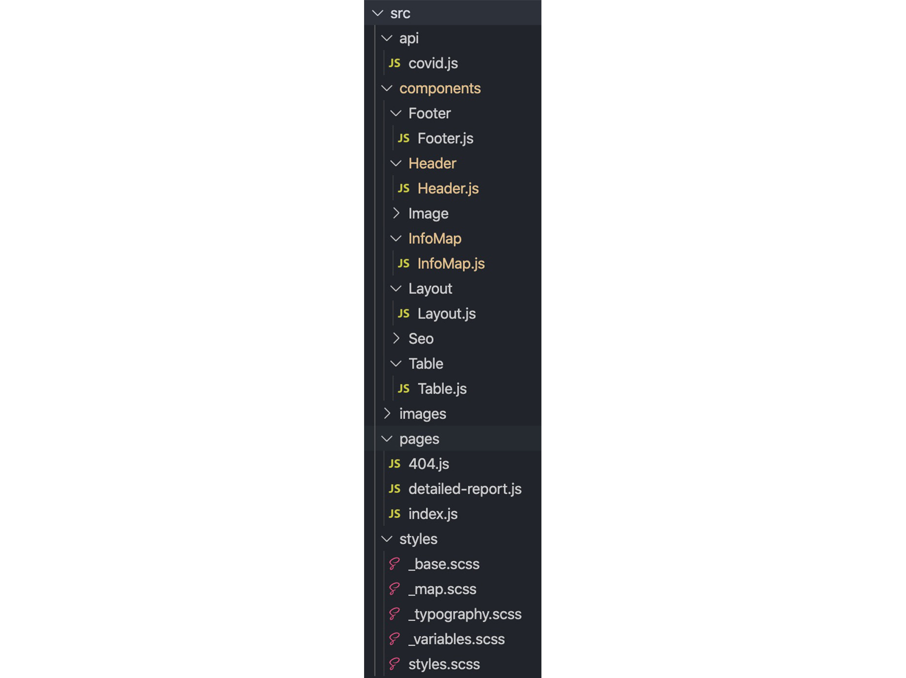

Que estamos saturados de información no es ningún secreto, pero esta saturación se pone más en relieve estos últimos días debido a la crisis del Coronavirus. Uno de los problemas de esta crisis es visualizar los datos de un modo que sea comprensible para la gente ya que estamos bombardeados de información de diferentes fuentes. Esto hace difícil tener una visión global de lo que supone el problema.

Para ayudar a comprender la magnitud de la situación han surgido varias iniciativas dentro de la comunidad de desarrolladores y científica entre la que destaca la surgida por [Postman](https://covid-19-apis.postman.com/?mkt_tok=eyJpIjoiWkRZMk0yVXdNMlZqWW1RNCIsInQiOiJ1blZxTUFmdzZxS0VKancxRHhlTTZ2RHVqOG1xb2VVR1MwN2N4V1JuenpVWUJkWTA1YW1EemZLMm1iU0diSFwvTWg2YU03V3lMRmdhZ2xsWHRvbnVFMFRGMGZ4bzNWazlxcEpzczV2S0FcL0QzWHliakFlQ3paTm5oa21pR05kZXVpIn0%3D) de publicar APIS con información actualizada sobre noticias, casos y todo lo relevante sobre el COVID-19

Al hilo de este problema se me ha ocurrido desarrollar una pequeña [aplicación](https://covid.rubenr.dev) basada en GatsbyJS, que muestre en un mapa información sobre los casos de cada país. Para la inserción del mapa dentro de Gatsby se hará uso de Leaflet, una potente librería de mapas Open Source. El resultado de este post se puede consultar tanto en la [aplicación desplegada](https://covid.rubenr.dev) como en [Github](https://github.com/rubenRP/covid-map)


## Qué es GatsbyJS

Gatsby es un framework basado en React cuyo objetivo es ayudar a los desarrolladores a realizar páginas web de manera ágil. Es uno de los frameworks basados en [JAMStack](https://www.netlify.com/jamstack/) con más tracción en los últimos meses. Tiene unos recursos de aprendizaje muy completos y debido a su arquitectura se puede desplegar en servicios de CDN/JAMStack como Netlify de modo muy sencillo (tan sencillo como enlazar a un repositorio).

## Qué es Leaflet

Leaflet es una librería Open Source para crear mapas interactivos. Es una librería muy muy potente con funcionalidades y posibilidades casi infinitas. Esto hace que el desarrollo con esta librería puede ser un poco áspero, pero para este proyecto vamos a usar el módulo [react-leaflet](https://react-leaflet.js.org) que agiliza y facilita bastante el trabajo con esta librería.

## Creación del proyecto con Gatsby

La manera más sencilla de crear un proyecto con GatsbyJS es mediante su CLI, para instalarlo se puede hacer mediante el siguiente comando de Npm:

```sh
npm install -g gatsby-cli
```

Una vez con el CLI instalado en nuestro ordenador podemos tanto crear proyectos “básicos” de Gatsby como tomando plantillas para diferentes propósitos, blogs, cms, documentación, etc...en nuestro caso utilizaremos el [starter](https://github.com/gatsbyjs/gatsby-starter-default) de gatsby, que crea un par de páginas y una home básica:

```sh
gatsby new covid-maps https://github.com/gatsbyjs/gatsby-starter-default
```

Una vez generado el proyecto es tan sencillo como descargar las dependencias y lanzar la aplicación:

```sh
cd my-default-starter/
gatsby develop
```

Perfecto, hemos lanzado la aplicación y ya podemos acceder a ella mediante la URL [http://localhost:8000](http://localhost:8000). También se podrá acceder a la consola de GraphQL mediante la URL [http://localhost:8000/\_\_\_graphql](http://localhost:8000/___graphql).


## Configuración de Gatsby

Ya tenemos el proyecto en marcha, ahora solo será necesario añadir las dependencias para el desarrollo de la aplicación: SASS para la compilación de estilos, el módulo de React de Leaflet, Axios para interactuar con la API de datos del COVID-19 y Bootstrap para realizar una maquetación básica pero responsive y resultona.

```sh
yarn add gatsby-plugin-react-leaflet gatsby-plugin-sass leaflet node-sass react-bootstrap react-leaflet bootstrap axios
```

Una vez instaladas todas las dependencias será necesario añadir estas dependencias al flujo de trabajo de Gatsby. Para Gatsby, este tipo de configuraciones se realizan desde el fichero gatsby-config.js y se hacen en forma de plugins. A su vez, en este fichero se puede añadir la descripción del proyecto, nombre o otro tipo de configuraciones generales. Este modo de trabajar evita realizar modificaciones en la configuración de Webpack o realizando desarrollos extra para la compilación de recursos o mostrar información. En nuestro caso, solo será necesario añadir los plugins de Leaflet, de SASS y la dependencia de Bootstrap en la compilación de SASS, quedando la sección de plugins del fichero del siguiente modo:

```js
 plugins: [
   `gatsby-plugin-react-helmet`,
   {
     resolve: `gatsby-source-filesystem`,
     options: {
       name: `images`,
       path: `${__dirname}/src/images`,
     },
   },
   `gatsby-transformer-sharp`,
   `gatsby-plugin-sharp`,
   {
     resolve: `gatsby-plugin-manifest`,
     options: {
       name: `gatsby-starter-default`,
       short_name: `starter`,
       start_url: `/`,
       display: `minimal-ui`,
       icon: `src/images/ico-world.png`,
     },
   },
   "gatsby-plugin-react-leaflet",
   {
     resolve: `gatsby-plugin-sass`,
     options: {
       includePaths: ["src/scss/bootstrap"],
     },
   },
 ],
```

## Estructura de ficheros



En la imagen previa se puede ver la distribución de fichero que hemos utilizado para este proyecto. En Gatsby, la gestión de creación de páginas se realiza de la manera más sencilla: Añadiendo un componente de React dentro de la carpeta pages. Su URL corresponderá con su nombre. A su vez se ha añadido tanto una página 404 (viene por defecto en el template _Gatsby Starter_) y una llamada detailed-report (muestra la tabla completa con la información de todos los países que informan sobre casos del COVID-19, pero no incidiremos en este post).

Respecto a los componentes, nos centraremos en dos: el componente sin estado Table, que renderiza el objeto que devuelve la llamada a la API y Maps, un objeto con estado que carga el componente Map de Leaflet dados unos parámetros y una serie de puntos (Marks) para las coordenadas de cada país con la información sobre los casos del mismo.

## Gestión de la API

Para obtener los datos sobre los afectados sobre el COVID-19 utilizaremos una de las APIS listadas en el [centro de recursos sobre el COVID-19 de Postman](https://covid-19-apis.postman.com), en concreto la API [NovelCOVID](https://documenter.getpostman.com/view/8854915/SzS7R6uu?version=latest).

Para interactuar con ella utilizaremos Axios. De momento, y al tratarse de un ejemplo sencillo, en el fichero [API/covid.js](https://github.com/rubenRP/covid-map/blob/master/src/api/covid.js) solo llamaremos al endpoint que retorna la información de todos los países y la ordenaremos por el número de casos:

```js
const axios = require("axios")

const get = endpoint => axios.get(`https://corona.lmao.ninja${endpoint}`)

export async function getAllCountriesInfo() {
  try {
    let res = await get("/countries?sort=cases")
    return res.data
  } catch (error) {
    console.log(error)
  }
}
```

La petición devuelve un json con un array de objetos con la información de todos los países. Un ejemplo con un solo país sería el siguiente:

```json
[
  {
    "country": "USA",
    "countryInfo": {
      "_id": 840,
      "country": "USA",
      "iso2": "US",
      "iso3": "USA",
      "lat": 38,
      "long": -97,
      "flag": "https://raw.githubusercontent.com/NovelCOVID/API/master/assets/flags/us.png"
    },
    "cases": 131403,
    "todayCases": 7825,
    "deaths": 2329,
    "todayDeaths": 108,
    "recovered": 4378,
    "active": 124696,
    "critical": 2948,
    "casesPerOneMillion": 397,
    "deathsPerOneMillion": 7,
    "updated": 1585499881120
  }
]
```

## Módulo Maps

El componente [InfoMap.js](https://github.com/rubenRP/covid-map/blob/master/src/components/InfoMap/InfoMap.js) es el componente que más enjundia tiene de todo el proyecto. Como el componente tabla, también es un componente sin estado.

```js
import React, { Component } from "react"
import L from "leaflet"

import { Map, Marker, Popup, TileLayer } from "react-leaflet"

const LOCATION = {
  lat: 40.416775,
  lng: -3.70379,
}
const CENTER = [LOCATION.lat, LOCATION.lng]
const DEFAULT_ZOOM = 2
```

En el encabezado del componente llamamos a los componentes de react-leaflet y a L de leaflet, ya que modificaremos el marker para mostrar en lugar de una chincheta, una bola roja con tamaño variable en función de los casos. A su vez, seteamos la localización en la que deseamos que se centre el mapa y el zoom que aplicaremos.

```js
class InfoMap extends Component {
 render() {
   const mapSettings = {
     center: CENTER,
     defaultBaseMap: "OpenStreetMap",
     zoom: DEFAULT_ZOOM,
   }

   const MarkerList = () => {
     const { countries } = this.props
     const maxCases = countries.length ? countries[0].cases : 0
     return countries.map(country => {
       const iconSize =
         60 * (country.cases / maxCases) <= 10
           ? 10
           : 60 * (country.cases / maxCases)
       const markerIcon = L.divIcon({
         className: "icon",
         html: `<span class="icon-point"></span>`,
         iconSize: iconSize,
       })

       return (
         <Marker
           key={country.countryInfo._id}
           position={[country.countryInfo.lat, country.countryInfo.long]}
           icon={markerIcon}
         >
           <Popup>
             <div className="card">
               
               <div className="card-body">
                 <h5 className="card-title">{country.country}</h5>
                 <p className="card-text">
                   <div>
                     <strong>Total cases:</strong> {country.cases}
                   </div>
                   <div>
                     <strong>Active cases:</strong> {country.active}
                   </div>
                   <div>
                     <strong>Deaths:</strong> {country.deaths}
                   </div>
                   <div>
                     <strong>Recovered:</strong> {country.recovered}
                   </div>
                 </p>
               </div>
             </div>
           </Popup>
         </Marker>
       )
     })
   }
```

Para crear todos los Markers del mapa recorremos el array que obtenemos como _prop_ y para cada país definimos un icono de tamaño variable y generamos el contenido del popup que se muestra al hacer _click_ en cada marker.

```js
return (
  <Map {...mapSettings}>
    <TileLayer
      url="https://{s}.tile.openstreetmap.org/{z}/{x}/{y}.png"
      attribution='&copy; <a href="http://osm.org/copyright">OpenStreetMap</a> contributors'
    />
    <MarkerList />
  </Map>
)
```

Finalmente renderizamos el mapa con los settings fijados previamente y el listado de markers generados en la función _MarkerList_.

## Punto de entrada de la aplicación: index.js

Para terminar este pequeño tutorial queda por describir la página/componente principal del proyecto en Gatsby: [index.js](https://github.com/rubenRP/covid-map/blob/master/src/pages/index.js)

```js
import React, { Component } from "react"

import { getAllCountriesInfo } from "../api/covid"

import Layout from "../components/Layout/Layout"
import SEO from "../components/Seo/Seo"
import InfoMap from "../components/InfoMap/InfoMap"
import Table from "../components/Table/Table"

class IndexPage extends Component {
  constructor(props) {
    super(props)
    this.state = {
      countries: [],
    }
  }
  componentDidMount = () => {
    getAllCountriesInfo().then(countries => {
      this.setState({ countries: countries })
    })
  }
  render() {
    const { countries } = this.state
    return (
      <Layout>
        <SEO title="Home" />
        <h1 className="mt-5 mb-4">COVID19 Updated Info</h1>
        <div className="row">
          <div className="col-12">
            <InfoMap countries={countries} />
          </div>
          <div className="col-12 mt-5">
            <h2>Top 15 infected countries overview</h2>
            <Table countries={countries.slice(0, 15)} />
          </div>
        </div>
      </Layout>
    )
  }
}
export default IndexPage
```

Como se puede ver, es un componente muy sencillo, con estado, en el que se llama a la api y se pintan tanto el componente del mapa como el de la tabla (mostrando sólo los primeros 15 casos). A su vez y para dar estilos se llama a las clases de Bootstrap importadas previamente.


¡Listo! Ya tenemos una aplicación muy básica desarrollada en GatsbyJS con mapas de Leaflet y llamadas a una API mediante Axios. Solo queda desplegar usando Netlify, pero aunque el despliegue es sencillísimo ese tema da para otro artículo. En cualquier caso, podéis echar un vistazo al resultado en la web [https://covid.rubenr.dev](https://covid.rubenr.dev).

Todo el código generado para esta aplicación se puede consultar en [https://github.com/rubenRP/covid-map](https://github.com/rubenRP/covid-map). PR y comentarios siempre son bienvenidos :)

## Recursos

[https://react-leaflet.js.org](https://react-leaflet.js.org)

[https://covid-19-apis.postman.com/](https://covid-19-apis.postman.com/)

[https://github.com/gatsbyjs/gatsby-starter-default](https://github.com/gatsbyjs/gatsby-starter-default)

[https://www.netlify.com/jamstack/](https://www.netlify.com/jamstack/)

[https://leafletjs.com](https://leafletjs.com)

Photo by [Brian McGowan](https://unsplash.com/@sushioutlaw?utm_source=unsplash&utm_medium=referral&utm_content=creditCopyText) on [Unsplash](https://unsplash.com/s/photos/covid-19?utm_source=unsplash&utm_medium=referral&utm_content=creditCopyText)
