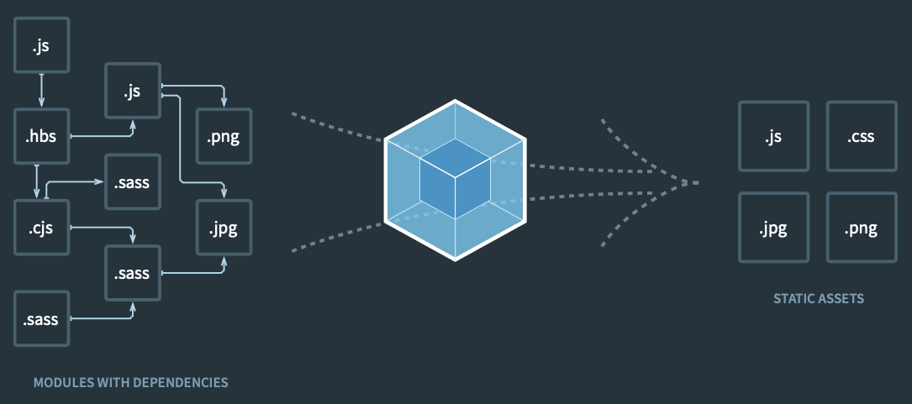

Vivimos en un tiempo en el que Javascript domina la web y la arquitectura basada en microservicios se tiene como un estándar. React, Vue y Angular tienen una posición dominante y creciente en la escena, sin embargo hay un gran porcentaje del desarrollo front que se realiza a la "antigua usanza" y es necesario encapsular funcionalidades un una librería para que puedan importarse en un HTML.

Un ejemplo típico es la importación de un widget, librería o un servicio de terceros en una web existente. La opción más sencilla y básica es crear un fichero .js y desarrollar ahí, exponiendo el contenido haciendo uso de [UMD](https://github.com/umdjs/umd) si fuera necesario. Esta sería una aproximación un poco limitada para librerías con funcionalidades complejas. En la actualidad existen herramientas que permiten la generación de librerías mientras se desarrolla en un _stack_ js moderno. Es el caso de [Webpack](https://webpack.js.org), una herramienta usada por casi todos, y sobre todo en React pero muy desconocida ya que trabaja "tras la cortina".

En este artículo vamos a crear un _boilerplate_ de desarrollo que genera un sencillo widget usando Webpack. Antes de continuar vamos a añadir un poco de contexto sobre qué es Webpack y qué requisitos necesitamos cubrir.

## ¿Qué es Webpack?



<div class="text-center" style="margin: -15px 0 20px;">
  <small>Concepto del funcionamiento de Webpack</small>
</div>

[Webpack](https://webpack.js.org) es una librería que nos permite gestionar recursos para hacer múltiples tareas: desde empaquetar código para su puesta en producción, la compilación de ficheros [SASS](https://sass-lang.com) o [LESS](http://lesscss.org), la generación de un servidor de desarrollo con hot reloading, o la creación de un bundle, minificación entre otros. Para ello se sirve de reglas en las que una vez reconocido el patrón de archivos o código realizar las modificaciones pertinentes. Esto se hace mediante los loaders. Hay loaders para compilar código SASS, para minificar html, para ejecutar [Babel](https://babeljs.io), etc...

Uno de los problemas de Webpack que puede hacer tantas cosas que abruma un poco, y es cierto: puede hacer muchísimas cosas, pero para este caso vamos a simplificar y vamos a generar un script que:

- Genere una librería en JS que pueda importarse en ficheros HTML e invocarse desde el mismo
- Compile archivos SCSS
- Utilice ES6
- Contenga ESlint y Prettier
- Esté aislado del hipotético desarrollo en el que se importe

Con estas condiciones fijadas ya estamos listos para comenzar a desarrollar el _boilerplate_.

## Creación de la aplicación

Una vez creado el proyecto con _npm init_ instalamos Webpack y sus dependencias:

```bash
npm install webpack@4 webpack-cli@3 webpack-dev-server html-webpack-plugin mini-css-extract-plugin html-loader sass-loader babel-loader css-loader node-sass --save-dev
```

> Se ha instalado la versión 4 de Webpack, debido a que existe una incompatibilidad con el loader de SASS y al no ser el objeto de este artículo no se ha invertido mucho tiempo en investigarlo.

Tras esto instalamos los plugins Babel, Prettier y sus respectivos plugins:

```bash
npm install babel babel-eslint eslint-config-airbnb eslint-config-prettier eslint-plugin-import eslint-plugin-jsx-a11y @babel/preset-env @babel/plugin-transform-runtime @babel/plugin-proposal-object-rest-spread @babel/plugin-syntax-dynamic-import prettier --save-dev
```

## Configuración de ESLint y Babel

Dado que hemos importado las configuraciones de AirBnb para desarrollar con sus reglas de estilo es necesario importarlas a ESLint mediante el fichero [.eslintrc.js](https://github.com/rubenRP/js-widget-boilerplate/blob/master/.eslintrc.js)

```jsx
module.exports = {
  parser: "babel-eslint",
  extends: ["airbnb", "prettier"],
  plugins: ["react", "jsx-a11y", "import"],
  env: {
    browser: true,
  },
}
```

Hacemos lo propio con el fichero de configuraciones de Babel [babel.config.js](https://github.com/rubenRP/js-widget-boilerplate/blob/master/babel.config.js):

```jsx
module.exports = {
  presets: ["@babel/preset-env"],
  plugins: [
    "@babel/plugin-transform-runtime",
    "@babel/plugin-proposal-object-rest-spread",
    "@babel/plugin-syntax-dynamic-import",
  ],
}
```

## Configuración de Webpack

Toda la acción de Webpack ocurre en el fichero **[webpack.config.js](https://github.com/rubenRP/js-widget-boilerplate/blob/master/webpack.config.js)**. En este fichero se fija tanto el origen y destino de datos como las transformaciones que se deben aplicar. Vamos a ir desgranando el fichero paso a paso:

```jsx
const webpack = require("webpack");
const HtmlWebpackPlugin = require("html-webpack-plugin");
const MiniCssExtractPlugin = require("mini-css-extract-plugin");

const SRC_DIR = `${__dirname}/src`;
const DIST_DIR = `${__dirname}/dist`;

const libraryName = "test-widget";

module.exports = {
  entry: [`${SRC_DIR}/index.js`],
  output: {
    path: DIST_DIR,
    publicPath: "",
    filename: `${libraryName}.js`
  },
```

En la parte inicial del archivo definimos el origen de datos y el destino. Nosotros pretendemos que la librería se genere a partir del fichero _index.js_ que se encuentra en la carpeta _/src_ y se aloje en la carpeta _/dist._ A su vez definimos el nombre del fichero resultante que en este caso será _/dist/test-widget.js._

```jsx
module: {
    rules: [
      {
        test: /\.(js|jsx)$/,
        exclude: /node_modules/,
        use: {
          loader: "babel-loader"
        }
      },
      {
        test: /\.(scss|sass|css)$/,
        exclude: /node_modules/,
        loaders: [
          MiniCssExtractPlugin.loader,
          {
            loader: "css-loader",
            options: {
              modules: true,
              sourceMap: true,
              importLoaders: 1,
              localIdentName: "[local]"
            }
          },
          "sass-loader"
        ]
      },
      {
        test: /\.(html)$/,
        exclude: /node_modules/,
        use: {
          loader: "html-loader",
          options: { minimize: false }
        }
      }
    ]
  },
```

Una vez definidas las rutas se pasa a gestionar las reglas de generación. en nuestro caso hay 3:

- Usar el loader de Babel para ficheros .js o .jsx
- Para ficheros sass, scss y css usar el loader de CSS para generar el [SourceMap](https://www.html5rocks.com/en/tutorials/developertools/sourcemaps/) y a su vez pasar el loader de SASS
- Para los ficheros html usar el loader de html y evitar la minificación del contenido.

Todos los loaders están documentados en la [página de Webpack](https://v4.webpack.js.org/concepts/loaders/) con información acerca de su funcionamiento y sus opciones de configuración.

```jsx
resolve: {
    extensions: ["*", ".js", ".jsx"]
  },
  plugins: [
    new webpack.HotModuleReplacementPlugin(),
    new HtmlWebpackPlugin({
      template: `${SRC_DIR}/index.html`,
      filename: "./index.html"
    }),
    new MiniCssExtractPlugin({
      filename: "[name].css",
      chunkFilename: "[id].css"
    })
  ],
  devServer: {
    contentBase: DIST_DIR,
    hot: true,
    port: 3000
  }
```

Para finalizar se añaden tanto los plugins para el _hot reloading_ como la información relativa al servidor de desarrollo.

Con toda esta información ya estamos preparados para añadir las tareas en el fichero _package.json_ y comenzar el desarrollo.

```json
"scripts": {
    "build": "webpack -p --mode production",
    "start": "webpack-dev-server --config ./webpack.config.js --mode development",
    "test": "jest --env=jsdom"
  },
```

## Desarrollo del widget

Para probar el funcionamiento vamos a crear un fichero sencillo [index.js](https://github.com/rubenRP/js-widget-boilerplate/blob/master/src/index.js) que suponga el punto de entrada de la aplicación y que tome como origen un div sobre el que se generará el contenido dinámicamente. Para ello creamos una función _init_, que será la que se llame al incrustar el widget:

```jsx
import Widget from "./components/widget"
import styles from "./styles/main.scss"
;(function(window) {
  console.log("Widget initialized!")
  const _init = params => {
    Widget.generate(params, model)
  }
  window.Widget = {
    init: _init,
  }
})(window)
```

Este archivo llama al componente [widget.js](https://github.com/rubenRP/js-widget-boilerplate/blob/master/src/components/widget.js), que se encarga de tomar el un parámetro que servida de _container_ y añadir el contenido pertinente allí:

```jsx
const Widget = {}

/**
 *
 *
 * @param {*} { container = "" }
 * @param {*} [model={}]
 */
Widget.generate = ({ container = "" }) => {
  const widgetInner = document.createElement("div")
  let widgetContainer = document.getElementById(container)

  widgetInner.setAttribute("class", "module-inner")
  widgetInner.innerHTML = "<h1>Widget created</h1>"

  if (!widgetContainer) {
    ;[widgetContainer] = document.getElementsByTagName("body")
  }

  widgetContainer.appendChild(widgetInner)
}

export default Widget
```

Con esto, y una vez llamado al comando npm run build podemos crear un fichero html llamando a la librería:

```html
<!DOCTYPE html>
<html>
  <head>
    <meta charset="utf-8" />
    <title>Test Widget</title>
    <script src="test-widget.js" type="text/javascript"></script>
  </head>
  <body>
    <div id="widget-container"></div>
    <script type="text/javascript">
      Widget.init({
        container: "widget-container",
      })
    </script>
  </body>
</html>
```

Esto es todo. Podéis ver el resultado final de este pequeño _boilerplate_ en [este repositorio de Github](https://github.com/rubenRP/js-widget-boilerplate).

## Referencias

[https://v4.webpack.js.org](https://v4.webpack.js.org/)

[https://v4.webpack.js.org/concepts/loaders/](https://v4.webpack.js.org/concepts/loaders/)

Photo by [CHUTTERSNAP](https://unsplash.com/@chuttersnap?utm_source=unsplash&utm_medium=referral&utm_content=creditCopyText) on [Unsplash](https://unsplash.com/s/photos/shipping?utm_source=unsplash&utm_medium=referral&utm_content=creditCopyText)
