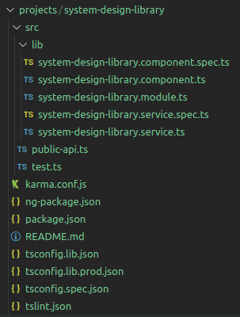
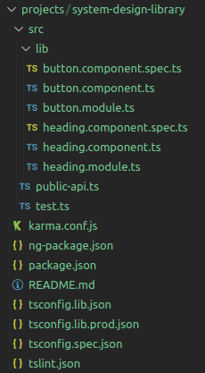
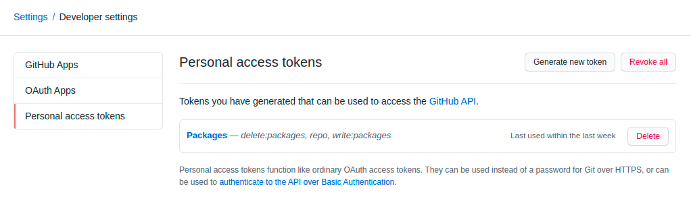
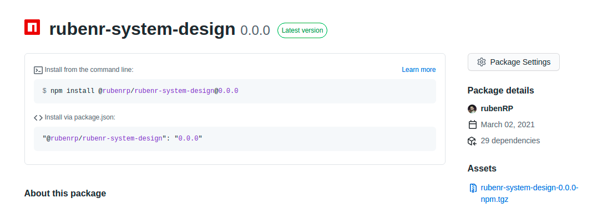

> You can read this article also in [English](https://rubenr.dev/en/blog/github-packages).

El uso la paquetización es habitual en proyectos Open Source a través de [NPM](https://www.npmjs.com/), pero también existe la posibilidad de publicar tus propios paquetes privados para que puedan ser consumidos por tus aplicaciones sin exponerlos a todo el mundo. Estamos acostumbrados a trabajar en proyectos cerrados y monorepo (o como mínimo aprender lenguajes y frameworks bajo este modo de funcionamiento), pero cada vez es más habitual dividir las funcionalidades de un proyecto por ámbito en paquetes, sobre todo en lo relacionado al desarrollo de sistemas de diseño y componentes.

En este artículo profundizaremos en la publicación de paquetes de [Angular](https://angular.io/) usando [GitHub Packages.](https://github.com/features/packages)

# Introducción

Imaginemos que estamos desarrollando un [sistema de diseño](https://designhandbook.mendesaltaren.com/design-systems) o una librería de componentes en Angular y la queremos utilizar en varios proyectos. La idea inicial es crear un proyecto en Angular, desarrollar los componentes, hacer un build y publicarlo en NPM. Esto tiene múltiples inconvenientes y varias limitaciones:

- Estás exponiendo el código completo del proyecto
- Estás publicando una aplicación formada por componentes, no los componentes en sí, con los problemas de _performance_ derivados.
- NPM es un repositorio de paquetes público, por lo que todo el mundo tendría acceso a dicho paquete.

Para evitar estos problemas podemos hacer uso de dos herramientas de Angular y GitHub: _Angular Libraries_ y _Github Packages_.

## Angular Libraries

Una [Angular Library](https://angular.io/guide/libraries) o biblioteca Angular es un proyecto Angular que se diferencia de una aplicación en que no se puede ejecutar por sí sola. Una biblioteca debe importarse y usarse en una aplicación.

## GitHub Packages

GitHub packages es una característica de GitHub que permite publicar y consumir paquetes haciendo uso de la infraestructura de GitHub, con múltiples integraciones entre las que se encuentra NPM, la que requerimos para nuestro proyecto de prueba.

# Creación del proyecto

Para crear el proyecto será necesario contar con el [CLI de Angular](https://cli.angular.io/), por lo que en caso de no estar instalado se instalará mediante el siguiente comando.

```bash
npm install -g @angular/cli
```

Procedemos a crear el proyecto. Es **importante añadir** el flag _-create-application=false_ para que no genere la estructura de ficheros estandar de Angular aunque se puede no añadir para probar "al vuelo" el comportamiento de los componentes que formarán parte del sistema de diseño.

```bash
// Project creation
ng new rubenr-system-design --create-application=false
cd rubenr-system-design

// Library creation
ng generate library system-design-library
```

Este último comando generará una estructura de ficheros similar a la de una aplicación estandar de Angular con la diferencia de que el contenido colgará de la carpeta projects y que la librería en sí cuenta con sus ficheros propios de configuración y su _package.json_



<div class="text-center" style="margin: -15px 0 20px;">
  <small>Estructura de ficheros de la librería creada.</small>
</div>

## Configuración del proyecto

Dado que queremos que nuestra librería tenga múltiples componentes vamos a renombrar el componente, módulo y servicio creado y vamos a crear otro más resultando la siguiente estructura de ficheros:



<div class="text-center" style="margin: -15px 0 20px;">
  <small>Estructura de ficheros tras la creación y renombrado de componentes.</small>
</div>

El contenido de los componentes Button y Heading es el siguiente:

```jsx
import { Component, ElementRef, EventEmitter, Input, OnInit, Output } from '@angular/core';

@Component({
  selector: 'rr-button',
  template: `
    <button [ngClass]="classMap" (click)="onClick.emit($event)">{{text}}</button>
  `,
  styles: [
  ]
})
export class ButtonComponent implements OnInit {

  @Input() color: "primary" | "success" | "danger" = "primary";
  @Input() disabled: boolean = false;
  @Input() outline: boolean = false;
  @Input() text = "";
  @Output() onClick = new EventEmitter<any>();

  rootClass: string;
  classMap: any;

  constructor(private elementRef: ElementRef) {}
  ngOnInit() {
      this.rootClass = this.elementRef.nativeElement.tagName.toLowerCase();
      this.updateClassMap();
  }
  updateClassMap() {
      this.classMap = {
          [`${this.rootClass}`]: true,
          [`${this.rootClass}--${this.color}`]: !!this.color,
          [`${this.rootClass}--outline`]: this.outline,
          [`${this.rootClass}--disabled`]: this.disabled,
      };
  }
  ngOnChanges() {
      this.updateClassMap();
  }
}
```

```jsx
import { Component, Input, OnInit } from "@angular/core"

@Component({
  selector: "rr-heading",
  template: ` <h1>{{ text }}</h1> `,
  styles: [],
})
export class HeadingComponent implements OnInit {
  @Input() text = ""
}
```

> **Es importante modificar las llamadas al componente** ButtonComponent y HeadingComponent en los módulos _button.module_ y _heading.module_.

Una vez modificadas las llamadas al componente se deberán exponer los componentes y módulos para que al hacer la _build_, se puedan consumir los componentes. Este export se suele realizar en el documento **public-api.ts**

```jsx
/*
 * Public API Surface of system-design-library
 */

export * from "./lib/button.component"
export * from "./lib/button.module"
export * from "./lib/heading.component"
export * from "./lib/heading.module"
```

## Publicación

Antes de publicar necesitamos **crear un personal token** en nuestra cuenta de GitHub. Esto se puede hacer en _Settings / Developer settings / personal access tokens_. El nuevo token creado debe tener permisos de escritura y eliminación de paquetes como se puede ver en la siguiente imagen:



<div class="text-center" style="margin: -15px 0 20px;">
  <small>Detalle de la creación del token personal en GitHub.</small>
</div>

Una vez creado el token, lo copiamos y lo añadimos en el fichero **_.npmrc_** de nuestro proyecto de Angular, que si no existe, debemos crearlo.

```jsx
@rubenrp:registry=https://npm.pkg.github.com/
//npm.pkg.github.com/:_authToken=<TOKEN_ID>
```

Tras esto es necesario realizar modificaciones. Por una parte modificar el nombre del paquete de modo que corresponda con **@vendor/package-name**. A su vez hay que añadir el repositorio donde se publicará el paquete y el origen del registro de GitHub tal y como se ve en el siguiente ejemplo:

```json
{
  "name": "@rubenrp/rubenr-system-design",
  "version": "0.0.0",
  "repository": {
    "type": "git",
    "url": "https://github.com/rubenRP/angular-package-test.git"
  },
  "publishConfig": {
    "registry": "https://npm.pkg.github.com"
  }
}
```

> **Importante**: no debe existir la propiedad private: true en el fichero package.json. Esta propiedad evita la publicación de paquetes tanto públicos como privados.

Con esto ya podemos generar el build y publicarlo desde el terminal.

```json
ng build
// Version for production use
ng build --prod
npm publish
```

Si todo ha ido bien nos podemos dirigir al repositorio donde hemos publicado el paquete y veremos que se ha generado una nueva release.



# Consumo del paquete

Para poder consumir nuestros componentes del sistema de diseño recien creado es necesario añadir o crear un fichero ._npmrc_ en nuestro proyecto de angular con la información referente al repositorio de referencia del paquete.

```jsx
@rubenrp:registry=https://npm.pkg.github.com/
```

Para terminar procedemos a instalar nuestro paquete

```jsx
npm install @rubenrp/rubenr-system-design
```

¡Listo! Ya podemos hacer uso de los componentes creados en nuestro sistema de diseño llamando a su selector.

```jsx
<rr-button></rr-button>
<rr-heading><rr-heading>
```

# Referencias

[https://designhandbook.mendesaltaren.com/design-systems](https://designhandbook.mendesaltaren.com/design-systems)

[https://angular.io/guide/libraries](https://angular.io/guide/libraries)

[https://github.com/features/packages](https://github.com/features/packages)

[https://docs.github.com/en/packages/guides/configuring-npm-for-use-with-github-packages](https://docs.github.com/en/packages/guides/configuring-npm-for-use-with-github-packages)

<span>Photo by <a href="https://unsplash.com/@isagalvezphoto?utm_source=unsplash&amp;utm_medium=referral&amp;utm_content=creditCopyText">Isabel Galvez</a> on <a href="https://unsplash.com/s/photos/octopus?utm_source=unsplash&amp;utm_medium=referral&amp;utm_content=creditCopyText">Unsplash</a></span>
