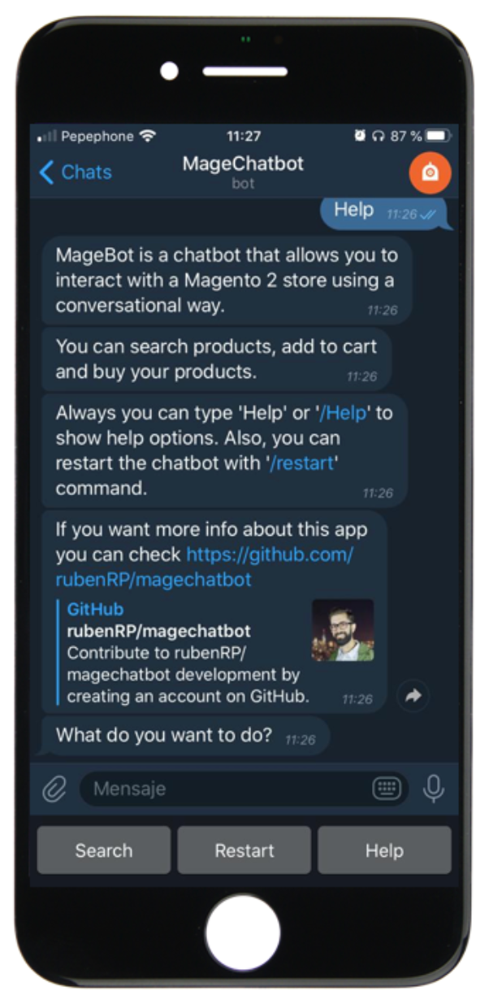
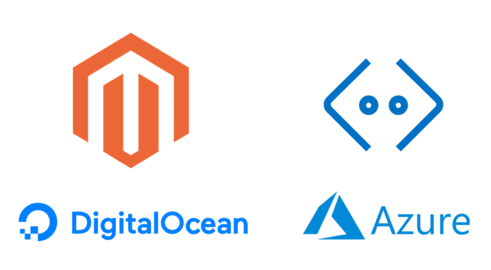
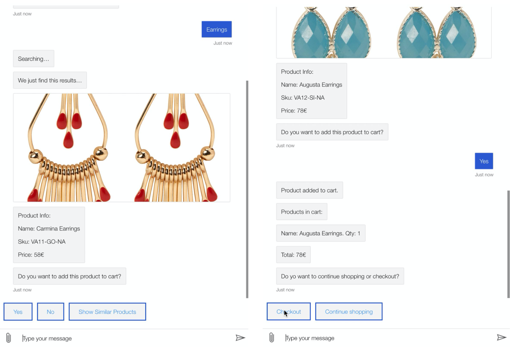

Quería hablar un poco de MageChatbot, un proyecto que me ha tenido entretenido unos cuantos meses y quería contar un poquito de que trata. Es un MVP, no está completo y por supuesto hay muchas cosas que mejorar, pero puede poner los cimientos de soluciones que puedan ser de utilidad para la comunidad y abre un modo de interactuar con ecommerce que no es habitual :)

## ¿Qué es MageChatbot?

  

    MageChatbot es un chatbot que permite interactuar con una tienda de comercio
    electrónico. Este chatbot permite, mediante una conversación, simplificar la
    navegación del usuario por el abanico de páginas y acciones, listar
    productos y permitir su compra. Para ello, utiliza la API del Magento2 para
    interactuar con el ecommerce como si las acciones fueran realizadas desde el
    storefront del ecommerce.
  

  

  

Es el resultado del mi TFM _[Desarrollo de nuevos modelos de interacción usuario-ecommerce](http://hdl.handle.net/10609/106526)_.

## ¿En qué consiste el proyecto?

El proyecto describe y desarrolla un MVP para analizar la viabilidad de este tipo de estrategia para interactuar con sistemas complejos como un ecommerce, ya que la complejidad de este tipo de plataformas puede generar problemas que dificultan la navegación para los usuarios. El uso de un chatbot con menú y botones simplifica la navegación y permite a su vez realizar las acciones necesarias para interactuar con un ecommerce.
El proyecto pretende generar un MVP que cumpla con los siguientes objetivos:

### Objetivos

- Desarrollar un chatbot que pueda conectarse a una plataforma de ecommerce (Magento 2) vía API.
- Desarrollar un sistema en el chatbot mediante el cual se permita realizar un flujo básico de compra
  en el ecommerce (búsqueda, detalle, carrito y compra).

## Tecnologías

Magechatbot está construido en JavaScript sobre Microsoft Bot Framework, una plataforma para el desarrollo de experiencias conversacionales con IA. Su gran potencia permite crear implementaciones de tipo empresarial. Este framework se puede integrar en aplicaciones con NodeJS de un modo sencillo para construir aplicaciones que cuenten con sistemas de conversación o IA. Esta plataforma permite exportar y desplegar de manera sencilla en los entornos en la nube de Microsoft Azure. A su vez, la exportación del chatbot a clientes de mensajería se realiza mediante el asistente de Microsoft Azure.

(Esta parte es obviable para los desarrolladores de Magento 2)
La plataforma de comercio electrónico compatible con MageChatbot es Magento 2. Magento es una plataforma de ecommerce open-source con la que se pueden llevar a cabo todo tipo de proyectos relacionados con la venta en internet. Está basado en PHP e incorpora como tecnologías en el desarrollo HTML, CSS, LESS, Javascript, RequireJS, KnockoutJS, Grunt y Composer. Esta plataforma permite de un modo flexible crear desde sencillas tiendas administrables desde su backend a complejos marketplaces con múltiples integraciones para grandes empresas y desplegar en servicios VPS como por ejemplo Digital Ocean.

## ¿Qué permite hacer?

Desde MageChatbot se pueden buscar productos sobre el catálogo de Magento 2, añadir al carrito, buscar productos similares y finalmente, realizar la compra de los mismos.

## Pasos futuros

Una de las decisiones tomadas para el desarrollo del proyecto ha sido que este fuera Open Source, esta es una de las razones por las que ha sido publicado en GitHub. De este modo, la comunidad de desarrolladores puede usar el código, modificarlo o contribuir para hacerlo más completo. Dentro de los pasos a seguir, destacan los siguientes:

- Incorporación de envío en el proceso de checkout.
- Incorporación de métodos de pago al proceso de checkout.
- Posibilitar los envíos a diferentes países en el checkout.
- Añadir la posibilidad de tener diferentes direcciones de envío y facturación
- Visualización y selección de productos configurables (productos con talla y color, por ejemplo).
- Acceso como usuario registrado
- Incorporación de funcionalidad de favoritos (_wishlist_).

Otra posible rama para el desarrollo del proyecto es la incorporación de sistemas para el reconocimiento natural del lenguaje. Para este propósito Microsoft provee de sistemas para complementar y evolucionar el bot mediante LUIS(_LanguageUnderstanding_). Esos sistemas pueden proveer de un valor añadido a la aplicación y una mejora en la usabilidad de la misma.

## ¿Puedo contribuir?

Sí, MageChatbot es un proyecto Open Source. Si eres desarrollador y quieres usarlo, modificarlo o ayudar a construir más funcionalidades, hacer una plataforma más robusta, ayudar en la documentación o reportar errores lo puedes hacer desde su página de Github [http://github.com/rubenrp/magechatbot](http://github.com/rubenrp/magechatbot)

Si quieres más información acerca de la arquitectura, decisiones tomadas o el alcande del proyecto general puedes echar un vistazo a la memoria [AQUÍ](http://hdl.handle.net/10609/106526).

Si tienes alguna pregunta o sugerencia sobre el chatbot puedes comentarme lo que sea en [Twitter](https://twitter.com/_rubenR) y responderé lo antes posible :)
