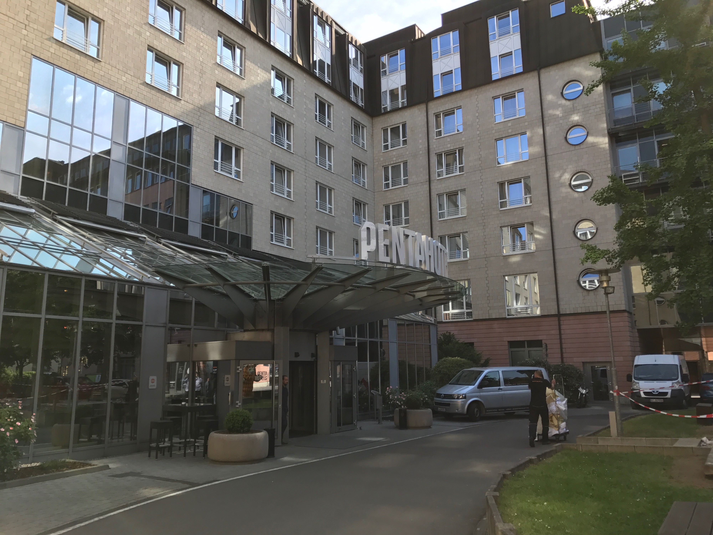
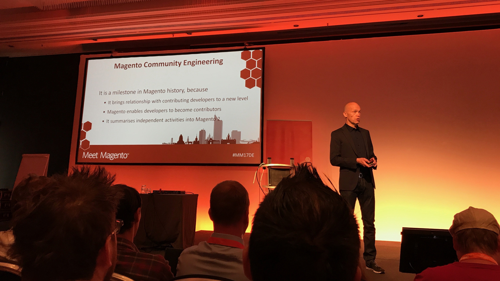
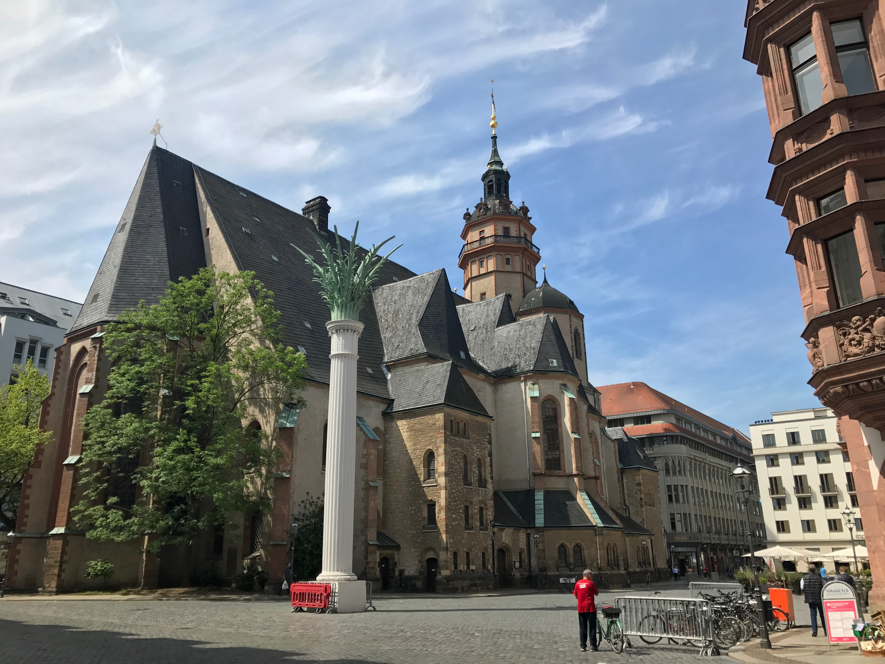
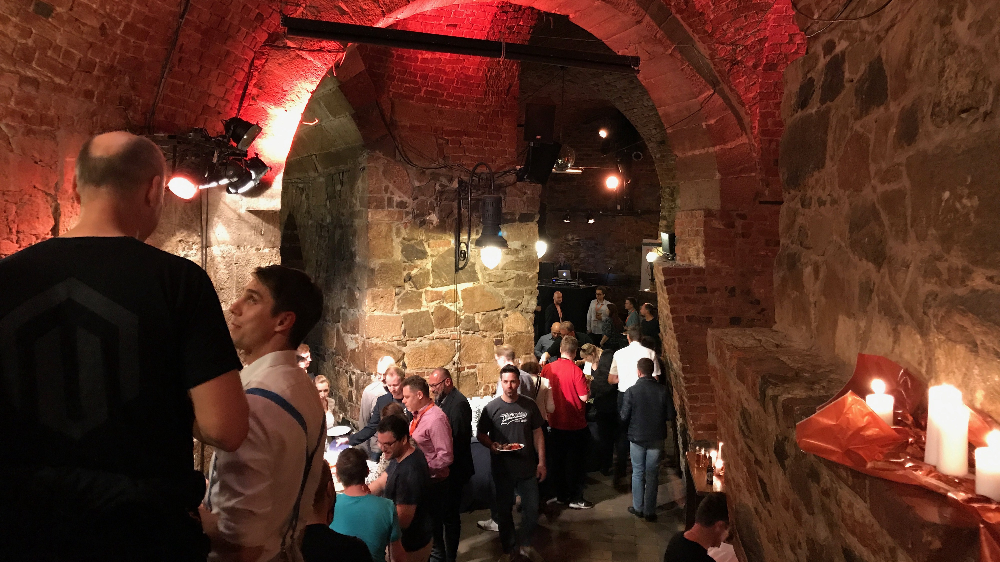
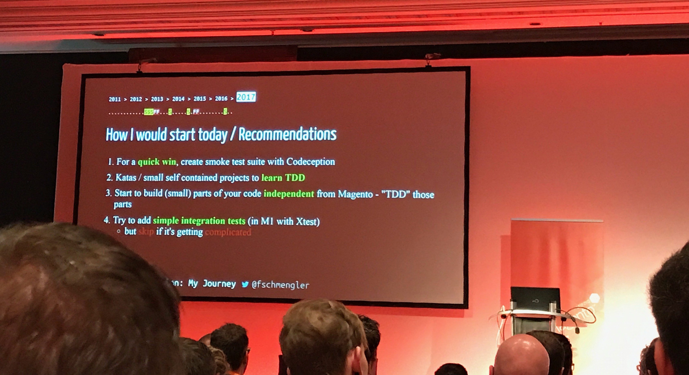

**Crónica del evento**

**Meet Magento Deutschland 2017** tuvo lugar el pasado 22 y 23 de mayo, evento al que tuve el placer de poder a asistir junto con Carlos Aguilar, content manager e Ignacio Riesco, CEO de Interactiv4. Tras unos días revisando las notas del evento os cuento un pequeño resumen de lo acontecido en Leipzig y de mis impresiones en el evento.

Después de reunirnos en el aeropuerto, tomar el avión y 4 horas de viaje (retraso incluído) llegamos a la capital alemana en la que hacía un tiempo primaveral. Estupendo clima para disfrutar de las autovías alemanas durante 250 kilómetros, ya que el evento se celebraba en Leipzig. Todo un lujo (y los coches también) :)

## Día 1

El evento se celebró en el **Pentahotel Leipzig**, un agradable hotel con salas de conferencias, pero que no tenía zonas para los expositores por lo que los pasillos estaban bastante concurridos entre la gente, los stands y la zona de catering para los coffee breaks. Estaba todo un poco apelotonado, pero las salas de conferencias estaban muy bien, y tenían un **hilo musical espectacular**. No digo que es lo que más me gustó, pero casi.

Tras recibir las acreditaciones nos acomodamos en la sala principal para escuchar la charla de apertura de la mano de **Thomas Goletz**. En su charla nos habló sobre la proyección de Meet Magento en el mundo, la simbiosis con Magento y los próximos eventos que tendrán lugar en todo el mundo. En este momento me di cuenta de dos cosas: Casi todas las charlas serán en alemán y **Magento 2 se dice Magento zwei**.

Después de la apertura **Paul Boisvert**, VP of Product Management detalló el roadmap de Magento 2 para los próximos meses. El dato más importante de la charla fue el lanzamiento de magento 2.2: último cuarto del año, y traerá muchísimas mejoras de rendimiento y fixes.

Como no había charlas en inglés hasta después de comer me dispuse a dar un paseo por el centro de la ciudad. Algo que me molestó un poco ya que no tenía mucho sentido solapar las charlas en inglés y espaciar las de alemán, pero que luego agradecí porque Leipzig es una ciudad bastante bonita con un centro histórico muy pintoresco. Y el día no invitaba a quedarse en el hotel.

A la vuelta pude disfrutar de la charla de **David Lambauer**, en la que detalló los pasos a seguir para crear correctamente un módulo en Magento 2. Tips muy útiles para los que somos frontenders pero metemos las manos en todos los sitios.

Para terminar la jornada de charlas (en inglés) tocó el turno de **Sandro Wagner**, la única charla en inglés hablando de frontend por lo que estaba muy interesado. En su charla utilizó la metáfora de la película *El bueno, el feo y el malo *para mostrar las cosas que en su opinión Magento tenía que mejorar a nivel de frontend. Un punto de vista muy interesante para una charla en la que estaba de acuerdo al 100%, pero de la que esperaba algo un poco más técnico.

### Aftershow party

La jornada terminó con la fiesta del evento que se celebró en **Moritzbastei**, una sala-discoteca-recinto subterráneo muy bonito en la que pudimos disfrutar de un buffet riquísimo y gran variedad de cervezas. Tras unos bailes de rigor, cantar _Despacito_ y perder la cuenta de las cervezas creímos conveniente que lo mejor era descansar. El día siguiente tocaba una jornada repleta de charlas en inglés.

## Día 2

El día comenzó como suelen comenzar los días en los que te acabas tomando un par de cervezas de más: con una resaca bávara. En cualquier caso las ganas de ver las charlas técnicas eran bastante grandes, ya que hoy sí siempre había al menos una charla en inglés en alguna sala

Tras la entrega de los Meet Magento Awards 2017 en los que el premio gordo recayó en Original Bootcamp como mejor tienda online, **Mark Lavelle** (CEO de Magento Commerce) abrió la mañana de charlas en el escenario principal detallando los retos futuros de la plataforma y su presencia actual. Augura un dominio de la plataforma en la que la omnicanalidad será la base de cualquier comercio con presencia online.

Después de hacer un pequeño break a media mañana comenzó el plato fuerte para los desarrolladores: Las charlas más técnicas. **Fabian Schmengler **de integer_net hizo una retrospectiva de su carrera como informático a través de su trabajo e interés en el testing de código. A lo largo de la charla indicó varios tips para comenzar con el TDD en Magento y en Magento 2, lo cual fue de mucha utilidad.

A continuación **Fabrizio Branca**, de AOE explicó en su charla cómo super-escalar un e-commerce usando Magento. Desde mi punto de vista fue **la charla más completa y detallada de todo el evento**. Un espectáculo. Como contrapartida (o no) en su solución para escalar un e-commerce es que el ámbito de uso de Magento en todo el sistema es el cálculo de precios, gestión de carrito, checkout y poco más.

](1*CN6old1tHoXFzIxhOpuVRg.jpeg)_Fuente [Marcel Hauri](undefined)_

Luego le tocó el turno a **Anna Völkl**. En su charla dio tips para mejorar la seguridad de tu tienda con Magento. En ella mezcló tanto consejos básicos para tener la tienda en orden (que siempre está bien recordar) como otros más específicos y técnicos. Para finalizar nos puso deberes para convertirnos poco a poco en expertos en seguridad. No está mal el reto ;)

Para terminar la jornada de charlas (y el evento para nosotros) tuve una gran dicotomía. A la misma hora se solapaban las charlas de **David Manners**y de **Vinai Kopp**. Me consta que no fui el único con la misma dicotomía por lo que la organización debería tenerlo en cuenta para los próximos eventos. En mi caso me decidí por David, en la que nos habló de cómo interactuar con Magento 2 utilizando una API. Una charla muy interesante en la que, al igual que Fabrizio demostró que sacar cierta lógica de Magento podía ser muy útil.

Ya solo nos quedó volver a Berlín para dar un breve paseo por el centro y tomar el avión de vuelta. Ha sido un gran evento en el que una vez más se ha visto que lo que hace grande a la plataforma es su comunidad.

Como conclusión salgo del evento con un **sabor agridulce,** ya que aunque el esfuerzo de reunir tantos grandes desarrolladores en un evento ha tenido que ser increíble, no se ha profundizado mucho en el contenido y la línea general del evento ha sido basarlo en la comercialización y promoción de la plataforma. Algo que creo que no tiene mucho sentido cuando la gran mayoría de los asistentes ya trabajamos a diario con ella. **Es como si Meet Magento se hubiera convertido en un evento que gira alrededor del mundo en el que los conferenciantes van de país en país contando lo mismo** y arriesgando poco, lo cual hace perder desde mi punto de vista el sentido al evento. **Sí, hablan los mejores desarrolladores pero no cuentan sus “mejores trucos”, se guardan un as en la manga.**

Nos vemos en próximos eventos! :)

Auf Wiedersehen!

_Este post ha sido publicado originalmente para el [blog de Interactiv4](http://www.interactiv4.com/blog-es/cronica-de-meet-magento-alemania-mm17de-por-ruben-rodriguez/)_
