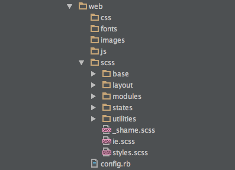

Una de las novedades de Magento 2 es la introducción de un compilador LESS que modifica el flujo de trabajo bastante respecto a M1. En M2 los ficheros resultantes de la compilación se guardan en una carpeta de estáticos situada en “pub/static/frontend/paquete/tema/css”.

Los ficheros resultantes de la compilación son:

- styles-m.css. Estilos CSS para móviles.

- styles-l.css. Estilos CSS para dispositivos ancho superior a 768px

- print.css. Estilos CSS para impresión.

Se puede dar la situación por la cual no queramos utilizar esta estructura, ya que preferimos utilizar **SASS**, **Gulp**, **Compass** o preferimos utilizar un workflow de maquetación diferente. Estoy bastante a favor, ya que desde mi punto de vista la estructura del tema “blank” de Magento 2 está pensada para realizar pequeñas o medianas modificaciones en el tema, no para ponerlo patas arriba. Y ponerlo patas arriba supone tener una estructura más dinámica, y con un framework por debajo (Bootstrap, Foundation…) que te permita realizar muchos cambios en poco tiempo.

**¿Qué haría yo?**

Modificar la estructura de la carpeta web de modo que se ajuste a nuestras preferencias, posicionar los CSS resultantes en la carpeta web/css y sustituir las llamadas a los CSS en el head del documento. Así que…allá vamos!

### Modificar la estructura de CSS

Un posible ejemplo sería la disposición arriba descrita, en la que la carpeta web contiene los css resultantes, imágenes, fuentes y otra carpeta llamada scss en la que compilan los ficheros .sass o .scss

### Actualizando el layout

Si el .css resultante de la compilación se llamara “mis-estilos.css” habría que añadirlo mediante una actualización de las cabeceras en el layout. También puede ser necesario eliminar los ficheros por defecto si lo que deseamos es unos estilos totálmente nuevos y un output limpio y sin sobreescrituras. Para ello copiamos en nuestro tema el fichero *default_head_blocks.xml *y realizamos las siguientes modificaciones:

    <?xml version="1.0"?>
    <page xmlns:xsi="http://www.w3.org/2001/XMLSchema-instance" xsi:noNamespaceSchemaLocation="urn:magento:framework:View/Layout/etc/page_configuration.xsd">
        <head>
            <remove src="css/styles-l.css" />
            <remove src="css/styles-m.css" />
            <remove src="css/print.css" />
            <css src="css/mis-estilos.css" />
        </head>
    </page>

Tras esto sólo queda **limpiar la caché, **los estáticos localizados en _“pub/static/frontend/paquete/tema/_” y refrescar la página.

Listo!

Fuentes: [Magento 2 dev docs](http://devdocs.magento.com/guides/v2.0/frontend-dev-guide/css-topics/css-overview.html), [Sassy Starter](https://github.com/minamarkham/sassy-starter)
