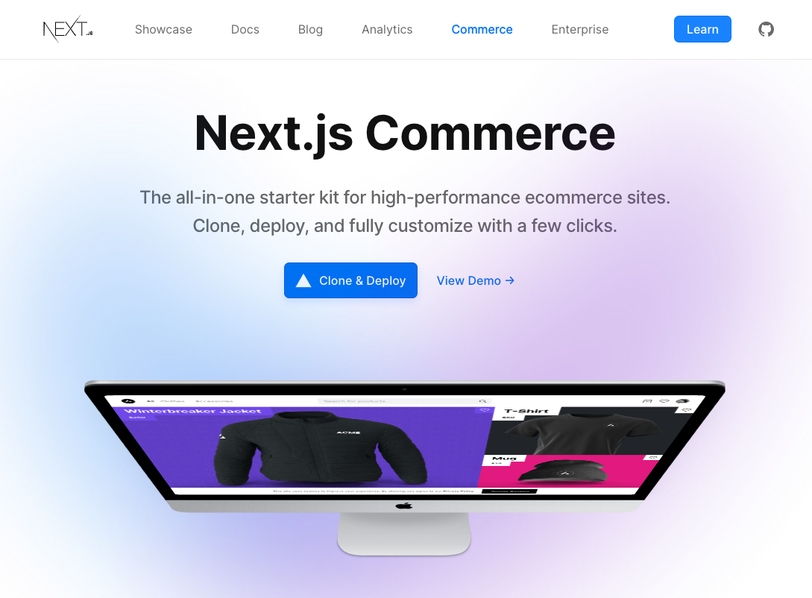
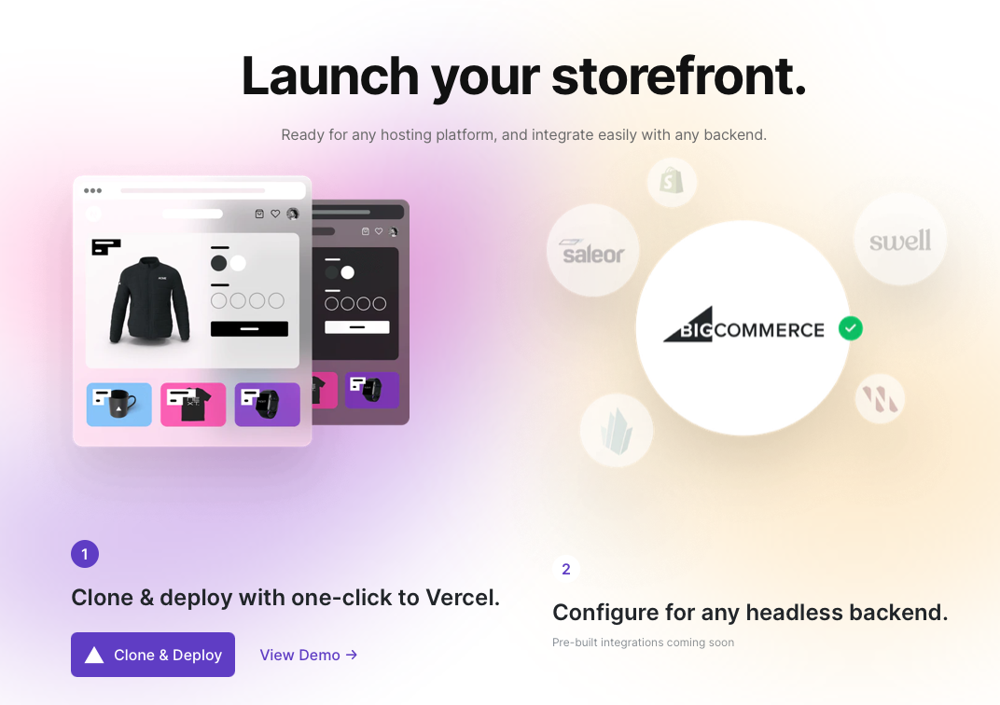
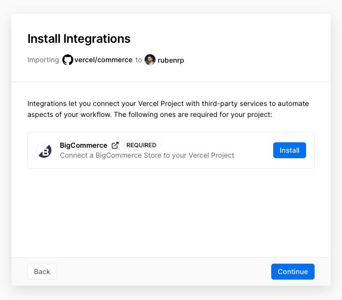
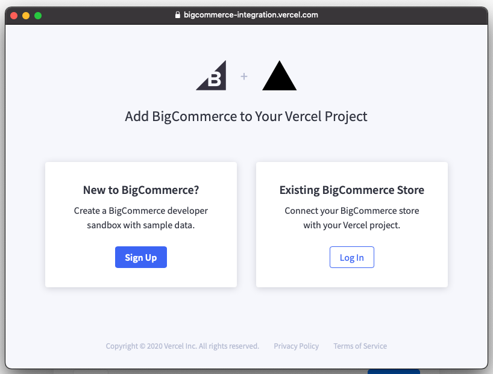
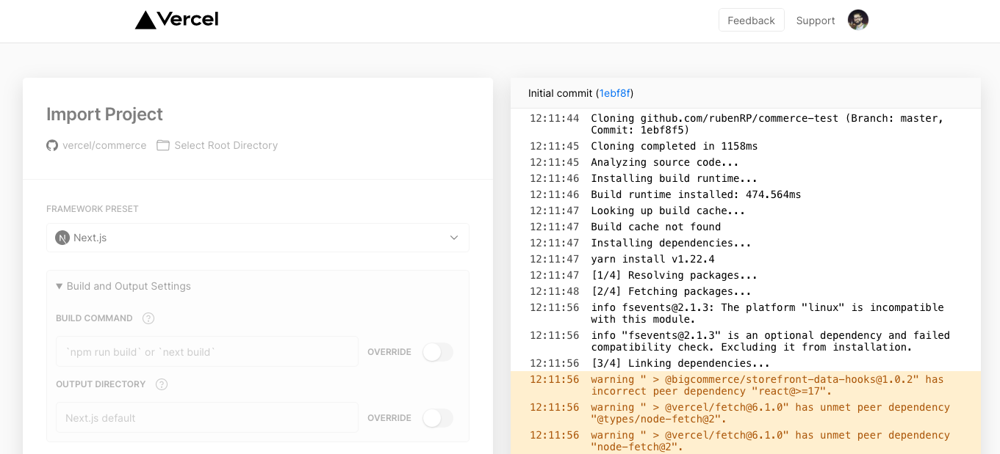
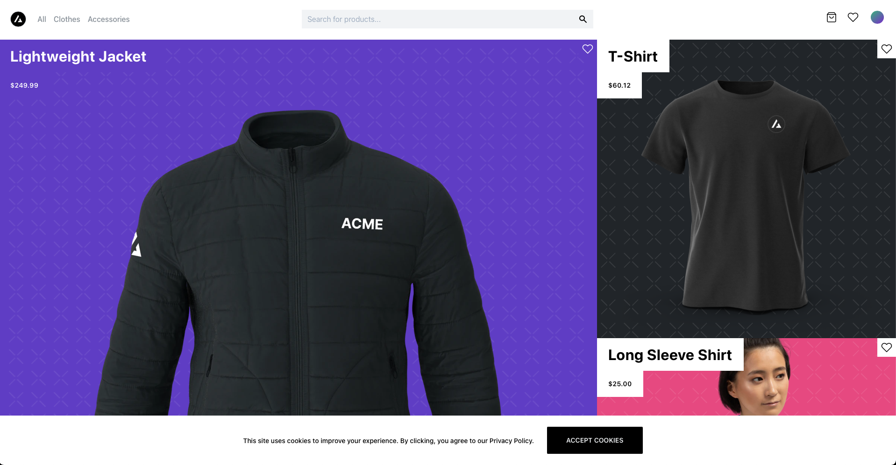
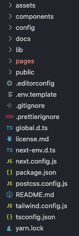
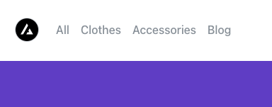
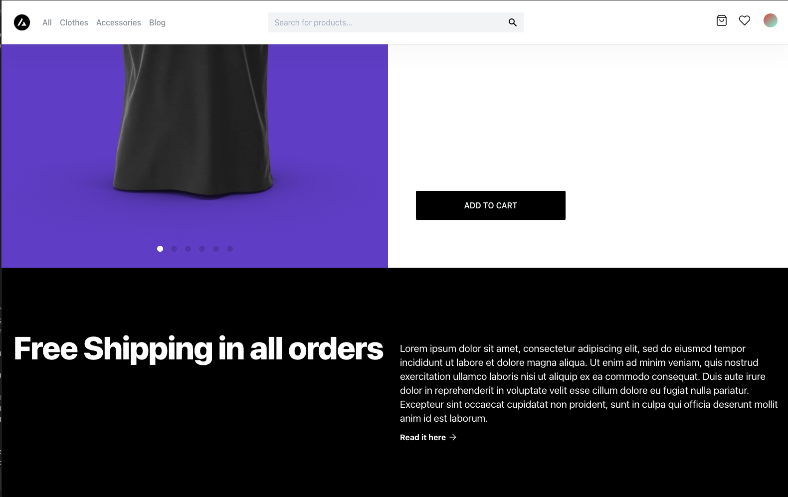

El pasado 27 de octubre tuvo lugar la [Next.js conf](https://nextjs.org/conf/stage/n), la conferencia global de [Next.js](https://nextjs.org) para la comunidad de desarrolladores, este año en formato online e interactivo. En la keynote inaugural del evento, organizado por [Vercel](https://vercel.com/) (creadores de Next.js y anteriormente conocidos como Zeit) se presentó la nueva plataforma [Commerce](https://nextjs.org/commerce), una solución basada en Next.js para poder integrarse con diferentes backends de ecommerce y que promete velocidad, facilidad de desarrollo y todas las ventajas asociadas a desarrollar con Next.js como internacionalización, analítica, optimización de imágenes.



<div class="text-center" style="margin: -15px 0 20px;">
  <small>Homepage de Next.js Commerce</small>
</div>

La idea de este proyecto es utilizar Next.js y todas sus ventajas como base del desarrollo de una gran plataforma de ecommerce, fácil de desarrollar, con múltiples integraciones, escalable, accesible y capáz de contribuir en el desarrollo tanto de tiendas sencillas como de grandes marketplaces con la misma base de conocimiento. Para empezar han realizado integración con BigCommerce mediante un módulo para Next.js, aunque prometen trabajar en integraciones con otras plataformas y servicios como Shopify, Magento, Wordpress, etc...

El reto es titánico, pero parece que tienen las cosas bastante claras y una comunidad activa y dispuesta a colaborar. He pasado unos días creando un entorno, jugando con la plataforma y desarrollando algún componente e incluso haciendo algún PR.

En este artículo vamos a resumir el proceso de creación, instalación y desarrollo de un proyecto con Next.js commerce y varios ejemplos sencillos de desarrollo.

## Tecnologías

- Next.js (of course) con TypeScript
- Tailwind
- BigCommerce Data Hooks para interactuar con BigCommerce
- CSS Modules para modificar estilos específicos

## Instalación

La manera más sencilla de instalar esta plataforma es haciendo uso de Vercel como servicio de alojamiento y CI ya que mediante este sistema puedes clonar el repositorio automáticamente, desplegar y setear las variables de entorno para conectar con el backend. Para ello nos dirigimos a la [home del proyecto](https://nextjs.org/commerce) y hacemos click en "Clone & Deploy".

<div class="columns" style="justify-content: center">
<div class="column col-8 col-sm-8">



</div>
</div>

Se iniciará un formulario de registro de usuarios nuevos si no tienes creada una cuenta y una vez creada se pasará a la configuración del proyecto, en la que se instalará la integración con BigCommerce. Si no tienes una cuenta o proyecto en BigCommerce previamente se creará una nueva.

<div class="columns" style="justify-content: center">
<div class="column col-4 col-sm-8">



</div>
<div class="column col-4 col-sm-8">



</div>
</div>

Tras un par de clics más para confirmar el repositorio que se creará se confirmará y comenzará el despliegue. Más sencillo imposible.

<div class="columns" style="justify-content: center">
<div class="column col-8 col-sm-8">



</div>
</div>

<div class="text-center" style="margin: -15px 0 20px;">
  <small>Ejemplo del despliegue de Next.js en Vercel</small>
</div>

Tras finalizar el despliegue Vercel nos muestra la URL del storefront. No vamos a indagar en las posibilidades de Vercel que son infinitas y nos vamos a centrar en la estructura del código y qué se puede hacer en un par de horas trabajando con Next.js Commerce.

<div class="columns" style="justify-content: center">
<div class="column col-8 col-sm-8">



</div>
</div>

<div class="text-center" style="margin: -15px 0 20px;">
  <small>Home de Next.js Commerce</small>
</div>

## Estructura

Para comenzar a trabajar con el código nos clonamos el repositorio creado previamente y lo abrimos con VSCode. A simple vista podemos ver lo siguiente:

<div class="columns" style="justify-content: center">
<div class="column col-8 col-sm-8">



</div>
</div>

- **Assets**: Carpeta con archivos CSS y sobreescrituras de Tailwind.
- **Components**: Carpeta con todos los componentes del proyecto, organizadas por ámbito (cart, product, wishlist, common) y genéricos (ui). Muy fácil ubicar los componentes con esta estructura.
- **Config**: Carpeta con configuraciones generales del sitio, por defecto sólo hay un JSON con configuraciones de SEO.
- **Lib**: Carpeta con funciones genéricas del sitio como búsqueda, obtención del slug o hooks utilizados en componentes y páginas. Es un poco cajón desastre pero tampoco son muchos ficheros por lo que es algo manejable.
- **Pages**: Carpeta con las páginas de la tienda (blog, cart, search). Cabe destacar las siguientes páginas:
  - [slug].tsx. Página encargada de resolver las url de página de producto y cargar el componente ProductView.
  - [...pages].tsx. Página genérica para resolver cualquier url en Next.

A su vez también hay varios ficheros destacados:

- **next.config.js**: Fichero con configuraciones generales de Next.js, como dominios, idiomas y enrutado. En este fichero es donde se definen las url de búsqueda y la redirección a la API de BigCommerce para el proceso de checkout.

## Desarrollo

Para poder desarrollar en local primero es necesario descargar todos los paquetes usando Yarn.

```bash
cd ecommerce-test
yarn
```

Una vez descargados todos los paquetes hay que enlazar el repositorio con Vercel para descargar las variables de entorno y poder conectarnos con BigCommerce en local, para ello instalamos Vercel CLI si no lo habíamos hecho antes y linkamos el proyecto

```bash
npm i -g vercel
vercel link
vercel env pull .env.local
```

Tras esto ya estamos listos para poder desarrollar en local nuestra tienda 🙂

```bash
yarn dev
```

> Nota: La integración con BigCommerce no funciona de manera fluida, yo he tenido que crear 2 proyectos en Vercel y linkar las variables de entorno 2 veces para que se conectara con BigCommerce, ya que la API devolvía 401 constantemente.

### Cambio de Logo

Para modificar el logo es necesario dirigirse a _components/ui/Logo/Logo.tsx_. En este módulo podemos ver como se ha añadido el logo en SVG insertando el código directamente, pero podemos reutilizar el componente añadiendo nuestro propio logo en SVG o bien insertando una imagen concreta y guardándola en la carpeta public.

```jsx
const Logo = ({ className = "", ...props }) => (
  <svg
    xmlns="http://www.w3.org/2000/svg"
    width="32"
    height="32"
    viewBox="0 0 481.11 345"
    className={className}
    {...props}
  >
    <title>logo-rr</title>
    <path
      d="M653.3,252.55a102.77,102.77,0,0,1-7.73,40.16,98.49,98.49,0,0,1-21.35,32A103.87,103.87,0,0,1,592,346.49,116.66,116.66,0,0,1,552,356l95.8,126.68H605.62L490.29,328.81c5.14,0,10.9.06,17.26.22s12.79.06,19.29-.22,12.87-.86,19.06-1.59a106,106,0,0,0,17-3.43q25.44-7.69,40.87-26.77t15.42-45.42a77.27,77.27,0,0,0-10-37.67A68.81,68.81,0,0,0,582,186.22a91.82,91.82,0,0,0-32-10.66,270.29,270.29,0,0,0-34.27-2H422.19V142.17h86.72a398.9,398.9,0,0,1,42.45,2.51q22.91,2.51,41.1,11.14,29,13.6,44.95,39.24T653.3,252.55Z"
      transform="translate(-172.19 -137.72)"
    />
    <path
      d="M302,351.56l96.23,126.68H354.72L239.82,324.31h17.27q9.55,0,19.29-.43t19.3-1.59a105.61,105.61,0,0,0,17.27-3.4q24.94-7.73,40.4-26.58t15.44-45.18A79.89,79.89,0,0,0,359,209.23q-9.76-18.38-27-27.47-16.35-9.11-32.44-10.9a313.86,313.86,0,0,0-34.3-1.83H205.79V478.24h-33.6V137.72h86.74c6.34,0,13.17.14,20.4.43s14.63.92,22,1.83a199.61,199.61,0,0,1,21.59,3.83A98.13,98.13,0,0,1,342,150.43q29.06,14,45.17,39.48t16.14,57.67a100.27,100.27,0,0,1-7.93,40.18A105.85,105.85,0,0,1,373.78,320a103.19,103.19,0,0,1-32,22A115.22,115.22,0,0,1,302,351.56Z"
      transform="translate(-172.19 -137.72)"
    />
  </svg>
)

export default Logo

// OR using an image:
import Image from "next/image"

const Logo = ({ className = "", ...props }) => (
  <Image src="/icon-192x192.png" alt="Logo" width="64" height="64" />
)

export default Logo
```

## Menú de navegación

<div class="columns" style="justify-content: center">
<div class="column col-8 col-sm-8">



</div>
</div>

<div class="text-center" style="margin: -15px 0 20px;">
  <small>Nuevo menu de navegación</small>
</div>

La lógica de navegación en esta plataforma reside en el componente _components/common/Navbar/Navbar.tsx_. De momento no hay integración con CMS o gestión de elementos de manera transparente y sin desarrollo. Para añadir un enlace con la estructura actual es tan sencillo como hacer uso del componente Link de Next.js

```jsx
<nav className="space-x-4 ml-6 hidden lg:block">
  <Link href="/search">
    <a className={s.link}>All</a>
  </Link>
  <Link href="/search?q=clothes">
    <a className={s.link}>Clothes</a>
  </Link>
  <Link href="/search?q=accessories">
    <a className={s.link}>Accessories</a>
  </Link>
  <Link href="/blog">
    <a className={s.link}>Blog</a>
  </Link>
</nav>
```

## Bloque de información en página de producto

<div class="columns" style="justify-content: center">
<div class="column col-8 col-sm-8">



</div>
</div>

<div class="text-center" style="margin: -15px 0 20px;">
  <small>Nuevo bloque de contenido en la página de producto</small>
</div>

El componente que se encarga de renderizar la información del producto se encuentra en _components/product/ProductView/ProductView.tsx_. Este componente es cargado en la página _pages/product/[slug].tsx_ cuando el objeto producto está cargado.

Vamos a utilizar el componente Hero definido en la carpeta de componentes UI, para ello añadimos al final el componente con nuestros valores deseados y probamos el funcionamiento del mismo.

```jsx
// Add the Hero component
import { Button, Container, Text, Hero } from '@components/ui'

...
  return (
    <Container className="max-w-none w-full" clean>
     ...
      <Hero
        headline="Free Shipping in all orders"
        description="
        Lorem ipsum dolor sit amet, consectetur adipiscing elit, sed do eiusmod tempor incididunt ut labore et dolore magna aliqua. Ut enim ad minim veniam, quis nostrud exercitation ullamco laboris nisi ut aliquip ex ea commodo consequat. Duis aute irure dolor in reprehenderit in voluptate velit esse cillum dolore eu fugiat nulla pariatur. Excepteur sint occaecat cupidatat non proident, sunt in culpa qui officia deserunt mollit anim id est laborum."
      />
    </Container>
  )
}

export default ProductView
```

## Conclusión

Si bien queda mucho trabajo por delante e ir sumando integraciones a la plataforma, el software es completamente funcional y desarrollar una tienda sencilla puede ser una tarea muy sencilla y divertida. Estoy deseando ver los siguientes pasos y la acogida que tiene entre los desarrolladores, porque esta plataforma promete.

## Referencias

[https://nextjs.org/commerce](https://nextjs.org/commerce)

[https://nextjs.org](https://nextjs.org/)

[https://vercel.com/](https://vercel.com/)

[https://www.bigcommerce.com](https://www.bigcommerce.com/)

[https://github.com/bigcommerce/storefront-data-hooks](https://github.com/bigcommerce/storefront-data-hooks)

<span>Photo by <a href="https://unsplash.com/@dipapami?utm_source=unsplash&amp;utm_medium=referral&amp;utm_content=creditCopyText">Dimosthenis Papamichail</a> on <a href="https://unsplash.com/s/photos/terminal?utm_source=unsplash&amp;utm_medium=referral&amp;utm_content=creditCopyText">Unsplash</a></span>
