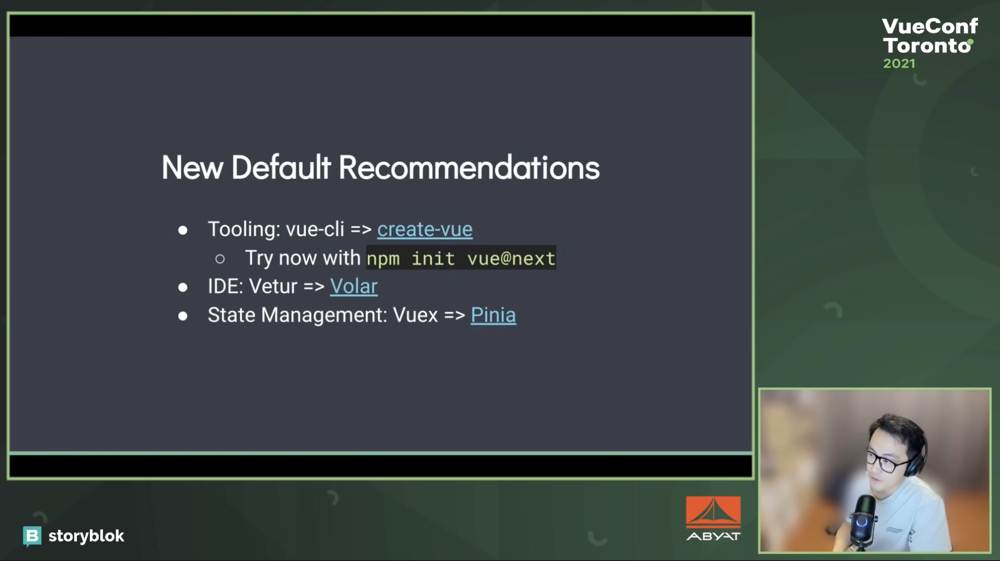
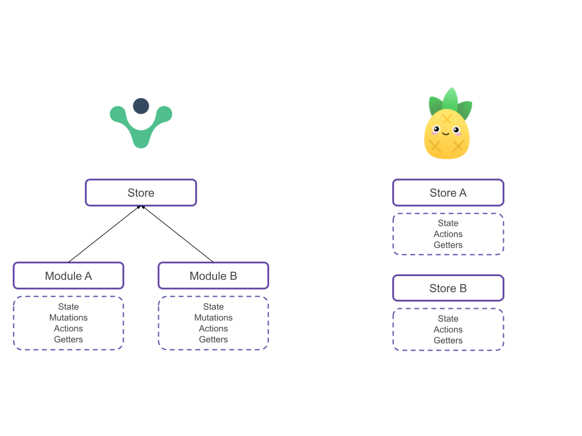

> You can read this article also in [English](/en/pinia-vuex).

El 8 de febrero de 2022 [Vue 3](https://vuejs.org/) se convirtió en la [versión por defecto](https://blog.vuejs.org/posts/vue-3-as-the-new-default.html) de Vue. Esto es un paso importante, ya que no solo considera Vue 3 _totalmente_ estable para aplicaciones en producción; también da por hecho que el ecosistema de aplicaciones propuesto alrededor de Vue 3 es estable. Uno de los cambios sugeridos gira en torno a la gestión de estado en Vue 3, como mencionó Evan You en su [charla en la VueConf Toronto](https://www.youtube.com/watch?v=2KBHvaAWJOA&t=1183s) celebrada el pasado noviembre.

<div style="margin: 50px auto 0; max-width: 600px;">



</div>
<div class="text-center" style="margin: -15px 0 70px;">
  <small>Captura de la charla con las nuevas recomendaciones para Vue3. Fuente: YouTube</small>
</div>

Como se puede ver en la imagen, hay cambios en el _tooling_, en la extensión de VSCode y en la gestión de estado, que es en lo que nos vamos a centrar hoy. Desde ahora [Pinia](https://pinia.vuejs.org/) será la opción recomendada por defecto para la gestión de estados sobre Vuex, así que haremos un pequeño _overview_ sobre esta nueva librería, qué es y las implicaciones que esto tiene en el desarrollo de aplicaciones en Vue 3.

<div style="margin: 50px auto; max-width: 100px;">


</div>

## ¿Qué es Pinia?

**[Pinia](https://pinia.vuejs.org/)** es una librería de JavaScript para el manejo de estados bajo un _store_. Permite compartir un estado a través de múltiples páginas y componentes. Esta librería surgió en 2019 a raíz de los primeros experimentos de Composition API realizados para Vue 3 y fue concebida pensando en ella, aunque también da soporte a Vue 2 y Vue 3 con _Options API._ Como características principales destaca la **gestión de tipos**, soporte para _Devtools_ y su ligereza.

## Vuex vs Pinia

Al pensar en Vue y la gestión de estado es un ejercicio automático pensar en Vuex en lugar de Pinia; primero porque es una librería relatívamente nueva y segundo porque Vuex es una librería fuertemente establecida en la comunidad. Por esta razón utilizaremos la comparación con Vuex para establecer las diferencias y ventajas con Pinia.

### Diseño modular

El enfoque que hace Pinia es ligeramente diferente al de Vuex, ya que Pinia **genera un Store por módulo**, que puede ser importado o no en los componentes que convenga. Por una parte, simplifica el desarrollo, puesto que sólo es necesario operar con los métodos del Store (o módulo) en cada ocasión, en lugar de con el Store “_completo_” de Vuex. Esto facilita a su vez el _code splitting_ y cargar sólo lo necesario en cada componente. Sí, Pinia permite _code splitting_
en Webpack.

### Eliminación de Mutaciones

Debido al diseño de Pinia, las mutaciones ya no son neceserarias. Uno de los objetivos iniciales de las mutaciones en Vuex (y otras librerías) era poder mostrar los cambios de estado en las Devtools. A su vez se establecía como parte necesaria en el workflow de Vuex considerado “buena práctica”: Componente llama acción, acción a mutación y mutación cambia el estado. La eliminación de las mutaciones tiene ciertas implicaciones en la práctica que describiremos posteriormente.

<div style="margin: 0 auto; max-width: 700px;">



</div>
<div class="text-center" style="margin: -70px 0 20px;">
  <small>Descripción gráfica de las diferencias de arquitectura de Vuex y Pinia.</small>
</div>

A su vez hay que destacar las siguientes características de Pinia:

- **Completa integración con TypeScript**
- **Muy ligero**, pesa sobre 1kb
- **Soporte para _Vue devtools_**
- **Soporte para SSR**

## Pinia en la práctica

En los siguientes fragmentos de código se muestra la definición de un módulo de Vuex y su traducción en un store de Pinia:

```jsx
// Vuex
const CounterModule: Module<State, RootState> = {
  namespaced: true,
  state: {
    count: 0,
  },
  getters: {
    double: (state) => state.count * 2,
  },
  actions: {
    increaseCount({ state, commit }) {
      commit("increment")
    },
  },
  mutations: {
    increment(state, payload) {
      state.count++
    },
  },
}

export default storeModule
```

```jsx
// Pinia
const useCounterStore = defineStore("counter", {
  state: () => ({ count: 0 }),
  getters: {
    double: (state) => state.count * 2,
  },
  actions: {
    increment() {
      this.count++
    },
  },
})
```

Como se puede ver, no hay excesivas diferencias en la sintaxis de definición de un Store de Pinia vs un módulo de Vuex: Ni las acciones ni las mutaciones necesitan como parámetro el estado o el payload, pero poco más. Si bien hay que mencionar que a la definición del módulo de Vuex le debería seguir su importación en la store para que pueda ser utilizada. En Pinia esa definición es **suficiente** y ya puede ser usada en los componentes. En cualquier caso, más allá de la definición de una Store en Pinia y las ligeras diferencias respecto a Vuex, los cambios importantes vienen en el uso de las Stores.

Por una parte, la invocación del store se realiza directamente en los componentes. Debido a esto, no es necesario llamar a todos los stores en la invocación a _**createApp**_ en `main.ts`. La llamada a _**createPinia**_ lo único que hace es crear una instancia de Pinia, nada más.

```jsx
import { useCounterStore } from "../stores/counterStore"
```

Por otra parte, el acceso a estado, getters y acciones se realiza de modo diferente, ya que hay helpers específicos para mapearlos en options API).

Las llamadas con **Options API** son más o menos similares a las ejecutadas en Vuex si se usaran los helpers.

```jsx
import { mapState, mapActions } from "pinia"
import { useCounterStore } from "../stores/counterStore"

export default {
  computed: {
    // First is state, second a getter
    ...mapState(useCounterStore, ["counter", "doubleCount"]),
  },
  methods: {
    ...mapActions(useCounterStore, ["increment"]),
  },
}
```

También se pueden renombrar los métodos o estado en el componente:

```jsx
import { mapState, mapActions } from "pinia"
import { useCounterStore } from "../stores/counterStore"

export default {
  computed: {
    // First is state, second a getter
    ...mapState(useCounterStore, {
      myOwnName: "doubleCounter",
      // you can also write a function that gets access to the store
      double: (store) => store.doubleCount,
    }),
  },
  methods: {
    ...mapActions(useCounterStore, { myOwnName: "increment" }),
  },
}
```

La ventaja de Pinia, es que a su vez se puede hacer uso de los estados de manera muy sencilla en componentes con **Composition API**:

```jsx
export default {
  setup() {
    const store = useCounterStore()

    const double = store.doubleCounter()

    const incremented = store.increment()

    return { store }
  },
}
```

### Migración de Vuex a Pinia

En la documentación de Pinia una [extensa guía](https://pinia.vuejs.org/cookbook/migration-vuex.html) detallando los pasos para migrar una store de Vuex a Pinia. En cualquier caso, y una vez teniendo claros los conceptos la migración es relativamente sencilla siempre y cuando se sea un poco ordenado:

- **Reestructuración de carpetas**: De módulos a Stores y eliminación del store principal.
- **Conversión de módulos**: modificar sintaxis para convertirlos en Stores.
- **Eliminación de mutaciones y conversión a acciones.**
- **Modificación de llamadas en componentes añadiendo helpers** (si aplica). Si tras la refactorización de las stores se ha modificado el nombre de los métodos se pueden hacer uso de los alias para evitar tocar más código del necesario.

En mi caso he realizado la migración de un proyecto bastante sencillo y ha funcionado a la primera. Por mi experiencia lo importante del proceso de migración es ser metódico en todos los pasos. Es posible que temporalmente aparezcan errores en el editor, pero hay que esperar hasta el final para revisar y comprobar que todo está correcto.

## Conclusiones

Desde mi punto de vista, Pinia supone un avance en la simplificación de la gestión de estados en proyectos con Vue (u otro framework JS). Es más fácil de entender, ya que no tiene conceptos que se solapen como mutación y acción. A su vez la sintaxis de uso es muy sencilla y clara: ya queda lejos las definiciones de stores y mutaciones en Redux de hace 5 años. No obstante, para proyectos que ya tienen implementado Vuex o incluso proyectos en Vue 3 con Vuex, no supone un gran avance, aunque la migración en aplicaciones pequeñas es bastante sencilla y agradecida.

## Referencias

[https://blog.vuejs.org/posts/vue-3-as-the-new-default.html](https://blog.vuejs.org/posts/vue-3-as-the-new-default.html)

[https://vuejs.org/](https://vuejs.org/)

[https://pinia.vuejs.org/](https://pinia.vuejs.org/)

[https://pinia.vuejs.org/cookbook/migration-vuex.html](https://pinia.vuejs.org/cookbook/migration-vuex.html)

[https://www.youtube.com/watch?v=2KBHvaAWJOA&t=1183s](https://www.youtube.com/watch?v=2KBHvaAWJOA&t=1183s)

Photo by <a href="https://unsplash.com/@phienix_han?utm_source=unsplash&utm_medium=referral&utm_content=creditCopyText">Phoenix Han</a> on <a href="https://unsplash.com/s/photos/pineapple?utm_source=unsplash&utm_medium=referral&utm_content=creditCopyText">Unsplash</a>
