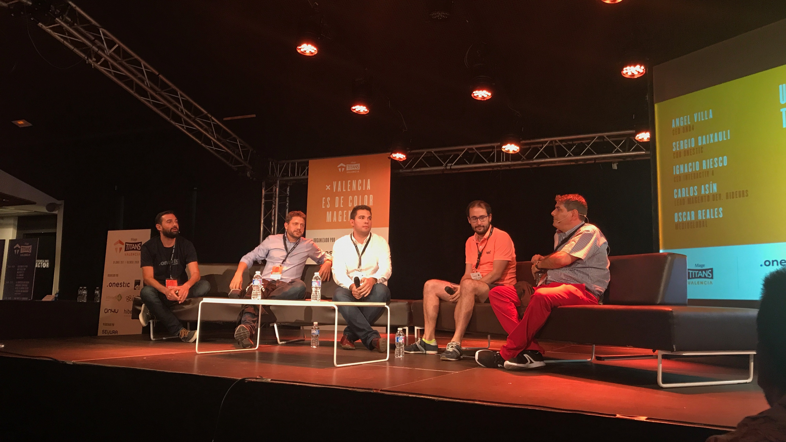

Tras unos días de descanso tras el evento me he decidido a escribir unas pequeñas lineas para comentar lo acontecido en Mage Titans, o más bien las sensaciones que he tenido en este evento.

### Somos pocos pero hacemos ruido

Sin ser de las mayores comunidades de Magento es cierto que el compromiso de la comunidad es muy grande, y que se están haciendo proyectos de gran nivel en nuestro país.

### No tenemos Magento Masters, pero da igual

El nivel de las charlas superó con creces a muchas dadas por gente muy conocida de la comunidad, yendo al fondo de las cuestiones, mostrando ejemplos y no evitando las preguntas conflictivas. No fueron charlas teóricas, fueron ejemplos reales, que son los que te hacen aprender.

P.D. La charla de mi compañero [Oscar Recio](undefined) fue absolutamente espectacular.

Se pueden ver todos los slides del evento [aquí](https://es.slideshare.net/MageTitansES).

### Los eventos por y para desarrolladores molan 😊

A diferencia de otros eventos, este estaba enfocado al 100% en los desarrolladores por lo que en cuanto se rompió el hielo el evento se convirtió en una especie de “terapia de grupo”, en la que no hubo limitaciones por clientes o proveedores. Es agradable compartir experiencias (buenas y malas) con gente que hace lo mismo que tu, aprender de sus errores y sus aciertos.

### Magento 2 ya es una realidad

La opinión de los asistentes a la mesa redonda lo dejó bastante claro: Ahora es una tecnología madura y la apuesta es fuerte por lo que hay que invertir en la formación y la dedicación de recursos a M2. A su vez la apuesta de Magento como empresa hace que el target de la plataforma haya cambiado enfocándose en clientes de alto nivel y proyectos de relevancia internacional. Esto hace replantear la continuidad de proyectos ya desarrollados en M1 y su migración a M2. No todos los clientes podrán pasar a M2 pero tendrán que tomar una decisión en cuanto a la plataforma que van a usar, ya que como dijo [Miguel Barlparda](https://twitter.com/mbalparda): “Magento 1 es un coche viejo lleno de problemas de seguridad”. También habrá desarrolladores que si no “espabilan” quedarán anclados en una tecnología obsoleta, pero que la comunidad se verá reforzada por la llegada de desarrolladores educados en tecnologías modernas que se sentirán mucho más cómodos en Magento 2.

Me quedé con ganas (no se por qué no lo hice) de preguntar por la parte menos madura y que más me toca (el frontend) a los asistentes. Hubiera sido interesante escuchar como otras compañías y compañeros está implementando el front de nuevos proyectos en Magento 2.
