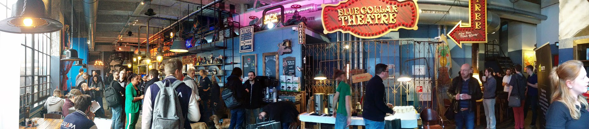
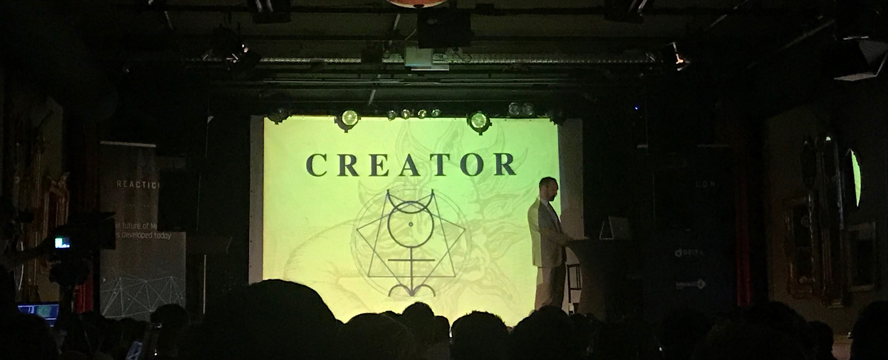
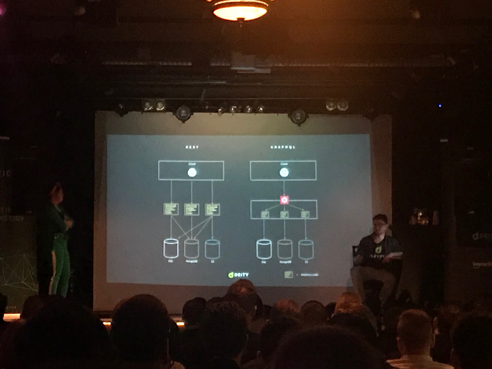
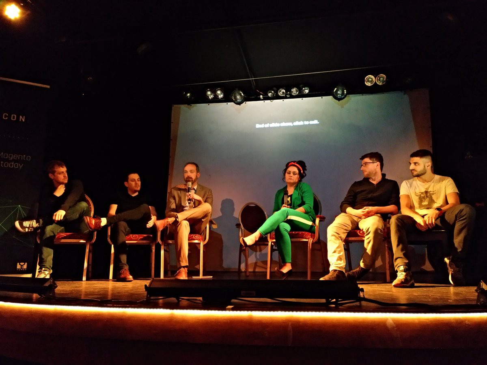
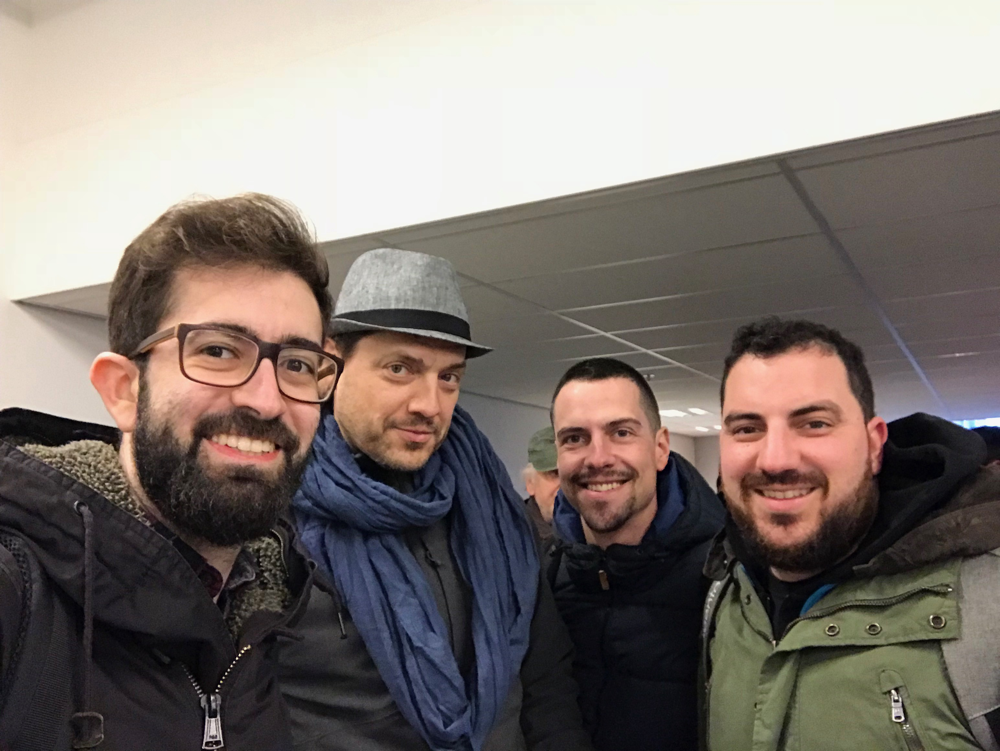

El pasado 16 y 17 de marzo tuvimos la oportunidad de asistir a la Reacticon Conference, evento realizado en Eindhoven y que trató sobre las nuevas tecnologías de frontend y PWA aplicadas a Magento y Magento 2.
La delegación española estuvo formada por Ignacio Riesco (CEO), Oscar Recio (Lead Developer), Lionel Álvarez (Frontend Developer) y yo. Tras las noticias de estos últimos meses respecto a la creación de nuevas plataformas como Deity, Vue Storefront y Frontcommerce y el desarrollo por parte de Magento de PWA Studio estábamos encantados de poder asistir a un evento en el que los pesos pesados que están moviendo este nuevo paradigma compartieran sus ideas, novedades y pasos futuros.

El evento tuvo lugar en el Blue Collar Hotel de Eindhoven, un pintoresco edificio perfecto para este tipo de evento. El formato de Reacticon no fue el clásico de los eventos sobre Magento a los que estamos acostumbrados a asistir, ya que las charlas de los ponentes fueron la “excusa” para intercambiar entre todos preguntas, inquietudes y proponer mejoras para lo que se está construyendo en la actualidad. Este no era un evento en el que se hablaba sobre lo que se ha hecho en ecommerce, en este evento se definió lo que se va a hacer en los próximos meses, y yo como desarrollador estaba encantado de la vida.

Tras la presentación de Jisse Reitsma, en la que nos habló sobre los objetivos del evento se dio paso a James Zetlen, Frontend Architect de Magento y encargado de PWA Studio. En su charla habló de los objetivos reales que pretendía PWA Studio, todo ello mediante una curiosa metáfora en la que los desarrolladores eran demiurgos.

Poco después fué el turno de Shane Osbourne, en el que nos habló sobre cómo mejorar el performance en Magento 2 e implementar ciertas técnicas para mejorar el modo de desarrollo con el stack actual de Magento. Desde mi punto de vista fue la mejor charla de todo el evento, absolutamente espectacular.

Antes del almuerzo Jisse Reitsma (Yireo) habló sobre las estrategias posibles cuando se está implementando ServiceWorkers. Esta tecnología permite interactuar en una con los dispositivos como si de una app nativa se tratara.

Tras la comida llegó el turno de los chicos de Deity. En su charla Jamie Marie Schouren y Michal Wujas hablaron del estado del arte del proyecto y de la integración de GraphQL en Magento con Deity. Una gran charla que abarcó desde temas técnicos como temas informativos sobre la plataforma.

La siguiente fue la charla en la que más se habló sobre Vue.js. En ella Bartek Igielski nos habló sobre la estructura de componentes que formaba Vue.js y las ventajas que traía out-of-the-box. Una interesante charla en la que se mostraba como se podía abarcar un proyecto de PWA con otra librería distinta a React.

Para terminar las charlas, turno otra vez de Magento. En este caso Andrew Levine nos habló desde un punto de vista más técnico de qué es Peregrine como cimientos de PWA Studio y para qué va a servir.

Como punto y aparte al evento, un panel formado por todos los ponentes en el que se formularon preguntas de todo tipo relacionadas con las charlas, PWA, y planes futuros. Fue una hora que se hizo bastante corta, ya que había muchas preguntas por parte de los asistentes.

Fiesta de por medio, de la que solo diré que llegamos con ojeras, el sábado fue el momento de mancharnos las manos de código y participar en el Hackaton. Se celebró en las oficinas de Deity y allí pudimos echar un ojo a los códigos de las plataformas PWA que hay en la actualidad y contribuir con ellas. También fue un ambiente ideal para seguir compartiendo ideas y preguntas a los especialistas de la materia.

Como resumen, este ha sido de los mejores eventos a los que he asistido en lo relacionado al Frontend. Mucho nivel por parte de los ponentes y participantes, y muchas ganas de ayudar a crear el próximo stack para Magento, algo necesario.

Gracias a Jisse Reitsma y Jamie Marie Schouren por su hospitalidad :)

_Este post ha sido publicado originalmente para el [blog de Interactiv4](https://www.interactiv4.com/eventos/cronica-de-reacticon-2018-pwa-magento/)_
