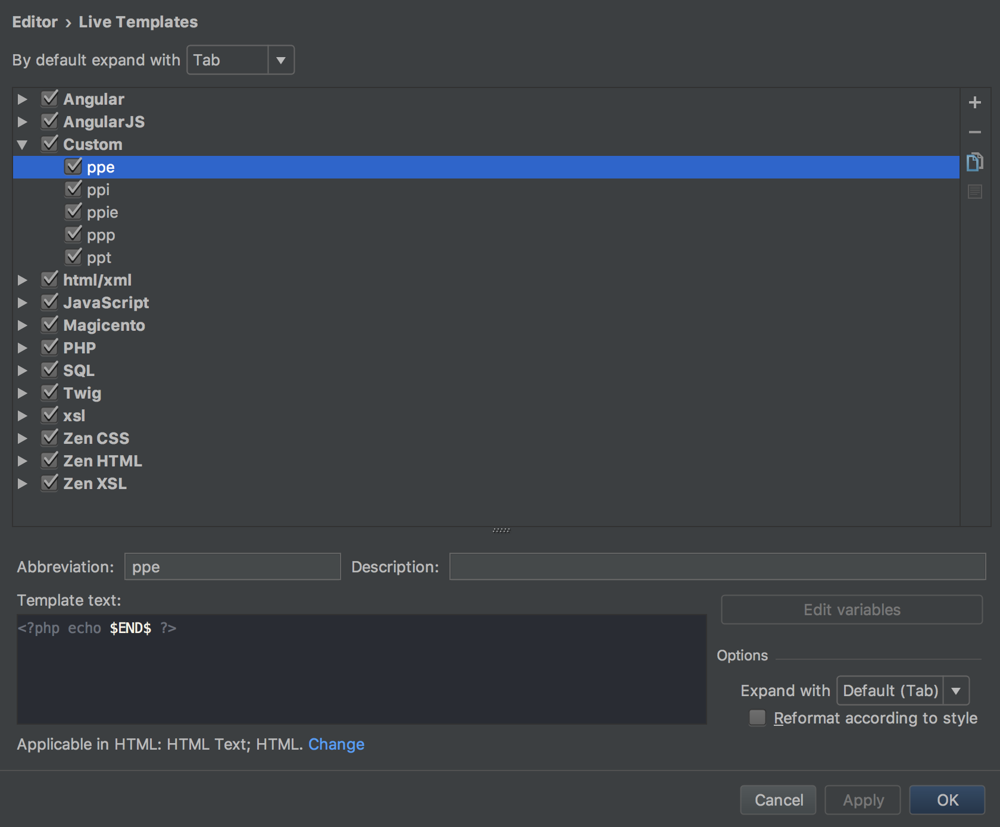
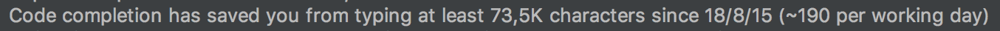

**3 Live Templates que te ahorrarán muchísimo tiempo**

Si hay algo que ayuda y ahorra tiempo en el desarrollo con Magento es el uso de Live Templates en PhpStorm. Un Live Template es una **estructura de código que usas con frecuencia que se inserta mediante un shortcode**. Escribes el shortcode, pulsas TAB y voilá!

Mola, ¿verdad? Yo los utilizo principalmente en los .phtml de Magento para añadir las cabeceras de php. Por ejemplo:

- ppp + TAB: <?php ‘contenido’ ?>

- ppe + TAB: <?php echo ‘contenido’ ?>

- ppt + TAB: <?php $this->__(‘contenido’) ?>

- ppi + TAB: <?php if(‘cursor’): ?> ‘contenido’ <?php endif; ?>

Añadir un Live Template en PhpStorm es muy sencillo, para ello nos dirigimos a _Preferences -> Editor -> Live templates._

En la parte superior de la ventana se puede ver la agrupación de Live Templates por lenguaje. En mi caso no las tengo agrupada en ningún lenguaje, por eso se encuentran dentro de la pestaña “Custom”.

En la parte inferior se define la abreviación a utilizar. Una pequeña descripción del Live Template y el texto del live template. Se pueden utilizar múltiples variables como nombre, año o otras referencias. Una variable muy útil es $END$, que se ocupa de posicionar el cursor una vez se ha añadido el Live Template.

Para finalizar en la parte derecha se puede definir con que tecla o combinación se desea expandir el Live Template. En mi caso utilizo la que tiene por defecto (TAB).

_Detalle de las estadísticas de PhpStorm. Me he ahorrado escribir bastante en dos años…y sólo con esos 4 Live Templates_

Como se puede ver es muy fácil de crear y da muchas facilidades para crear muchas estructuras de código tecleando poco. Se pueden utilizar para generar la estructura de un documento HTML, un componente de ReactJS o de Polymer, la estructura de un modelo…las opciones son infinitas y para todos los lenguajes y frameworks.
