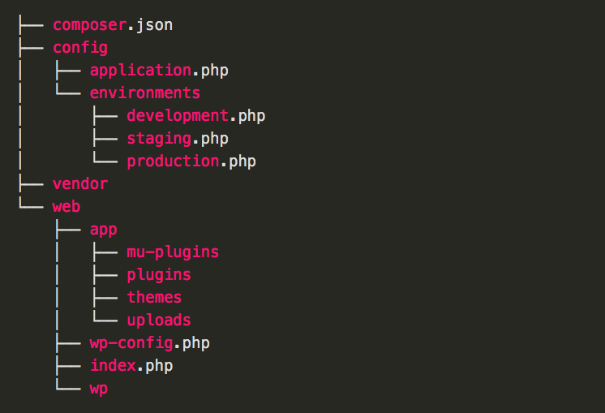
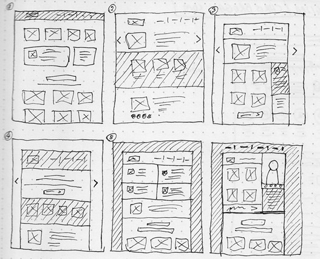

Quien más y quien menos le ha tocado coger un proyecto en producción para hacer evolutivos o fixes y ha dicho ¿cómo puede funcionar esto? Tras unos momentos observando el código del proyecto ha aparecido un sudor frío y la mirada de las 1000 yardas al no entender nada de lo que hay. Esta sensación es bastante habitual en lo que a front-end se refiere ya que las metodologías de maquetación y la estandarización es algo relativamente reciente, a que la parte de front-end de un proyecto tiene una buena parte de fine-tunning y de mejora incremental. Pero sobre todo a que esta tarea ha sido relegada a un status inferior en cuanto a la complejidad de un proyecto. No os llaméis a engaños, el front-end tiene mucho de ingeniería. Y cada día más…

Por eso es buena práctica (no es buena práctica, **es VITAL**) documentar los proyectos en lo que a front-end se refiere, y que esta sea de calidad, para que en el futuro con leer un pequeño documento, y en unos minutos se tenga una panorámica del proyecto entero.

**Nota**: _Este post lo estoy escribiendo pensando en un proyecto de front de Magento, por lo que puede ser que no haga hincapié en algunos aspectos que para un desarrollo propio sean importantes._

### Tecnologías

Breve descripción de las tecnologías utilizadas, frameworks (versiones incluidas), compiladores, gestores de tareas, librerías relevantes de javascript. En fin, un pequeño parrafo que con leerlo te puedas hacer una idea de **sobre qué estás trabajando**.

### Organización

_Estructura de ficheros de Bedrock, un boilerplate para Wordpress._

A la descripción de las tecnologías utilizadas le sigue una pequeña descripción de la estructura de ficheros utilizada. Si no es algo estandar o lógico lo correcto es argumentarlo, ya que si otro desarrollador toma el proyecto, llegado a este punto puede preguntarse \*¿por qué ha hecho esto?. **\*Un diagrama es de mucha ayuda** para tener una imagen rápida de la disposición de los ficheros.

### Layout

_Ejemplos de layout para una web. No olvides señalar el nombre de cada bloque y su handle o hook._

En este apartado se debe explicar la disposición general de los bloques del sitio, usando un esquema, o un boceto en que se situarán los diferentes módulos que compondrán la web, los posibles lugares en los que se puede situar, y los handles o hooks necesarios para llamarlos.

### Módulos

Tras esta descripción global se pasará a detallar cada módulo, o bloque “con identidad propia”. Por ejemplo: Un bloque de productos relacionados, un slider con publicidad, un bloque con pestañas detallando características técnicas del producto. En definitiva, cualquier módulo cuyo comportamiento pueda ser aislado y **tenga relevancia** a lo largo del sitio. Es importante explicar cómo llamar al módulo, sus posibles parámetros, sus peculiaridades y su ámbito. También sería conveniente explicar de dónde se obtienen los datos, o que transformaciones de éstos se realizan. Cualquier cosa que se aleje un poco de la “normalidad” es importante documentarla.

### Javascript

En este apartado se explicará brevemente la disposición de los ficheros js del proyecto, su alcance, su uso y las herramientas para gestionarlas (requireJS, por ejemplo). A su vez se listarán todas las librerías de javascript usadas a lo largo del sitio (sliders, ellipsis, resizers…) y las extensiones de las mismas. Si has optado por un **diseño modular** (bien!) y no por uno monolítico, este apartado tiene bastante miga, por lo que los ejemplos seguro serán bien recibidos por el lector.

### CSS

En lo que a CSS se refiere hay que detallar la disposición de los ficheros (sass o less) si no se ha hecho anteriormente. Es bueno recordar en este punto las alternativas para compilar los ficheros para las que el proyecto está preparado. Tras **explicar la nomenclatura utilizada y el patrón de nombrado** (BEM, SMCSS, Atomic Design…) se daría paso a dar una serie de ejemplos para que el lector comprenda cómo debería nombrar los componentes de su código.

Aquí se puede optar por enlazar o añadir una **hoja de estilos**, ya sea dinámica o estática, aunque esto depende del tipo de proyecto. Para un proyecto en Magento, todavía no he visto la necesidad de hacerlo, ya que no lo veo muy rentable en términos de tiempo/utilidad. Si estamos desarrollando un CMS, o un periódico online, por poner un par de ejemplos, sería ideal, ya que una hoja de estilos ayuda a dar consistencia en la parte visual y facilita la **homogeneidad del código **a un proyecto de larga duración.

### Getting started

Para terminar es de gran utilidad explicar y comentar los procesos, comandos y procedimientos necesarios para poner el proyecto en marcha, compilar, gestionar las dependencias, etc…Ponerlo al final del documento es una manera de “forzar” al lector a **leerse todo** lo anterior por lo menos una vez antes de comenzar a desarrollar.

¿Se me olvida algo? Agradecería mucho el feedback con vuestras experiencias o vuestra forma de trabajar.

Fuentes: [Bedrock](https://roots.io/bedrock/), [Bootstrap](http://getbootstrap.com), [Hologram](http://trulia.github.io/hologram/), [Pattern Lab](http://patternlab.io)
