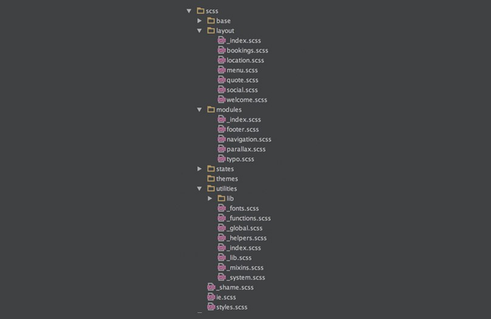
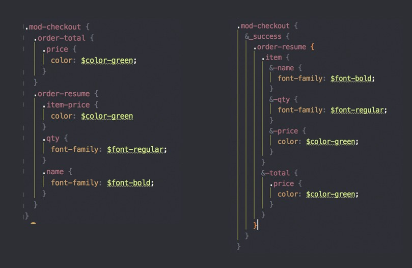

El proceso de maquetación de una web es uno de los más sencillos (en teoría) una vez que aprendes la técnica, pero de los que más dolores de cabeza dan si no se ha hecho correctamente. Sobre todo si la creación de los “cimientos” ha sido deficiente.

Para no tener problemas en ese futuro que se antoja lejano pero que se convierte en presente muy, pero que muy rápido yo pongo en práctica un par de ideas que describiré a continuación.

### Orden de los ficheros

El modularizar los ficheros es uno de los pasos más importante en el proceso de maquinación para establecer una jerarquía entre módulos, elementos, layouts, variables, frameworks, etc…

¿Por qué? Porque cuando pasen unas semanas sin tocar el proyecto esa jerarquía te ayudará a encontrar los fragmentos de código rápidamente, y si no eres tú el que tiene que hacer la modificación le va a ayudar a situarse. Una buena organización del código en ficheros ahora horas de tiempo.

Yo uso [Sassy-Starter](https://github.com/minamarkham/sassy-starter) como toolkit para empezar. Tiene un montón de mixins, funciones y la organización me parece ideal. La versión actual incorpora Atomic Design como metodología para maquetar. En [esta rama](https://github.com/rubenRP/sassy-starter/tree/without-ad) podéis ver una versión sin Atomic Design. Si no te gusta este toolkit, puedes desarrollar una jerarquía propia que se adapte a tus necesidades, siempre que sea coherente y esté documentada.

### Orden dentro del fichero

Imagina una estructura estandar de una web con cabecera, cuerpo, un formulario y un pie de página por ejemplo. Nosotros leemos de izquierda a derecha y de arriba a abajo, así que el fichero SCSS debe tener la misma estructura, utilizando la indentación para situar los elementos dentro de sus contenedores. Aunque puedan funcionar desde fuera, visualmente es más fácil ver la jerarquía de elementos en el código.

Imaginemos el resumen del pedido en una tienda online. Este resumen cuenta con una lista compuesta por nombre, cantidad, precio y con un total general al final.

Como se puede ver, en el fragmento de la izquierda no hay orden y no se sigue el orden de lectura ni tiene una indexación coherente, mientras que el de la derecha ya se puede imaginar qué forma tiene el código HTML.

### Breakpoints y media queries

Para las media queries y los breakpoints hay múltiples formas de organización. En mi caso añado un los breakpoints al final de cada fichero de módulo o layout, para evitar moverse entre ficheros, ya que cuando se da forma a una maqueta se hace en todos los viewports a la vez (por lo menos la forma general)

    .breadcrumb {
      font-family: $font-montserrat-light;
      text-transform: uppercase;
      .active {
        color: $color-text-gold;
      }
      li + li:before {
        content:"/"
      }
    }
    /************ RESPONSIVE TABLET ************/
    @include breakpoint(tablet){
      .breadcrumb {
        display: inline;
      }
    }
    /************ RESPONSIVE MOBILE ************/
    @include breakpoint(mobile){
      .breadcrumb {
        display: none;
      }
    }

Algo no muy recomendable es añadir un fichero único para cada viewport. Acaba siendo muy extenso y eso fomenta que se acabe siendo desordenado.

Por último una pequeña mención al nombrado de clases y variables. Tienen que ser coherente a lo largo del sitio y comprensibles. Está bien tener una variable que defina el color en función de su pantone o gama cromática, pero a su vez debería renombrarse con un nombre más fácil de utilizar.

    $PC-cromatico_6   : #E50706; //Red claro
    $color-red-light  : $PC-cromatico_6;

Tras un mes nadie se va a acordar de qué color es _\$PC-cromatico_7_, pero sin embargo si se llama _\$color-red-light_ te puedes hacer una idea de qué estamos hablando ;)
