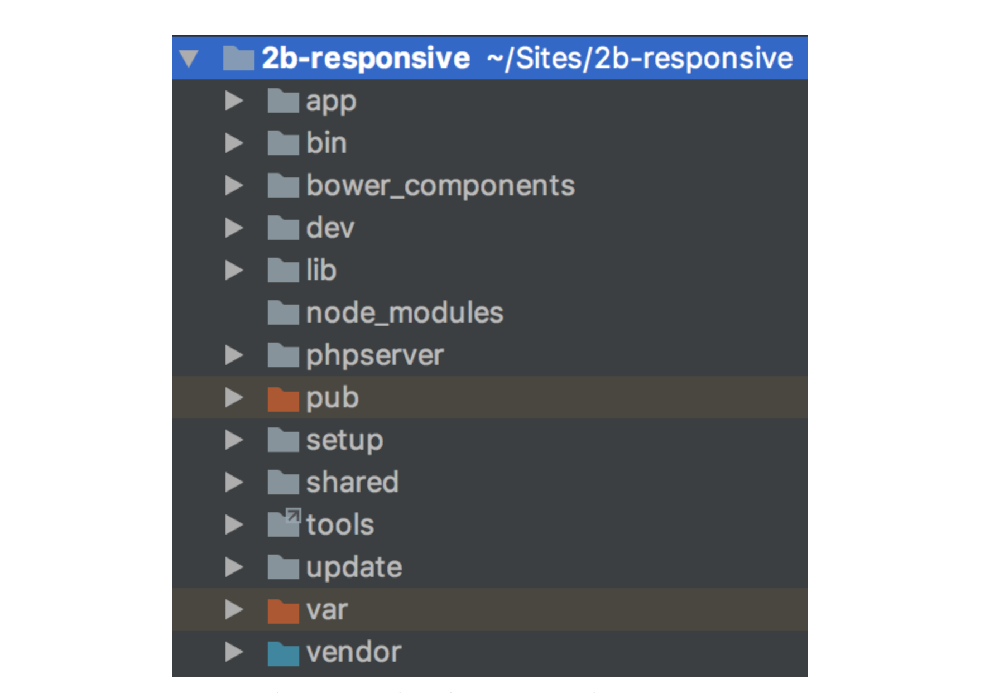

Mil perdones por la espera. Casi un año sin escribir un post…

Con el desarrollo de un nuevo proyecto en Magento 2 puede surgir la necesidad de añadir un grid system a un template. Una buena alternativa en lugar de recurrir a frameworks como Bootstrap o Foundation es usar Susy, un motor para generar layouts personalizados con SASS

### Prerrequisitos

- Node JS — [http://nodejs.org](http://nodejs.org/)

- Bower — [http://bower.io](http://bower.io/)

- Gulp Js — [http://gulpjs.com](http://gulpjs.com/)

Cuento con la premisa de que no se está utiliando el compilador de LESS de Magento 2 en favor de Gulp y SASS, utilizando un Gulpfile propio o el fantástico módulo [Frontools de Snowdog](https://github.com/SnowdogApps/magento2-frontools). Podéis encontrar información sobre como trabajar con SASS en Magento 2 en [Magento Dev Docs](http://devdocs.magento.com/guides/v2.1/frontend-dev-guide/css-topics/custom_preprocess.html) y [Magento Forums](https://community.magento.com/t5/Less-to-Sass-Community-Project/bd-p/less-to-sass).

### Instalando los paquetes de Bower

Nos situamos desde el terminal en la raiz del proyecto.

    bower install susy --save

La nueva estructura del proyecto es la siguiente:

_Podemos ver como en la estructura aparece una nueva carpeta “bower_components”_

Si deseamos poder utilizar las funciones de breakpoint de Susy:

    bower install breakpoint-sass --save

Ahora sólo nos queda añadir los paquetes a nuestro **styles.scss**

    //Si no se usa Frontools la ruta puede variar
    @import "../../../bower_components/susy/sass/susy";

    //Si se han instalado breakpoint
    @import "../../../bower_components/breakpoint-sass/stylesheets/breakpoint";

Listo! Con esto ya se puede compilar ficheros SASS con gulp usando Susy.

**Corrección**: La idea de mantener los componentes de Bower en la raíz del proyecto no es la mejor. Se puede crear un módulo para Bower y usar el parámetro “module” en el themes.json. Así se evita usar las rutas con “../../../”. Gracias a Bartek Igielski por el apunte.

Fuentes: [Susy Sass](http://susy.oddbird.net/)
